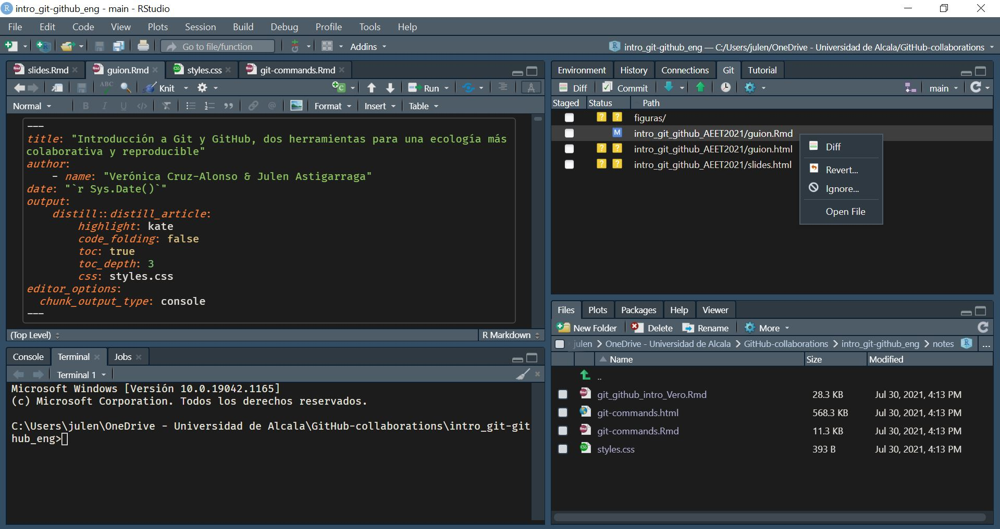
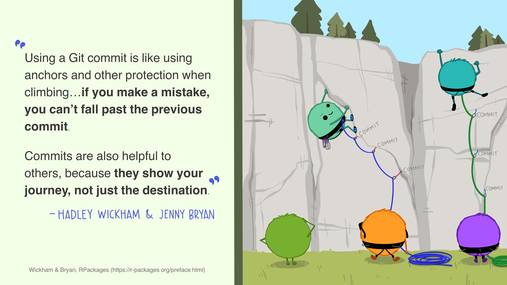
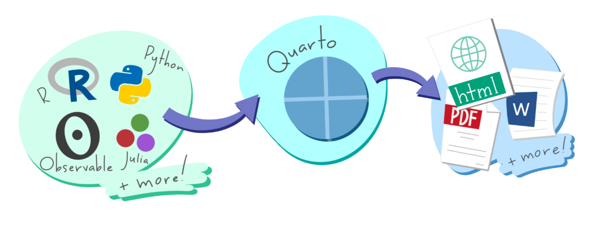
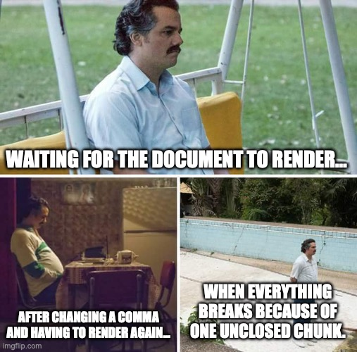
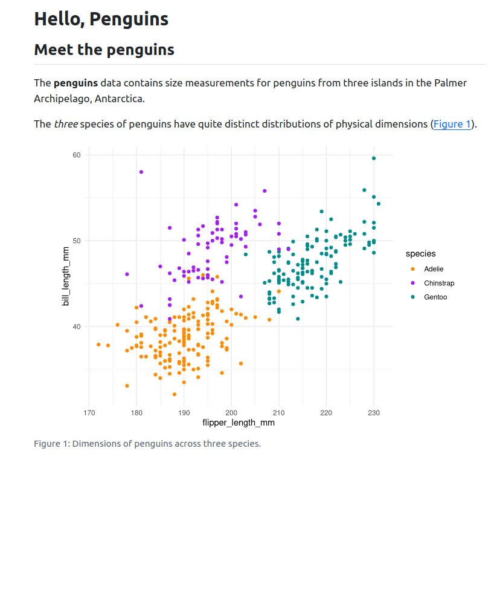
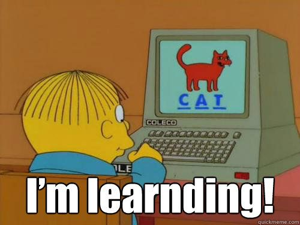
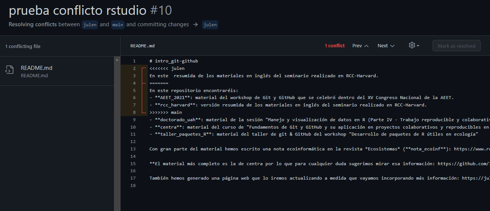

# Improving scientific workflows with reproducible and collaborative

projects in R Verónica Cruz-Alonso, Elena Quintero, Julen Astigarraga
and Guillermo Fandos 02/06/2025

-   [[1](#introduction)]{.toc-section-number}[
    Introduction](#introduction)
    -   [[1.1](#workshop-structure)]{.toc-section-number}[ Workshop
        structure](#workshop-structure)
    -   [[1.2](#who-we-are)]{.toc-section-number}[ Who we
        are?](#who-we-are)
-   [[2](#introduction-to-git-and-github)]{.toc-section-number}[
    Introduction to Git and GitHub](#introduction-to-git-and-github)
    -   [[2.1](#git)]{.toc-section-number}[ Git](#git)
    -   [[2.2](#what-is-git)]{.toc-section-number}[ What is
        Git](#what-is-git)
    -   [[2.3](#what-is-github)]{.toc-section-number}[ What is
        GitHub](#what-is-github)
    -   [[2.4](#git-instalation)]{.toc-section-number}[ Git
        instalation](#git-instalation)
    -   [[2.5](#git-repositories-and-projects)]{.toc-section-number}[
        Git repositories and projects](#git-repositories-and-projects)
    -   [[2.6](#git-ignore)]{.toc-section-number}[ Git
        ignore](#git-ignore)
    -   [[2.7](#structure-of-a-github-repository)]{.toc-section-number}[
        Structure of a GitHub
        repository](#structure-of-a-github-repository)
    -   [[2.8](#github-the-social-network)]{.toc-section-number}[
        GitHub: the social network](#github-the-social-network)
    -   [[2.9](#workflow-in-git-and-github)]{.toc-section-number}[
        Workflow in Git and GitHub](#workflow-in-git-and-github)
        -   [[2.9.1](#how-to-move-from-one-area-to-another)]{.toc-section-number}[
            How to move from one area to
            another?](#how-to-move-from-one-area-to-another)
        -   [[2.9.2](#navigating-git-history)]{.toc-section-number}[
            Navigating Git History](#navigating-git-history)
-   [[3](#quarto)]{.toc-section-number}[ Quarto](#quarto)
    -   [[3.1](#introduction-to-quarto)]{.toc-section-number}[
        Introduction to Quarto](#introduction-to-quarto)
        -   [[3.1.1](#what-is-quarto)]{.toc-section-number}[ What is
            Quarto](#what-is-quarto)
        -   [[3.1.2](#why-use-quarto)]{.toc-section-number}[ Why use
            Quarto](#why-use-quarto)
        -   [[3.1.3](#brief-history-evolution-from-r-markdown)]{.toc-section-number}[
            Brief history: Evolution from R
            Markdown](#brief-history-evolution-from-r-markdown)
        -   [[3.1.4](#quarto-installation)]{.toc-section-number}[ Quarto
            installation](#quarto-installation)
    -   [[3.2](#key-differences-between-r-markdown-and-quarto)]{.toc-section-number}[
        Key differences between R Markdown and
        Quarto](#key-differences-between-r-markdown-and-quarto)
        -   [[3.2.1](#why-use-quarto-instead-of-r-markdown)]{.toc-section-number}[
            Why use Quarto instead of R
            Markdown?](#why-use-quarto-instead-of-r-markdown)
        -   [[3.2.2](#what-should-i-do-with-my-existing-.rmd-files)]{.toc-section-number}[
            What should I do with my existing `.Rmd`
            files?](#what-should-i-do-with-my-existing-.rmd-files)
    -   [[3.3](#getting-started-with-quarto)]{.toc-section-number}[
        Getting started with Quarto](#getting-started-with-quarto)
    -   [[3.4](#quarto-workflow)]{.toc-section-number}[ Quarto
        workflow](#quarto-workflow)
        -   [[3.4.1](#rendering)]{.toc-section-number}[
            Rendering](#rendering)
    -   [[3.5](#quarto-anatomy)]{.toc-section-number}[ Anatomy of a
        Quarto document](#quarto-anatomy)
        -   [[3.5.1](#yaml-header)]{.toc-section-number}[ YAML
            header](#yaml-header)
        -   [[3.5.2](#markdown)]{.toc-section-number}[
            Markdown](#markdown)
        -   [[4.1.2](#code)]{.toc-section-number}[ Code](#code)
        -   [[4.1.3](#tables-and-figures)]{.toc-section-number}[ Tables
            and figures](#tables-and-figures)
        -   [[4.1.4](#cross-references)]{.toc-section-number}[ Cross
            references](#cross-references)
    -   [[4.2](#quarto-aplicabiltiy)]{.toc-section-number}[ Quarto
        aplicabiltiy](#quarto-aplicabiltiy)
        -   [[4.2.1](#presentations)]{.toc-section-number}[
            Presentations](#presentations)
        -   [[4.3.1](#quarto-projects)]{.toc-section-number}[ Quarto
            Projects](#quarto-projects)
-   [[5](#collaborative-work-in-github)]{.toc-section-number}[
    Collaborative work in GitHub](#collaborative-work-in-github)
    -   [[5.1](#github-branches)]{.toc-section-number}[ GitHub
        branches](#github-branches)
    -   [[5.2](#how-to-merge-different-branches)]{.toc-section-number}[
        How to merge different
        branches?](#how-to-merge-different-branches)
    -   [[5.3](#resolving-conflicts)]{.toc-section-number}[ Resolving
        conflicts](#resolving-conflicts)
-   [[6](#useful-links)]{.toc-section-number}[ Useful
    Links](#useful-links)


# Introduction {#introduction}

The objectives of this workshop are:

-   Effective collaboration, using the version control Git within
    RStudio.

-   Pushing local changes in R to a remote repository.

-   Sharing reproducible research with the community through GitHub.

-   Meet Quarto and learn the anatomy of a qmd file to authoring Quarto
    documents

-   Basic functionalities of Quarto, enabling attendees to create
    good-looking and easily shareable documents.

## Workshop structure {#workshop-structure}

+----------------------------------------+-----------------+
| Bloques                                | Tiempo estimado |
+========================================+=================+
| Introduction to Git and GitHub         | 30 min          |
+----------------------------------------+-----------------+
| Repositories and R projects            | 15 min          |
+----------------------------------------+-----------------+
| Working flow in Git and GitHub         | 45 min          |
+----------------------------------------+-----------------+
| *Break*                                | 30 min          |
+----------------------------------------+-----------------+
| Introduction to Quarto                 | 15 min          |
+----------------------------------------+-----------------+
| Structure of a Quarto document         | 15 min          |
+----------------------------------------+-----------------+
| Create a Quarto document               | 40 min          |
+----------------------------------------+-----------------+
| *Break*                                | 10 min          |
+----------------------------------------+-----------------+
| Collaborative work with Git and GitHub | 40 min          |
+----------------------------------------+-----------------+

## Who we are? {#who-we-are}

Verónica Cruz Alonso (veronica.cral\@gmail.com), Elena Quintero
(elenaquintero.qb\@gmail.com) and Guillermo Fandos (gfandos\@ucm.es)

And you… who are you?

<https://www.menti.com/alefzp9t3t17>

# Introduction to Git and GitHub {#introduction-to-git-and-github}

Probably, at some point, you’ve struggled with broken scripts that no
longer work, repeated the same calculations multiple times to update a
manuscript, or dealt with co-authors’ comments while working on
different versions of a document. To help avoid these situations and
other challenges in scientific workflows, this workshop explores the
powerful combination of GitHub and Quarto in RStudio to author
scientific documents. The aim is to foster among researchers the
adoption of open and reproducible practices while improving their
project and data management skills. In particular, we will introduce the
version control system Git, the remote repository GitHub, and the
publishing framework Quarto. Quarto is the next generation of R Markdown
for publishing dynamic documents with multi-lingual programming language
support. These tools are becoming increasingly useful in ecology, as
they allow the creation of reproducible documents —including text and
analyses— while tracking changes in R and facilitating collaboration
among multiple users.

## Git {#git}

Git (<https://git-scm.com/>) and GitHub (<https://github.com/>) are
becoming increasingly relevant in various fields as data volumes
increase and analyses become more complex. We will learn how Git can be
used to control versioning in projects or files, and how this is
especially useful in collaborative projects using GitHub.

Though there are many manuals available on Git and GitHub, these are
complex tools. Git was created to help software developers collaborate
on large-scale projects, so it can be convoluted, offer multiple
solutions to the same problem, and have a steep learning curve. Still,
Git and GitHub solve many common problems:

-   File overwriting

-   Endless “final” versions

    <figure>

    

    <figcaption aria-hidden="true">

    “FINAL.doc”

    </figcaption>

    </figure>

-   Working by mistake on a non-final version

-   Conflicting copies when two people edit simultaneously

-   Edits without change tracking

    <figure>

    

    <figcaption aria-hidden="true">

    Ediciones sin control de cambios

    </figcaption>

    </figure>

## What is Git {#what-is-git}

Git is a distributed version control system (like MS Word’s track
changes). It tracks project progress through snapshots. These allow you
to see what changed, who did it, and why — and return to earlier
versions.

<figure>


<figcaption aria-hidden="true">

Ejemplo de un proyecto rastreado por Git con indicaciones de cómo se
registran los cambios y la evolución del proyecto, el autor o autora de
los cambios (¿quién?), el momento en que se han registrado (¿cuándo?),
en qué documentos o líneas se han producido cambios (¿dónde?) y qué ha
cambiado (¿qué?)

</figcaption>

</figure>

Moreover, Git facilitates parallel work among multiple collaborators.
While in other version control systems (e.g., Subversion (SVN,
<https://subversion.apache.org/>) or Concurrent Versions System (CVS,
<http://cvs.nongnu.org/>)) there is a central server and any change made
by a user is synchronized with this server and then with the rest of the
users, Git is a distributed version control system that allows all users
to work on the project simultaneously and take individual “snapshots” of
their work, which can later be merged. Other distributed version control
alternatives comparable to Git include Mercurial
(<https://www.mercurial-scm.org/>) and Bazaar
(<https://bazaar.canonical.com/>), but Git is by far the most widely
used.

<figure>


<figcaption aria-hidden="true">

Interacción entre Git y GitHub. Git, al ser un control de versiones
distribuido, permite que todos los usuarios trabajen paralelamente sin
interferir en el trabajo de los demás. Luego cada usuario sincroniza su
trabajo con la copia principal del proyecto ubicado en GitHub

</figcaption>

</figure>

Git emerged in 2005, following the breakdown of the relationship between
the community developing Linux and the commercial company behind
BitKeeper (a distributed version control system). At that point,
BitKeeper stopped being free, which led the Linux developer community
(particularly Linus Torvalds, the creator of Linux) to develop their own
version control tool based on their experience using BitKeeper. Some of
the main goals for the new system were speed, simple design, strong
support for non-linear development (branches), a distributed model, and
the ability to handle large datasets. Therefore, the original purpose of
Git was to help teams of software developers collaborate on large-scale
software projects. In this regard, we will see that there are multiple
ways to solve the same problem and that the learning curve can be steep
for non-developers.

## [What is GitHub](https://github.com/) {#what-is-github}

GitHub is an online hosting server or remote repository for storing
Git-based projects, enabling collaboration between different users or
even with oneself [@galeano2018; @perez-riverol2016]. A repository is a
directory where a project is developed, containing all the necessary
files for it. Although there are other remote repositories (e.g.,
GitLab, <https://gitlab.com/>, or Bitbucket, <https://bitbucket.org/>)
with similar functionality, GitHub is currently the most widely used.
GitHub records the development of projects remotely, allows users to
share projects with others, and provides cloud-based security, among
other features.

<figure>


<figcaption aria-hidden="true">

Página inicial de GitHub

</figcaption>

</figure>

When working on collaborative projects, the foundation of the
interaction between Git and GitHub is that all collaborators agree that
GitHub hosts the main copy of the project — that is, GitHub serves as
the centralized copy of the otherwise distributed or decentralized
version control system.

## Git instalation {#git-instalation}

**📝 Your turn**

At this point, you need to have the latest version of R installed
(<https://cloud.r-project.org/>), RStudio
(<https://www.rstudio.com/products/rstudio/download/>), Git
(<https://happygitwithr.com/install-git.html>) and an account in GitHub
(<https://github.com/>) created.

1.  Introduce yourself to Git ([Chapter 7: Git-Intro](#0))

    ``` r
    #|eval: false    
    # install.packages("usethis")  
    # library(usethis)  
    # use_git_config(user.name = "Monchi", user.email = "monchi@example.org")}
    ```

💡**You must use the email address associated with your GitHub account**

1.  In the terminal, check that Git is installed correctly:

    `git --version`

    To see the user configured for Git:

    `git config user.name`

    To view both the user and the associated email:

    `git config user.email`

    To view both the user and the associated email:

    `git config --global --list`

⚡What is the shell? The shell (or terminal) is a program on your
computer whose job is to run other programs (see
https://happygitwithr.com/shell.html#shell). RStudio includes a terminal
that you can use to interact with Git; however, it also has a tab called
“Git” that provides basic Git functionalities and makes its use much
easier.

<figure>


<figcaption aria-hidden="true">

Terminal

</figcaption>

</figure>

💡For troubleshooting installation issues, we recommend checking here:
<https://happygitwithr.com/troubleshooting.html>

1.  Generate a PAT (*Personal Access Token*) for HTTPS

    Git can communicate with a remote server using one of two protocols:
    HTTPS or SSH. We will use HTTPS with a personal access token (PAT,
    https://happygitwithr.com/https-pat.html).

``` r
#|eval: false

# install.packages("gitcreds")  
# library(gitcreds)  
# create_github_token() # generar un token, elegir temporalidad 
# gitcreds_set() # acceder al Git credential store
```

👀 It’s a good idea to describe the purpose of the token in the *Note*
field, since you can have several PATs. You won’t be able to view this
token again, so don’t close or leave the browser window until you’ve
stored the PAT locally. Treat this PAT like a password!

## Git repositories and projects {#git-repositories-and-projects}

Un repositorio es como un “contenedor” donde desarrollar un proyecto.

To create a repository on GitHub, click “*+ New repository*”. Here
you’ll enter the name, a brief description, and decide whether you want
it to be public or private. It’s recommended to initialize the
repository with a “README” file (*Initialize this repository with a
README*) to record essential information about the repository’s use
(structure, more detailed description of contents, etc.).

In RStudio, create a new project and connect it to the repository: File
\> New project \> Version control \> Git \> copy the URL of the
repository you created on GitHub (you’ll find it on the main page of
your repository, under “*clone or download*”). Choose the local
directory where you want to save the project and click “*Create
project*”.

If you go to the selected local directory, you’ll find the folder
connected to Git and GitHub that you created on your computer. You can
copy here all the files you need for the project (data, images, etc).

💡For more information on how to clone the repository from GitHub
(remote repository) to your computer (local repository), see
https://happygitwithr.com/rstudio-git-github.html for doing it from
RStudio and @galeano2018 for doing it via command line.

💡If you want to connect an existing RStudio project to Git and GitHub,
you can follow the steps described here:
<https://happygitwithr.com/existing-github-first.html>.

**📝 Your turn**

1.  Create a repository on GitHub and connect it to a new RStudio
    project (this will generate a repository (folder) on your computer
    in the location you specified). Include a “*.gitignore*” file.
    Create a new R script in the working directory (that is, create an R
    script and save it inside the repository you just created)
2.  In RStudio, go to the Git tab to see all the documents that have
    been identified by Git

<figure>



<figcaption aria-hidden="true">

Git en RStudio

</figcaption>

</figure>

## Git ignore {#git-ignore}

When creating a repository, it’s recommended to create a `*.gitignore*`
file. This file will list the names or extensions of project files that,
by default, we don’t want to share even though they exist in the local
repository (e.g., the `*.Rhistory*` file that RStudio creates by
default). It’s good practice to ignore files that won’t be useful to
other collaborators, as well as very large files (e.g., a database
generated by running a script) so they aren’t repeatedly uploaded and
downloaded from GitHub.\
To add files to the *gitignore*, you can right-click on the file in
RStudio’s **Git** tab, or you can manually add the file name you wish to
ignore to the `*.gitignore*` file.

**📝 Your turn**

1.  Add your project’s `.Rproj` file to the `*.gitignore*` file.

2.  Create a folder named `datos` (data) in your working directory. Add
    it to the `*.gitignore*` file and save. What happened in the **Git**
    tab?

## Structure of a GitHub repository {#structure-of-a-github-repository}

On the main page of your repository on GitHub you’ll find the following
tabs:

-   **Code**: project content.

-   **Issues**: a project forum to discuss bugs, pending tasks, make
    requests to developers, ask questions, etc. You can assign tasks or
    questions to project members by writing `@` before the
    collaborator’s name. Once resolved, the issue is closed (**Close
    issue**).

-   **Pull requests**: we’ll see what this is for later.

-   **Actions**: small applications that perform actions every time a
    commit is pushed (e.g., tests).

-   **Projects**: like a spreadsheet for tasks, assignees, deadlines,
    status, etc. It integrates with issues and pull requests to help
    plan and track project work.

-   **Wiki**: a space to document the project (roadmap, status, detailed
    documentation, etc.).

-   **Security**: security options.

-   **Insights**: project statistics.

-   **Settings**

<figure>


<figcaption aria-hidden="true">

GitHub repository highlighting some important tabs

</figcaption>

</figure>

## GitHub: the social network {#github-the-social-network}

GitHub is not just a remote repository for storing different versions of
your work or developing collaborative projects — it’s also a social
network for programmers. Like on other platforms, you can browse
profiles, follow people, gain followers, and save projects you like.

Using the search tool (🔍), you can look for content that interests you.
The search is organized into categories (Repositories, Commits, Issues,
Users, etc.), which makes it easier to find what you’re looking for. To
follow a user, you can use the *Follow* option. By clicking *Star* ⭐,
you can bookmark any repository in your GitHub account. With Fork,
you’re saving a personal copy of a repository that you can interact
with. Watch 👁️ lets you follow activity in a repository. *Download*
allows you to save a copy of any public repository to your computer.

## Workflow in Git and GitHub {#workflow-in-git-and-github}

Git is able to track all the files contained in a repository. To
understand how Git records changes and how we can share those changes
with collaborators, it’s important to grasp how Git is structured and
how it synchronizes with GitHub. There are four main “working areas”:

1.  **Working directory:** this is where you actively work. This area is
    synchronized with the local files on your computer.

2.  **Staging area or Index:** this is the intermediate zone between the
    working directory and the local Git repository. It acts as a draft
    space. The user must select which files will be recorded in the next
    Git “snapshot.”

3.  **Local repository or HEAD:** this is where all the changes captured
    by Git on your computer are recorded.

4.  **Remote repository:** this is where all the changes captured by Git
    are stored in the cloud (GitHub).

<figure>


<figcaption aria-hidden="true">

Graphical representation of the different working areas in Git and
GitHub: working directory, staging area (or index), local repository
(HEAD), and remote repository. Background image by Philip Brookes
(https://creativecommons.org/licenses/by-nc-nd/2.0/legalcode)

</figcaption>

</figure>

### How to move from one area to another? {#how-to-move-from-one-area-to-another}

It can be done through the command line in the terminal as well as
through the integrated tab in RStudio, but the process is the same.

<figure>


<figcaption aria-hidden="true">

Options of Git in RStudio

</figcaption>

</figure>

At first, all the changes made appear in yellow because Git doesn’t know
what to do with them. We are in the working directory, and we might not
want to save all the changes for the future.

To add a change from the working directory to the staging area, you need
to use `git add` (in RStudio’s Git tab, this is done by selecting the
file). This command tells Git that you want to include the updates of a
file in the next “snapshot” of the project and that Git should record
them. However, `git add` does not affect the local repository.

-   `git add <file name>`: adds an update of a file from the working
    directory to the staging area.

To record the changes we are interested in, you need to use `git commit`
(in RStudio’s Git tab, this is done by clicking the “*Commit*” button).
When you run `git commit`, a “snapshot” of the project’s state is taken.
Along with the commit, a message is added with a brief explanation of
the changes made and why (e.g., “include formatted references”). Each
`git commit` has a SHA (*Secure Hash Algorithm*), which is an
alphanumeric code that uniquely identifies that commit (e.g.,
1d21fc3c33cxxc4aeb7823400b9c7c6bc2802be1). It seems hard to understand,
but don’t worry, you only need to remember the first seven digits
1d21fc3 😮 (just kidding). With the SHA, you can always see the changes
made in that commit and easily go back to that version.

-   `git commit -m "short and descriptive message"`

<figure>


<figcaption aria-hidden="true">

Commit in RStudio

</figcaption>

</figure>

💡Using `git commit` for the project is like using anchors when climbing
a rock wall. Developing a script without commits is like climbing
without securing yourself: you can move much faster in the short term,
but in the long run, the chances of catastrophic failure are high. On
the other hand, making too many commits will slow down your progress.
The best approach: use more commits when you are in uncertain or
dangerous territory.

<figure>



<figcaption aria-hidden="true">

Working lines (ropes) secured with multiple commits (anchors)

</figcaption>

</figure>

Finally, `git push` allows you to upload the changes you have made to
GitHub, making them visible to your collaborators (in RStudio’s Git tab,
this is done by clicking the “*Push*” button). Basically, `git commit`
records the changes in the local repository, and `git push` updates the
remote repository with the changes and associated files.

When resuming a project after hours, days, or even months, `git pull`
downloads all updates from GitHub (ours or from our collaborators),
which are merged (*merge*) with the latest commit in our local
repository (in RStudio’s Git tab, this is done by clicking the “*Pull*”
button).

<figure>


<figcaption aria-hidden="true">

Workflow in Git and GitHub showing the different work areas and the
commands used to transition from one work area to another

</figcaption>

</figure>

In addition to the main buttons described earlier, in RStudio’s Git tab
we can see the “*Diff*” button, which shows the changes made to each
file since the last commit, and the branches (which we will explain
later). By right-clicking, we can open the modified files using “*Open
file*”, and with the “*Revert*” button, we return to the state of the
last commit (⚠️ be careful with this because it will delete the changes
made in your working directory).

**📝 Your turn**

In the project previously created, save and upload the changes made to
GitHub (`git add` + `git commit` + `git push`)

💡 `git status`: shows the branch we are on and the changes made and
added since the last commit.

In the remote GitHub repository, in the *Code* tab, we can see the
contents of our project, including every commit made:


### Navigating Git History {#navigating-git-history}

A repository’s history (*🕘XX commits*) contains a list of links to all
the commits made on any branch. Inside each commit you can see which
files were added or deleted, and which lines of code were added (green)
or removed (red) in each modified file. You can also add comments on
specific lines of code or general comments to an entire commit.

On GitHub, you can also access each file’s commit history (*History*)
and see who wrote each part of the code (*Blame*).

The project’s and files’ history is also accessible through RStudio
(🕒).

💡 More info on navigating your project’s history here:
<https://happygitwithr.com/time-travel-see-past.html>

<figure>


<figcaption aria-hidden="true">

Repository history

</figcaption>

</figure>

💡 In *issues*, you can reference a specific line of code in a specific
project state by opening the file in the *Code* tab and clicking the
line number, or by copying the commit SHA.

💡 If you need to go back in time or undo a bad change, there are
multiple options.
[Here](https://github.com/DatSciR/intro_git-github/blob/main/centra/dia3_comandos.md)
(see the section “La he liado ¿cómo deshago los cambios?”) you’ll find
three: *restore*, *reset*, and *revert*.

# Quarto {#quarto}

This part of the workshop is designed to provide an introduction to
**Quarto**, a modern, open-source scientific and technical publishing
system. Participants will learn the basics of creating dynamic
documents, integrating code and text, and producing reproducible reports
in multiple formats.

In addition to learning how to use Quarto, this section will also cover
some essential first steps for practicing **reproducible research**,
including the importance of literate programming, documenting analysis
workflows, and properly licensing and sharing materials.

Some of the materials and ideas included here are inspired by openly
available resources shared under Creative Commons licenses.

Specifically, parts of this course draw inspiration from:

-   Tom Mock - [*Get started with Quarto
    workshop*](https://jthomasmock.github.io/quarto-2hr-webinar/)
-   Casajus et al. (2021): *Data Toolbox for Reproducible Research in
    Computational Ecology*. [Zenodo
    DOI](https://doi.org/10.5281/zenodo.4262978)
-   The *“Reproducible publishing with Quarto”* short course by [Mine
    Çetinkaya-Rundel](https://mine-cetinkaya-rundel.github.io/quarto-jsm24/)
    at JSM 2024.

## Introduction to Quarto {#introduction-to-quarto}

### What is Quarto {#what-is-quarto}

Quarto is a dynamic document publishing system that allows you to create
reports, books, manuscripts, presentations, and websites. It is a very
versatile tool that supports multiple programming languages (R, Python,
Julia, etc.) and output formats (HTML, PDF, Word, etc.). Quarto is based
on R Markdown but offers a number of improvements and new features that
make it more powerful and flexible. It can be used in different
workspaces (e.g., RStudio, Jupyter) and has a visual editing interface
in RStudio.

<figure>



<figcaption aria-hidden="true">

Figure from jthomasmock.github.io/quarto-2hr-webinar

</figcaption>

</figure>

### Why use Quarto {#why-use-quarto}

Quarto is an ideal tool for creating *reproducible scientific documents*
and for *collaborative work*. It allows you to integrate code, text, and
results into a **single document**, making it easier to produce
scientific reports and publications. In addition, Quarto is **compatible
with Git and GitHub**, enabling version control and efficient
collaboration with others.


### Brief history: Evolution from R Markdown {#brief-history-evolution-from-r-markdown}

Quarto (<https://quarto.org/>) began as an open-source project in 2021
by Posit Software (formerly RStudio) and is based on over 10 years of
experience with R Markdown. Quarto functions as an open-source
scientific and technical publishing system built on top of **Pandoc**
(<https://pandoc.org>). It converts plain text formats (e.g., .md, .Rmd)
or mixed formats (e.g., .ipynb) into static reports and more. It can
interweave narrative text and code to produce elegantly formatted
results in the form of documents, web pages, blog posts, books, and so
on.

The Quarto file extension is .qmd, and it uses Lua filters, which is
Pandoc’s extension language
(<https://quarto.org/docs/extensions/lua.html>). To do this, Quarto uses
an engine like knitr to execute the code and generate a temporary .md
output. The .md file is then processed by Pandoc and Quarto’s Lua
filters, plus Bootstrap CSS for HTML or LaTeX for PDF. Lua filters
written by R/Python/Julia developers should be interchangeable between
formats — they are typically not language-specific.

<figure>


<figcaption aria-hidden="true">

Diagram of how Quarto works. Figure from
\<jthomasmock.github.io/quarto-2hr-webinar\>

</figcaption>

</figure>

### Quarto installation {#quarto-installation}

Quarto comes pre-installed with the latest versions of RStudio (v2022.07
and later). However, if you want to use it in other interfaces as well,
you can follow the installation instructions on the official website:
<https://quarto.org/docs/get-started/>.

To use Quarto from within R, you need to have the rmarkdown package
installed:

``` r
#|eval: false
install.packages("rmarkdown")
```

You can also verify the Quarto installation and its location with the
following command:

``` r
#|eval: false
quarto::quarto_path()
```

## Key differences between R Markdown and Quarto {#key-differences-between-r-markdown-and-quarto}

The main difference between Quarto and R Markdown is that Quarto was
designed for collaboration across multiple communities (i.e., not just R
or Python users) and uses a shared syntax and format across different
languages. Additionally, as more capabilities were added to R Markdown
through external R packages, the syntax for basic tasks became
inconsistent. Some differences between Quarto and R Markdown in terms of
code are:Diferencias clave entre R Markdown y Quarto

-   **YAML structure -** both follow `key: value` but Quarto is more
    flexible and nested

-   **code chunk header syntax -** `#|` syntaxis *(hash pipe)*. This is
    the preferred syntax in Quarto, although it is compatible with the
    older R Markdown syntax. The hash pipe adds more consistency across
    engines (Jupyter, knitr) and gives us more control over the order
    and spacing of chunk options (it’s not limited to a single line of
    options). Each #\| line is interpreted as a key: value pair.

-   **Enhanced tab completion**: start typing a word and press Tab to
    auto-complete, or use Ctrl + Space to view all available options.

``` r
2 * 2
```

```         
[1] 4
```

### Why use Quarto instead of R Markdown? {#why-use-quarto-instead-of-r-markdown}

-   Shared syntax (choose your preferred editor and language)
-   Greater versatility
-   Better features and further improvements in the future (R Markdown
    is still maintained, but most new features will be incorporated into
    Quarto)

### What should I do with my existing `.Rmd` files? {#what-should-i-do-with-my-existing-.rmd-files}

No problem! Most existing `.Rmd` or .`ipynb` files can be converted
as-is using Quarto. To do this from the terminal command line, type:

`quarto render file.Rmd --to html`

Additionally, there are various options for converting `.Rmd` files to
`.qmd`:

1.  Rename `.Rmd` to `.qmd` (this will always use Quarto for rendering)
2.  Update the YAML output: change html_document to format: html
3.  Use the R function:
    `knitr::convert_chunk_header("file.Rmd", "file.qmd")`

You don’t have to convert the syntax of all your old documents. Quarto
is backward compatible with R Markdown.

## Getting started with Quarto {#getting-started-with-quarto}


**📝 Your turn**

### Creating a Quarto document

To create a Quarto document in RStudio, follow these steps:

1.  In RStudio, go to File → New File → Quarto Document

2.  A window will open where you can choose the type of document you
    want to create (for example, a report, a presentation, etc.).

3.  Select the type you want and click OK. A file with the extension
    `.qmd` (Quarto Markdown) will be created, containing a basic
    document structure.

## Quarto workflow {#quarto-workflow}

Rendering a Quarto file in RStudio via the Render button calls
`quarto render` in a **background job**, preventing Quarto rendering
from cluttering up the R console, and gives you and easy way to stop:

### Rendering {#rendering}

1.  Option 1: In RStudio as a background job, and preview the output.

2.  Option 2: In the Terminal via `quarto render`:

``` bash
quarto render document.qmd # defaults to html
quarto render document.qmd --to pdf
quarto render document.qmd --to docx
```

1.  Option 3: In the R console, via the `quarto` R package:

``` r
library(quarto)

quarto_render("document.qmd") # defaults to html
quarto_render("document.qmd", output_format = "pdf")
```

```{=html}

```
**📝 Your turn**

-   Open `hello-penguins.qmd`.
-   Render the document.
-   Update your name and re-render.
-   Inspect components of the document and make one more update and
    re-render.
-   Compare behavior of rendering with
    -   RStudio \> Render,
    -   using the CLI with `quarto render`, and
    -   in the R console via `quarto::quarto_render()`. You need
        library(quarto)
-   If you’re an RStudio user, brainstorm why you might still want to
    know about the other two ways of rendering Quarto documents.

## Anatomy of a Quarto document

It contains three types of content:

1.  Metadata: YAML header surrounded by —s.

2.  Markdown. Text mixed with simple text formatting like \## heading,
    **bolds** and *italics*.

3.  Code: Executed via `knitr` or `jupyter`

**Weave it all together**, and you have beautiful, powerful, and useful
outputs!

``` markdown
#| eval: false
#| echo: true
#| code-line-numbers: "|1-6|8-15|17-29|"

---
title: "Hello, Penguins"
format: html
execute:
  echo: false
---

## Meet the penguins

The __penguins__ data contains size measurements for 
penguins from three islands in the Palmer Archipelago, 
Antarctica.

The _three_ species of penguins have quite distinct 
distributions of physical dimensions (@fig-penguins).

#| label: fig-penguins
#| fig-cap: "Dimensions of penguins across three species."
#| warning: false
library(tidyverse, quietly = TRUE)
library(palmerpenguins)
penguins |>
  ggplot(aes(x = flipper_length_mm, y = bill_length_mm)) +
  geom_point(aes(color = species)) +
  scale_color_manual(
    values = c("darkorange", "purple", "cyan4")) +
  theme_minimal()
```



### YAML header {#yaml-header}

The YAML header is demarcated by three dashes (—) on either end. It
informs on some documents meta-data and sets up many generic and output
format specific options. The YAML consists of `key: values` pairs. The
**colon** and **space** are **required**.

YAML header can be very simple

“Yet Another Markup Language” or “YAML Ain’t Markup Language” is used to
provide document level metadata.

``` bash
---
title: "Hello, Penguins"
format: html
execute:
  echo: false
---
```

The YAML header is demarcated by three dashes (—) on either end. It
informs on some documents meta-data and sets up many generic and output
format specific options. The YAML consists of `key: values` pairs. The
**colon** and **space** are **required**.

As well as much more elaborated, e.g. when [scholarly
writing](https://quarto.org/docs/authoring/front-matter.html)

``` bash
---
title: "Toward a Unified Theory of High-Energy Metaphysics: Silly String Theory"
date: 2008-02-29
author:
  - name: Josiah Carberry
    id: jc
    orcid: 0000-0002-1825-0097
    email: josiah@psychoceramics.org
    affiliation: 
      - name: Brown University
        city: Providence
        state: RI
        url: www.brown.edu
abstract: > 
  The characteristic theme of the works of Stone is 
  the bridge between culture and society. ...
keywords:
  - Metaphysics
  - String Theory
license: "CC BY"
copyright: 
  holder: Josiah Carberry
  year: 2008
citation: 
  container-title: Journal of Psychoceramics
  volume: 1
  issue: 1
  doi: 10.5555/12345678
funding: "The author received no specific funding for this work."
---
```

YAML headers can operate at the document level to manage execute
options:

``` bash
---
title: "Hello, Penguins"
subtitle: "Penguins are vertebrates"
execute:
  echo: false
  eval: true
  warning: false
  error: true
---
```

Or can set format specific options (here for html output):

``` bash
---
title: "Hello, Penguins"
subtitle: "Penguins are vertebrates"
format:
  html:
    theme: united
    code-fold: true
    code-summary: "see the code"
execute:
  echo: true
  eval: true
  warning: false
  error: true
---
```

All format specific options are listed in the [`Quarto` official
documentation](https://quarto.org/docs/reference/).

**YAML Intelligence**: YAML code completion is available for project
files, YAML front matter, and executable cell options:

```{=html}

```
If you have incorrect YAML it will also be highlighted when documents
are saved:

```{=html}

```
``` yaml
---
key: value
---
```

##### Output options

``` yaml
---
format: something
---
```

``` yaml
---
format: html
---
```

``` yaml
---
format: pdf
---
```

``` yaml
---
format: revealjs
---
```

Indentation matters!

``` yaml
---
format: 
  html:
    toc: true
    code-fold: true
---
```

##### YAML validation

-   Invalid: No space after `:`

``` yaml
---
format:html
---
```

-   Invalid: Read as missing

``` yaml
---
format:
html
---
```

-   Valid, but needs next object

``` yaml
---
format: 
  html:
---
```

There are multiple ways of formatting valid YAML:

-   Valid: There’s a space after `:`

``` yaml
format: html
```

-   Valid: There are 2 spaces a new line and no trailing `:`

``` yaml
format:
  html
```

-   Valid: `format: html` with selections made with proper indentation

``` yaml
format: 
  html:
    toc: true
```

##### Why YAML?

To avoid manually typing out all the options, every time when rendering
via the CLI:

``` bash
quarto render document.qmd --to html
```

``` bash
quarto render document.qmd --to html -M code-fold:true
```

``` bash
quarto render document.qmd --to html -M code-fold:true -P alpha:0.2 -P ratio:0.3
```

**📝 Your turn**

Open `hello-penguins.qmd` in RStudio.

-   Try <kbd>`Ctrl + space`</kbd> to see the available YAML options.
-   Try out the tab-completion of any options you remember.
-   You can use the [HTML
    reference](https://quarto.org/docs/reference/formats/html.html) as
    needed.

##### List of valid YAML fields

-   Many YAML fields are common across various outputs

-   But also each output type has its own set of valid YAML fields and
    options

-   Definitive list:
    [quarto.org/docs/reference/formats/html](https://quarto.org/docs/reference/formats/html.html)

### Markdown {#markdown}

The markdown you know from R Markdown will work in Quarto.

Quarto is based on Pandoc and uses its variation of markdown as its
underlying document syntax. Pandoc markdown is an extended and slightly
revised version of John Gruber’s
[Markdown](https://daringfireball.net/projects/markdown/) syntax.

Markdown is a plain text format that is designed to be easy to write,
and, even more importantly, easy to read:

> A Markdown-formatted document should be publishable as-is, as plain
> text, without looking like it’s been marked up with tags or formatting
> instructions. – John Gruber

```{=html}

```
#### Text Formatting

+-----------------------------------+-----------------------------------+
| Markdown Syntax                   | Output                            |
+===================================+===================================+
| ```                               | *italics* and **bold**            |
| *italics* and **bold**            |                                   |
| ```                               |                                   |
+-----------------------------------+-----------------------------------+
| ```                               | superscript^2^ / subscript~2~     |
| superscript^2^ / subscript~2~     |                                   |
| ```                               |                                   |
+-----------------------------------+-----------------------------------+
| ```                               | ~~strikethrough~~                 |
| ~~strikethrough~~                 |                                   |
| ```                               |                                   |
+-----------------------------------+-----------------------------------+
| ```                               | `verbatim code`                   |
| `verbatim code`                   |                                   |
| ```                               |                                   |
+-----------------------------------+-----------------------------------+

#### Headings

+-----------------------------------+-----------------------------------+
| Markdown Syntax                   | Output                            |
+===================================+===================================+
| ```                               | # 4 Header 1                      |
| # Header 1                        |                                   |
| ```                               |                                   |
+-----------------------------------+-----------------------------------+
| ```                               | ## 4.1 Header 2                   |
| ## Header 2                       |                                   |
| ```                               |                                   |
+-----------------------------------+-----------------------------------+
| ```                               | ### 4.1.1 Header 3                |
| ### Header 3                      |                                   |
| ```                               |                                   |
+-----------------------------------+-----------------------------------+
| ```                               | #### 4.1.1.1 Header 4             |
| #### Header 4                     |                                   |
| ```                               |                                   |
+-----------------------------------+-----------------------------------+
| ```                               | ##### 4.1.1.1.1 Header 5          |
| ##### Header 5                    |                                   |
| ```                               |                                   |
+-----------------------------------+-----------------------------------+
| ```                               | ###### 4.1.1.1.1.1 Header 6       |
| ###### Header 6                   |                                   |
| ```                               |                                   |
+-----------------------------------+-----------------------------------+

#### Links

There are several types of “links” or hyperlinks.

**Markdown**

``` markdown
You can embed [named hyperlinks](https://quarto.org/),
direct urls like https://quarto.org/, and links to 
[other places](#quarto-anatomy) in the document. 

The syntax is similar for embedding an
inline image: .
```

**Output**

You can embed [named hyperlinks](https://quarto.org/), direct urls like
<https://quarto.org/>, and links to [other places](#quarto-anatomy) in
the document.

The syntax is similar for embedding an inline image:
.

#### Lists

Unordered list:

**Markdown:**

``` markdown
-   unordered list         
    -   sub-item 1         
    -   sub-item 1         
        -   sub-sub-item 1 
```

**Output**

-   unordered list
    -   sub-item 1
    -   sub-item 1
        -   sub-sub-item 1

Ordered list:

**Markdown:**

``` markdown
1. ordered list            
2. item 2                  
    i. sub-item 1          
         A.  sub-sub-item 1
```

**Output**

1.  ordered list
2.  item 2
    1.  sub-item 1
        1.  sub-sub-item 1

#### Quotes

**Markdown:**

``` markdown
> Let us change our traditional attitude to the construction of programs: Instead of imagining that our main task is to instruct a computer what to do, let us concentrate rather on explaining to human beings what we want a computer to do. 
> - Donald Knuth, Literate Programming
```

**Output:**

> Let us change our traditional attitude to the construction of
> programs: Instead of imagining that our main task is to instruct a
> computer what to do, let us concentrate rather on explaining to human
> beings what we want a computer to do. - Donald Knuth, Literate
> Programming

“Literate Programming”, The Computer Journal 27 (1984), p. 97.
(Reprinted in Literate Programming, 1992, p. 99.) Literate Programming
(1984)

Rstudio’s visual editor toolbar includes buttons for the most commonly
used formatting commands:

```{=html}

```
Additional commands are available on the **Format**, **Insert**, and
**Table** menus:

+----------------------+----------------------+----------------------+
| Format               | Insert               | Table                |
+:====================:+:====================:+:====================:+
|  | ing-insert-menu.png) | ting-table-menu.png) |
+----------------------+----------------------+----------------------+

Rstudio’s visual editor toolbar includes buttons for the most commonly
used formatting commands:

```{=html}

```
Check out the `Quarto` official documentation to learn more about visual
markdown editing:

-   [Technical
    Writing](https://quarto.org/docs/visual-editor/technical.html)
    covers features commonly used in scientific and technical writing,
    including citations, cross-references, footnotes, equations,
    embedded code, and LaTeX.

-   [Content
    Editing](https://quarto.org/docs/visual-editor/content.html)
    provides more depth on visual editor support for tables, lists,
    pandoc attributes, CSS styles, comments, symbols/emojis, etc.

-   [Shortcuts &
    Options](https://quarto.org/docs/visual-editor/options.html)
    documents the two types of shortcuts you can use with the editor:
    standard keyboard shortcuts and markdown shortcuts and describes
    various options for configuring the editor.

-   [Markdown
    Output](https://quarto.org/docs/visual-editor/markdown.html)
    describes how the visual editor parses and writes markdown and
    describes various ways you can customize this.

A complete guide to `Quarto` authoring is available in the [official
documentation](https://quarto.org/docs/authoring).

**📝 Your turn**

-   Skim the previous content. Share one new that’s new to you with your
    neighbor.
-   Open `markdown-syntax.qmd` in RStudio.
-   Follow the instructions in the document.

#### Divs and spans

Pandoc, and therefore Quarto, can parse [“fenced div
blocks”](https://pandoc.org/MANUAL.html#divs-and-spans):

-   You can think of a `:::` **div** as a HTML `<div>` but it can also
    apply in specific situations to content in PDF:

``` markdown
::: {style="border-left:10px solid red"}
This content can be styled with a border
:::
```

This content can be styled with a border

. . .

-   `[text]{.class}` **span**s can be thought of a
    `<span .class>Text</span>` but again are a bit more transferable if
    using Pandoc/Quarto native attributes.

``` markdown
This is text with [special]{style="color:red;"} formatting.
```

This is text with [special]{style="color:red;"} formatting.

##### Divs with pre-defined classes

These can often apply between formats:

**Single class**: Two equivalent syntaxes

No `{`, and no `.`:

``` markdown
::: unnumbered
Text
:::
```

`{` and `.`:

``` markdown
::: {.unnumbered}
Text
:::
```

**Multiple classes**: use `{` and `.`, separate with spaces

``` markdown
::: {.unnumbered .unlisted}
Text
:::
```

#### Callouts

```         
::: callout-note
Note that there are five types of callouts, including: 
`note`, `tip`, `warning`, `caution`, and `important`.
:::
```

Note that there are five types of callouts, including: `note`, `tip`,
`warning`, `caution`, and `important`.

##### More callouts

> **Warning**
>
> Callouts provide a simple way to attract attention, for example, to
> this warning.

> **Important**
>
> Danger, callouts will really improve your writing.

> **Caution**
>
> Here is something under construction.

> **Caption**
>
> Tip with caption.

**📝 Your turn**

Open `callout-boxes.qmd` and render the document.

-   Using the visual editor, change the type of the first callouts box
    and then re-render. Also play with the options to change its
    appearance.

-   Add a caption to the second callout box.

-   Make the third callout box collapsible. Then, switch over to the
    source editor to inspect the markdown code.

##### Footnotes

Pandoc supports numbering and formatting footnotes.

###### Inline footnotes

```         
Here is an inline note.^[Inlines notes are easier to write,
since you don't have to pick an identifier and move down to
type the note.]
```

Here is an inline note.\[1\]

```         
Here is an footnore reference[^1]

[^1]: This can be easy in some situations when you have a really long note or
don't want to inline complex outputs.
```

Here is an footnote reference\[2\]

Notice in both situations that the footnote is placed at the bottom of
the page in presentations, whereas in a document it would be hoverable
or at the end of the document.

### Code {#code}

#### Computations (using R)

Code blocks that use braces around the language name
(e.g. ```` ```{r} ````) are executable, and will be run by Quarto during
render. Chunk options (optional), in YAML style, identified by #\| at
the beginning of the line are used to set chunk-specific meta-data and
behaviours.

Going back to the penguins example:

``` markdown
#| eval: false
#| echo: true
#| code-line-numbers: "|17-29"

---
title: "Hello, Penguins"
format: html
execute:
  echo: false
---

## Meet the penguins

The __penguins__ data contains size measurements for 
penguins from three islands in the Palmer Archipelago, 
Antarctica.

The _three_ species of penguins have quite distinct 
distributions of physical dimensions (@fig-penguins).

#| label: fig-penguins
#| fig-cap: "Dimensions of penguins across three species."
#| warning: false
library(tidyverse, quietly = TRUE)
library(palmerpenguins)
penguins |>
  ggplot(aes(x = flipper_length_mm, y = bill_length_mm)) +
  geom_point(aes(color = species)) +
  scale_color_manual(
    values = c("darkorange", "purple", "cyan4")) +
  theme_minimal()
```

#### Anatomy of a code chunk

```` markdown
```{r}
#| label: penguin-stuff
#| message: false
#| output: false

library(tidyverse)
library(palmerpenguins)

penguins |> 
  distinct(species)
```
````

-   Has 3x backticks on each end
-   Engine (`r`) is indicated between curly braces `{r}`
-   Options stated with the `#|` (hashpipe): `#| option1: value`

Available code cell options:
<https://quarto.org/docs/reference/cells/cells-knitr.html>

#### Code, who is it for?

-   The way you display code is very different for different contexts.
-   In a teaching scenario like today, I *really* want to display code.
-   In a business, you may want to have a data-science facing output
    which displays the source code AND a stakeholder-facing output which
    hides the code.

**Code**

If you simply want code formatting but don’t want to execute the code:

Add `eval: false` as chunk option

```` markdown
```{r}
#| eval: false

head(penguins)
```
````

#### Showing and hiding code with `echo`

-   The `echo` option shows the code when set to `true` and hides it
    when set to `false`.

-   If you want to both execute the code and return the full code
    including backticks (like in a teaching scenario) `echo: fenced` is
    your friend!

Source:

```` markdown
```{{r}}
#| echo: fenced

1 + 1
```
````

Output:

```` markdown
```{r}
1 + 1
```
````

```         
[1] 2
```

In addition to rendering the complete document to view the results of
code chunks you can also run each code chunk interactively in the
`RStudio` editor by clicking the icon or keyboard shortcut
(`Cmd/Ctrl + Shift + Enter`).

`RStudio` executes the code and displays the results either inline
within your file or in the Console, depending on your preference.

```{=html}

```
### Tables and figures {#tables-and-figures}

-   In reproducible reports and manuscripts, the most commonly included
    code outputs are **tables** and **figures**.

-   So they get their own special sections!

#### Tables

**Markdown:**

``` markdown
| Right | Left | Default | Center |
|------:|:-----|---------|:------:|
|   12  |  12  |    12   |    12  |
|  123  |  123 |   123   |   123  |
|    1  |    1 |     1   |     1  |
```

**Output:**

+-------+------+---------+--------+
| Right | Left | Default | Center |
+======:+:=====+=========+:======:+
| 12    | 12   | 12      | 12     |
+-------+------+---------+--------+
| 123   | 123  | 123     | 123    |
+-------+------+---------+--------+
| 1     | 1    | 1       | 1      |
+-------+------+---------+--------+

: Grid tables

**Markdown:**

``` markdown
+----------------------+------------+-------------------------------+
| Variable              | Valor      | Ventajas                      |
+======================+============+===============================+
| Café_consumido        | 12 tazas   | - mantiene vivo al investigador  |
|                      |            | - mejora los plots            |
+----------------------+------------+-------------------------------+
| R_script_rotura       | 3 veces    | - fomenta trabajo en equipo    |
|                      |            | - excusa para otra ronda       |
+----------------------+------------+-------------------------------+
| GPS_marmotas          | 7 activos  | - datos en tiempo real         |
|                      |            | - posible reality show         |
+----------------------+------------+-------------------------------+
| Bicho_raro_observado  | 2          | - oportunidad de nuevo paper   |
|                      |            | - nombre gracioso asegurado    |
+----------------------+------------+-------------------------------+


: Sample grid table.
```

**Output:**

+-------------+-------------+----------------------------------------+
| Variable    | Valor       | Ventajas                               |
+:============+:============+:=======================================+
| Caf         | 12 tazas    | \- mantiene vivo al investigador \     |
| é_consumido |             | - mejora los plots                     |
+-------------+-------------+----------------------------------------+
| R_sc        | 3 veces     | \- fomenta trabajo en equipo \         |
| ript_rotura |             | - excusa para otra ronda               |
+-------------+-------------+----------------------------------------+
| G           | 7 activos   | \- datos en tiempo real \              |
| PS_marmotas |             | - posible reality show                 |
+-------------+-------------+----------------------------------------+
| Bicho_rar   | 2           | \- oportunidad de nuevo paper \        |
| o_observado |             | - nombre gracioso asegurado            |
+-------------+-------------+----------------------------------------+

#### Grid tables: Alignment

-   Alignments can be specified as with pipe tables, by putting colons
    at the boundaries of the separator line after the header:

<!-- -->

```         
+---------------+---------------+--------------------+
| Right         | Left          | Centered           |
+==============:+:==============+:==================:+
| Bananas       | $1.34         | built-in wrapper   |
+---------------+---------------+--------------------+
```

. . .

-   For headerless tables, the colons go on the top line instead:

<!-- -->

```         
+--------------:+:--------------+:------------------:+
| Right         | Left          | Centered           |
+---------------+---------------+--------------------+
```

#### Grid tables: Authoring

-   Note that grid tables are quite awkward to write with a plain text
    editor because unlike pipe tables, the column indicators must align.

-   The Visual Editor can assist in making these tables!

#### Tables from code

The **knitr** package can turn data frames into tables with
`knitr::kable()`:

``` r
library(knitr)
library(palmerpenguins)

head(penguins) |> 
  kable()
```

+-------+-------+-------+-------+-------+-------+-------+-------+
| sp    | i     | bill  | bil   | fl    | b     | sex   | year  |
| ecies | sland | _leng | l_dep | ipper | ody_m |       |       |
|       |       | th_mm | th_mm | _leng | ass_g |       |       |
|       |       |       |       | th_mm |       |       |       |
+:======+:======+======:+======:+======:+======:+:======+======:+
| A     | Torg  | 39.1  | 18.7  | 181   | 3750  | male  | 2007  |
| delie | ersen |       |       |       |       |       |       |
+-------+-------+-------+-------+-------+-------+-------+-------+
| A     | Torg  | 39.5  | 17.4  | 186   | 3800  | f     | 2007  |
| delie | ersen |       |       |       |       | emale |       |
+-------+-------+-------+-------+-------+-------+-------+-------+
| A     | Torg  | 40.3  | 18.0  | 195   | 3250  | f     | 2007  |
| delie | ersen |       |       |       |       | emale |       |
+-------+-------+-------+-------+-------+-------+-------+-------+
| A     | Torg  | NA    | NA    | NA    | NA    | NA    | 2007  |
| delie | ersen |       |       |       |       |       |       |
+-------+-------+-------+-------+-------+-------+-------+-------+
| A     | Torg  | 36.7  | 19.3  | 193   | 3450  | f     | 2007  |
| delie | ersen |       |       |       |       | emale |       |
+-------+-------+-------+-------+-------+-------+-------+-------+
| A     | Torg  | 39.3  | 20.6  | 190   | 3650  | male  | 2007  |
| delie | ersen |       |       |       |       |       |       |
+-------+-------+-------+-------+-------+-------+-------+-------+

If you want fancier tables, try the **gt** package and [all that it
offers](https://gt.rstudio.com/)!

``` r
library(gt)

head(penguins) |> 
  gt() |>
  tab_style(
    style = list(
      cell_fill(color = "pink"),
      cell_text(style = "italic")
      ),
    locations = cells_body(
      columns = bill_length_mm,
      rows = bill_length_mm > 40
    )
  )
```

#### Figures

The figure basic
[guide](https://quarto.org/docs/authoring/figures.html#figure-basics)

##### Markdown figures

```         

```

<figure>


<figcaption aria-hidden="true">

Penguins playing with a Quarto ball

</figcaption>

</figure>

##### Markdown figures with options

```         
{fig-align="left"}
```


```         
{fig-align="right" fig-alt="Illustration of two penguins playing with a Quarto ball."}
```

```{=html}

```
#### Subfigures

**Markdown:**

```         
::: {#fig-penguins layout-ncol=2}

{#fig-blue width="250px"}

{#fig-orange width="250px"}

Two penguins

:::
```

**Output:**

```{=html}

```
```{=html}

```
#### Figure divs

**Markdown:**

``` code
::: {#fig-penguin}

<iframe width="560" height="315" src="https://www.youtube.com/embed/q3uXXh1sHcI"</iframe>

Baby penguin tries to make friends
:::
```

**Output:**

\<iframe width="560" height="315"
src="https://www.youtube.com/embed/q3uXXh1sHcI"

</iframe>

Last paragraph in the div block is used as the figure caption.

#### Finding the figures to include

In places like markdown, YAML, or the command line/shell/terminal,
you’ll need to use **absolute** or **relative** file paths:

. . .

-   Absolute = BAD: `"/Users/mine/quarto-asa-nebraska"` - Whose computer
    will this work on?

. . .

-   Relative = BETTER:

    -   `"../` = up one directory, `../../` = up two directories, etc.
    -   `/..` or `/` = start from `root` directory of your current
        computer

#### Figures from code

```` markdown
```{r fig_code}
#| fig-width: 6
#| fig-asp: 0.618

library(ggplot2)

ggplot(penguins, aes(x = species, fill = species)) +
  geom_bar(show.legend = FALSE)
```
````


**📝 Your turn**

-   Open `tables-figures.qmd`.
-   Follow the instructions in the document, then exchange one new thing
    you’ve learned with your neighbor.

### Cross references {#cross-references}

> Quarto cross references provide automatic numbering and reference
> creation for figures, tables, equations, sections, listings, theorems,
> and proofs. In books, cross references work the same way except they
> can reach across chapters.

You can cross reference almost everything : [figures]{.green},
[tables]{.yellow}, [equations]{.purple}, [sections]{.cyan}, …

Cross reference identifiers

To reference an item later we need an identifier for it.

Identifiers must start with the type of the item:

-   figures: fig-

-   tables: tbl-

-   equations: eq-

-   section: sec-

Check reserved/appropriate prefixes at the [official
documentation](https://quarto.org/docs/authoring/cross-references.html).

#### **Figures**

**Markdown:**

```         
{#fig-programmer fig-align="center"}
```


See <a href="#fig-programmer" class="quarto-xref">Figure 4</a> for an
illustration.

#### Tables

``` r
library(gt)
library(palmerpenguins)

head(penguins) |> 
  gt() |>
  tab_style(
    style = list(
      cell_fill(color = "lightblue"),
      cell_text(style = "italic")
    ),
    locations = cells_body(
      columns = bill_length_mm,
      rows = bill_length_mm < 37
    )
  )
```

#### Equations

Provide an #eq- label immediately after an equation to make it
referenceable. For example:

``` r
As shown in Equation @eq-eco-coffee, coffee consumption increases quadratically with talk excitement and linearly with tweet rate — until supplies run out or the poster session begins:
  
$$
\\frac{\\partial C}{\\partial t} + \\frac{1}{2}\\alpha^2 E^2  
\\frac{\\partial^2 C}{\\partial A^2}
+ \\beta T \\frac{\\partial C}{\\partial A} =
\\gamma C
$$
```

As shown in Equation
<a href="#eq-eco-coffee" class="quarto-xref">Equation 1</a>, coffee
consumption increases quadratically with talk excitement and linearly
with tweet rate — until supplies run out or the poster session begins:

[ $$
\frac{\partial C}{\partial t} + \frac{1}{2}\alpha^2 E^2 
\frac{\partial^2 C}{\partial A^2}
+ \beta T \frac{\partial C}{\partial A} =
\gamma C
 \qquad(1)$$ ]{#eq-eco-coffee}

Where: *C* = Coffee consumption rate (cups per minute) *t* = Time since
the first plenary session (minutes) *E* = Talk excitement level
(log-scale of standing ovations) *A* = Coffee availability (cups
remaining) *T* = Tweet rate about the talk (tweets per minute)
*α*, *β*, *γ* = Ecological conference constants empirically calibrated
at multiple symposia

As always, check the [official
documentation](https://quarto.org/docs/authoring/cross-references.html).

#### Citations

Quarto uses Pandoc to automatically format in text citations and create
a reference list properly styled. You’ll need:

-   A quarto document formatted with citations (see next slide).

-   A bibliographic data source, for example a BibLaTeX (.bib) or BibTeX
    (.bibtex) file. This can be automatically generated when using the
    visual `Quarto` editor.

-   Optionally, a CSL file which specifies the formatting to use when
    generating the citations and bibliography.

#### Bibliography Files

Quarto supports bibliography files in a wide variety of formats
including BibLaTeX and CSL. Add a bibliography to your document using
the bibliography YAML metadata field. For example:

``` bash
---
title: "AEET 2025 talk"
bibliography: references.bib
---
```

Visual mode uses the standard Pandoc markdown representation for
citations (e.g. `[@citation]`). Citations can be inserted from a variety
of sources:

1.  **Your document bibliography.** (`bibliography: references.bib`)
2.  **Zotero** personal or group libraries.
3.  **DOI** (Document Object Identifier) references.
4.  Searches of [Crossref](https://www.crossref.org/),
    [DataCite](https://datacite.org/), or
    [PubMed](https://pubmed.ncbi.nlm.nih.gov/).

If you insert citations from Zotero, DOI look-up, or a search then they
are automatically added to your document bibliography.

Use the **Insert \> Citation** or the `ctrl + shift + F8` keyboard
shortcut to show the **Insert Citation** dialog:


Note that you can insert multiple citations by using the add button on
the right side of the item display.

## Quarto aplicabiltiy {#quarto-aplicabiltiy}

Many Quarto formats

+-----------------+-----------------------------------------------------+
| Feature         | Quarto                                              |
+=================+=====================================================+
| Basic Formats   | [html](https:                                       |
|                 | //quarto.org/docs/output-formats/html-basics.html), |
|                 | [pdf](https                                         |
|                 | ://quarto.org/docs/output-formats/pdf-basics.html), |
|                 | [docx](ht                                           |
|                 | tps://quarto.org/docs/output-formats/ms-word.html), |
|                 | [typst]                                             |
|                 | (https://quarto.org/docs/output-formats/typst.html) |
+-----------------+-----------------------------------------------------+
| Beamer          | [beamer]                                            |
|                 | (https://quarto.org/docs/presentations/beamer.html) |
+-----------------+-----------------------------------------------------+
| PowerPoint      | [pptx](htt                                          |
|                 | ps://quarto.org/docs/presentations/powerpoint.html) |
+-----------------+-----------------------------------------------------+
| HTML Slides     | [revealj                                            |
|                 | s](https://quarto.org/docs/presentations/revealjs/) |
+-----------------+-----------------------------------------------------+
| Advanced Layout | [Quarto Article                                     |
|                 | Layout](htt                                         |
|                 | ps://quarto.org/docs/authoring/article-layout.html) |
+-----------------+-----------------------------------------------------+
| Cross           | [Quarto                                             |
| References      | Crossrefs](https                                    |
|                 | ://quarto.org/docs/authoring/cross-references.html) |
+-----------------+-----------------------------------------------------+
| Websites &      | [Quarto                                             |
| Blogs           | Websites](https://quarto.org/docs/websites/),       |
|                 | [Quarto                                             |
|                 | Blogs](                                             |
|                 | https://quarto.org/docs/websites/website-blog.html) |
+-----------------+-----------------------------------------------------+
| Books           | [Quarto Books](https://quarto.org/docs/books/)      |
+-----------------+-----------------------------------------------------+
| Interactivity   | [Quarto Interactive                                 |
|                 | Doc                                                 |
|                 | uments](https://quarto.org/docs/interactive/shiny/) |
+-----------------+-----------------------------------------------------+
| Journal         | [Journal                                            |
| Articles        | Art                                                 |
|                 | icles](https://quarto.org/docs/journals/index.html) |
+-----------------+-----------------------------------------------------+
| Dashboards      | [Quarto                                             |
|                 | Dashboards](https://quarto.org/docs/dashboards/)    |
+-----------------+-----------------------------------------------------+

### Presentations {#presentations}

Quarto supports a variety of formats for creating presentations,
including:

`revealjs` —
[reveal.js](https://quarto.org/docs/presentations/revealjs/) (HTML)

`pptx` —
[PowerPoint](https://quarto.org/docs/presentations/powerpoint.html) (MS
Office)

`beamer` — [Beamer](https://quarto.org/docs/presentations/beamer.html)
(LaTeX/PDF)

The most capable format by far is `revealjs`, so it is highly
recommended unless you have specific Office or LaTeX output
requirements. Note that revealjs presentations can be presented as HTML
slides or can be printed to PDF for easier distribution.

-   Slides are delineated using headings (##) or horizontal rules (- -
    -).

### Code

``` markdown
## Getting up
- Turn off alarm
- Get out of bed
```

### Output

## Getting up

-   Turn off alarm

-   Get out of bed

-   Separate in columns using fenced divs (:::)

### Code

``` markdown
:::: {.columns}
::: {.column width="40%"}
Content in the left side.
:::
::: {.column width="60%"}

:::
::::
```

### Output

Content in the left side. <figure>

{alt="Picture here"
fig-align="right" width="300"}

<figcaption aria-hidden="true">

Picture here

</figcaption>

</figure>

### Quarto Projects {#quarto-projects}

When projects are larger than a simple analysis (e.g. a paper with
additional analyses presented in supplementary material), it is useful
to split the project reporting in several Quarto documents.

Quarto projects are such collections of Quarto documents, which can be
rendered together or separately. They are defined by a `quarto.yml` file
in the root directory of the project. This file contains metadata and
configuration options for the project, such as the title, author, output
formats, and more.

Quarto projects are directories that provide:

-   A way to render all or some of the files in a directory with a
    single command (e.g. quarto render myproject).
-   A way to share YAML configuration across multiple documents.
-   The ability to redirect output artifacts to another directory.
-   The ability to freeze rendered output (i.e. don’t re-execute
    documents unless they have changed).
-   In addition, projects can have special “types” that introduce
    additional behavior (e.g. websites or books).

#### Project Metadata

All Quarto projects include a `_quarto.yml` configuration file. Any
document rendered within the project directory will automatically
inherit the metadata defined at the project level.

The configuration file contains both global options that apply to all
formats (e.g. toc and bibliography) as well as format-specific options:

``` yaml
project:
  output-dir: _output

toc: true
number-sections: true
bibliography: references.bib  
  
format:
  html:
    css: styles.css
    html-math-method: katex
  pdf:
    documentclass: report
    margin-left: 30mm
    margin-right: 30mm
```

**Manuscripts**

Quarto manuscripts is a recent format. To create a Quarto Manuscript you
will have to clone a github template repository
(<https://quarto.org/docs/manuscripts/components.html>).

Quarto manuscript projects are made for writing and publishing scholarly
articles.

A Quarto manuscript lets you:

-   Use one or more notebooks or `.qmd` documents as the source of
    content and computations, and then publish these computations
    alongside the manuscript, allowing readers to dive into your code.
-   Produce manuscripts in multiple formats (including LaTeX or MS Word
    formats required by journals), and give readers easy access to all
    of the formats through a manuscript website.

The output of a Quarto manuscript is a website ([see this
example](https://quarto-ext.github.io/manuscript-template-jupyter/)).

The article itself appears as the content of the website, and can
include all the elements common to scholarly writing like figures,
tables, equations, cross references and citations.

The website also makes available other formats (e.g. PDF, Docx) as well
as links to all of the computations used to create the article.

# Collaborative work in GitHub {#collaborative-work-in-github}

Although Git and GitHub make version control easier for our individual
projects, their full potential is realized when working as a team, as
they facilitate tracking each collaborator’s work and the orderly
integration of every part into a final product.

To give editing permission to your collaborators, go to the main page of
your project on GitHub and navigate to “*Settings -\> Access -\>
Collaborators -\> Manage Access -\> Add people*”. Collaborators can
create their own local copy of the version-controlled project by cloning
the remote repository.

**📝 Your turn**

In teams of 2 or 3 people:

1.  The repository owner invites the other team members to their
    project.
2.  The collaborators clone the repository they have been invited to
    into their working directory.

## GitHub branches {#github-branches}

Git allows you to create a parallel “*branch*” in the project if you
want to follow an independent line of work, either because it differs
from the main one (e.g., testing a new analysis) or to specifically
develop a part of the project (e.g., working only on writing the methods
section of a paper while other collaborators work on different
sections). Branches allow team members to work on the project without
interfering with each other’s progress.

In Git, a branch is a *commit* that is given a name and contains a
“link” (*pointer*) to a specific SHA, which is the origin of the branch.
The *main* branch is the default branch when a repository is created,
and it is typically the base from which other branches are created.

Branches can be created in the
[terminal](https://github.com/DatSciR/intro_git-github/blob/main/centra/dia2_colaboracion.md)
and in the Git tab of RStudio. In the Git tab, they are created using
the “*New Branch”* button. Next to”*New Branch*”, you can see all the
branches in the repository, and it allows you to easily switch between
them by clicking on them.

<figure>


<figcaption aria-hidden="true">

Creating process of “PPP” and “monchi” branches

</figcaption>

</figure>

**📝 Your turn**

1.  A team member creates a branch in the project they’re collaborating
    on.

2.  They modify the first sentence of the README.txt file and push the
    changes to the remote repository.

3.  They switch back to the main branch and check the README.txt file.


## How to merge different branches? {#how-to-merge-different-branches}

When the work developed in a branch is considered finished, it must be
merged into the *main* branch. This can be done in the
[terminal](https://github.com/DatSciR/intro_git-github/blob/main/centra/dia2_colaboracion.md)
or using the “*pull request*” button on the project’s GitHub page,
following the steps outlined below.

<figure>


<figcaption aria-hidden="true">

Process of creating and merging branches. Merge example of “monchi”
branch in to “main” branch

</figcaption>

</figure>

Once we have been made the desired changes in the branch and pushed them
to GitHub (`git add` + `git commit` + `git push`), GitHub will display
the option “Compare & pull request”. Now you can create the *pull
request* (“*Create pull request*”) and add a message to describe what is
being merged. GitHub will indicate whether there are any conflicts. If
there are no conflicts, you’ll be able to complete the pull request
without issue; if there are conflicts, they must be resolved manually.


<figure>


<figcaption aria-hidden="true">

Merge characteristics

</figcaption>

</figure>


<figure>


<figcaption aria-hidden="true">

Merge confirmation and end of the merging process

</figcaption>

</figure>

## Resolving conflicts {#resolving-conflicts}

Git may encounter conflicts when merging branches that must be resolved
manually (GitHub will indicate this with “Can’t automatically merge”).
This happens when the same lines of a file have been modified in both
branches. In this case, you need to create the pull request and click on
“*Resolve conflicts*”.

<figure>


<figcaption aria-hidden="true">

Arisal of conflics

</figcaption>

</figure>

<figure>


<figcaption aria-hidden="true">

Resolving conflicts

</figcaption>

</figure>

Git will show where the conflicts are like this:

`<<<<<< main code ======= branch code to be merged >>>>>>`



In order to resolve it, you need to choose the changes from either the
main branch or the branch being merged. Once resolved, Git allows you to
complete the *merge* (i.e., a new *commit* that will contain the merged
branches). The best way to avoid conflicts, or at least reduce their
complexity, is to make small changes, sync frequently with GitHub, and
maintain clear communication with your collaborators.

**📝 Your turn**

1.  One of the team members also modifies the first sentence of the
    README.txt file in the main branch and pushes the changes to the
    remote repository. This sentence had previously been modified in a
    branch during the previous exercise.
2.  A team member merges the branch from the previous exercise with the
    project’s *main* branch.
3.  Resolve the conflict (i.e., keep the changes that are appropriate
    and push the resolved file to the remote repository).

💡[Here](https://github.com/DatSciR/intro_git-github/blob/main/centra/dia3_comandos.md)
(in the “Otros comandos útiles” section - in Spanish) you can see how to
delete branches and other useful commands.

# Useful Links {#useful-links}

**Reproducible science (in Spanish)**

-   [Ciencia reproducible: qué, por qué,
    cómo](https://github.com/ecoinfAEET/Reproducibilidad)

-   [Ciencia reproducible y colaborativa con R, Git y GitHub
    (DatSciR)](https://github.com/DatSciR/intro_git-github)

**Version control (Git)**

-   [Git reference manual](https://git-scm.com/docs)

-   [Oh Shit, Git!?!](https://ohshitgit.com/)

-   [git - la guía sencilla
    (Spanish)](https://rogerdudler.github.io/git-guide/index.es.html)

-   [Pro Git](https://git-scm.com/book/es/v2)

-   [Happy Git and GitHub for the useR](https://happygitwithr.com/)

-   [¡Se puede entender cómo funcionan Git y GitHub!
    (Spanish)](https://www.revistaecosistemas.net/index.php/ecosistemas/article/view/2332)

**Quarto**

-   [Quarto](https://quarto.org)

-   [Quarto workshop](https://www.youtube.com/watch?v=yvi5uXQMvu4)

-   [What is Quarto? RStudio rolls out next-generation R
    Markdown](https://www.infoworld.com/article/3666743/what-is-quarto-rstudio-quietly-rolls-out-next-generation-r-markdown.html)

-   [Install TinyTeX to create PDF reports](https://yihui.org/tinytex/)

-   [How to create Word docs from R or Python with
    Quarto](https://www.infoworld.com/article/3671668/how-to-create-word-docs-from-r-or-python-with-quarto.html)

-   [Code chunk options](https://yihui.org/knitr/options/)

-   [Template for Quarto academic
    website](https://github.com/Pakillo/academic-website-template-Quarto)

-   [Quarto templates and
    examples](https://github.com/mcanouil/awesome-quarto?tab=readme-ov-file#presentations-formats)

\[1\] Inlines notes are easier to write, since you don’t have to pick an
identifier and move down to type the note.

\[2\] This can be easy in some situations when you have a really long
note or don’t want to inline complex outputs.
