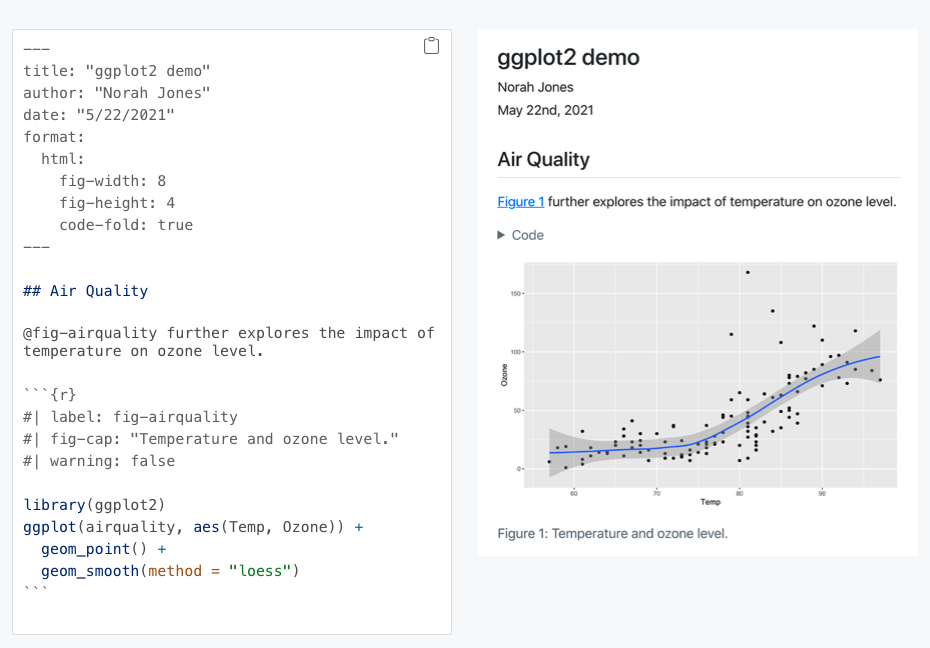
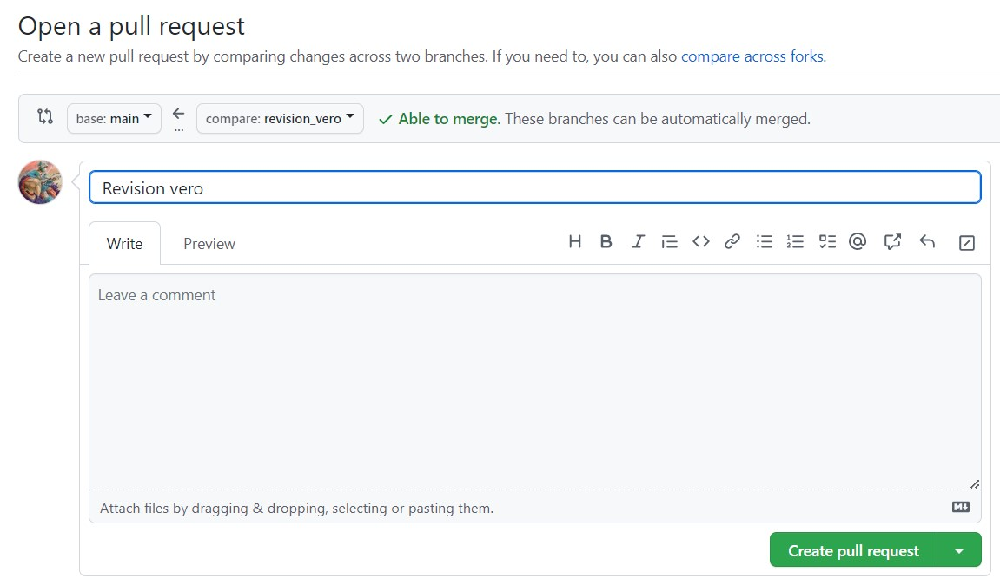
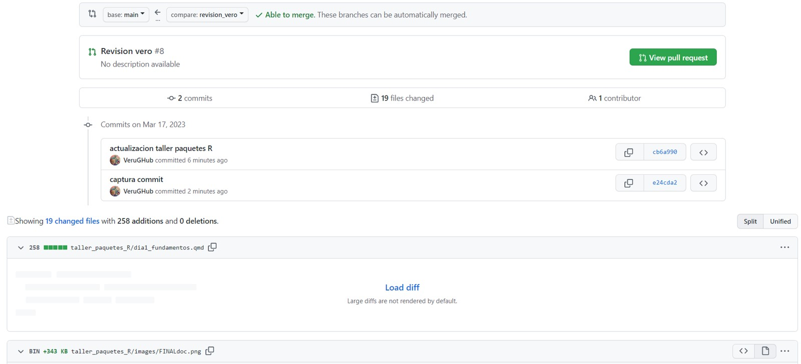

# Improving scientific workflows with reproducible and collaborative
projects in R
Verónica Cruz-Alonso, Elena Quintero, Julen Astigarraga and Guillermo
Fandos
31/05/2025

- [<span class="toc-section-number">0.1</span>
  Introduction](#introduction)
  - [<span class="toc-section-number">0.1.1</span> Workshop
    structure](#workshop-structure)
- [<span class="toc-section-number">0.2</span> Who we are?](#who-we-are)
- [<span class="toc-section-number">0.3</span>
  Introducción](#introducción)
  - [<span class="toc-section-number">0.3.1</span> Git](#git)
  - [<span class="toc-section-number">0.3.2</span> What is
    Git](#what-is-git)
  - [<span class="toc-section-number">0.3.3</span> What is
    GitHub](#what-is-github)
- [<span class="toc-section-number">1</span> Instalation](#instalation)
  - [<span class="toc-section-number">1.0.1</span> 📝**Ejercicio
    1.1**](#ejercicio-11)
- [<span class="toc-section-number">2</span> Repositorios y
  proyectos](#repositorios-y-proyectos)
  - [<span class="toc-section-number">2.0.1</span> 📝**Ejercicio
    1.2**](#ejercicio-12)
  - [<span class="toc-section-number">2.0.2</span> Git
    ignore](#git-ignore)
  - [<span class="toc-section-number">2.0.3</span> 📝**Ejercicio
    1.3**](#ejercicio-13)
  - [<span class="toc-section-number">2.0.4</span> Estructura del
    repositorio de GitHub](#estructura-del-repositorio-de-github)
- [<span class="toc-section-number">3</span> GitHub: la red
  social](#github-la-red-social)
- [<span class="toc-section-number">4</span> Flujo de trabajo en Git y
  GitHub](#flujo-de-trabajo-en-git-y-github)
  - [<span class="toc-section-number">4.1</span> ¿Cómo moverse de una
    zona a otra?](#cómo-moverse-de-una-zona-a-otra)
    - [<span class="toc-section-number">4.1.1</span> 📝**Ejercicio
      1.4**](#ejercicio-14)
  - [<span class="toc-section-number">4.2</span> Navegar por el
    historial](#navegar-por-el-historial)
- [<span class="toc-section-number">5</span> Quarto](#quarto)
  - [<span class="toc-section-number">5.1</span> What is
    Quarto](#what-is-quarto)
  - [<span class="toc-section-number">5.2</span> Why use
    Quarto](#why-use-quarto)
    - [<span class="toc-section-number">5.2.1</span> Brief history:
      Evolution from R
      Markdown](#brief-history-evolution-from-r-markdown)
  - [<span class="toc-section-number">5.3</span> Quarto
    installation](#quarto-installation)
  - [<span class="toc-section-number">5.4</span> Key differences between
    R Markdown and
    Quarto](#key-differences-between-r-markdown-and-quarto)
  - [<span class="toc-section-number">5.5</span> Why use Quarto instead
    of R Markdown?](#why-use-quarto-instead-of-r-markdown)
    - [<span class="toc-section-number">5.5.1</span> What should I do
      with my existing `.Rmd`
      files?](#what-should-i-do-with-my-existing-rmd-files)
  - [<span class="toc-section-number">5.6</span> Getting started with
    Quarto](#getting-started-with-quarto)
  - [<span class="toc-section-number">5.7</span> Quarto
    workflow](#quarto-workflow)
    - [<span class="toc-section-number">5.7.1</span>
      Rendering](#rendering)
  - [<span class="toc-section-number">5.8</span> Anatomy of a Quarto
    document](#quarto-anatomy)
    - [<span class="toc-section-number">5.8.1</span> YAML
      header](#yaml-header)
    - [<span class="toc-section-number">5.8.2</span>
      Markdown](#markdown)
      - [<span class="toc-section-number">6.1.1.2</span> Links](#links)
      - [<span class="toc-section-number">6.1.1.3</span> Lists](#lists)
      - [<span class="toc-section-number">6.1.1.4</span>
        Quotes](#quotes)
      - [<span class="toc-section-number">6.1.1.5</span> Divs and
        spans](#divs-and-spans)
      - [<span class="toc-section-number">6.1.1.6</span>
        Callouts](#callouts)
    - [<span class="toc-section-number">6.1.2</span> Code](#code)
      - [<span class="toc-section-number">6.1.2.1</span> Computations
        (using R)](#computations-using-r)
      - [<span class="toc-section-number">6.1.2.2</span> Anatomy of a
        code chunk](#anatomy-of-a-code-chunk)
      - [<span class="toc-section-number">6.1.2.3</span> Code, who is it
        for?](#code-who-is-it-for)
      - [<span class="toc-section-number">6.1.2.4</span> Code](#code-1)
      - [<span class="toc-section-number">6.1.2.5</span> Showing and
        hiding code with `echo`](#showing-and-hiding-code-with-echo)
    - [<span class="toc-section-number">6.1.3</span> Tables and
      figures](#tables-and-figures)
      - [<span class="toc-section-number">6.1.3.1</span>
        Tables](#tables)
      - [<span class="toc-section-number">6.1.3.2</span> Grid tables:
        Alignment](#grid-tables-alignment)
      - [<span class="toc-section-number">6.1.3.3</span> Grid tables:
        Authoring](#grid-tables-authoring)
      - [<span class="toc-section-number">6.1.3.4</span> Tables from
        code](#tables-from-code)
      - [<span class="toc-section-number">6.1.3.5</span>
        Figures](#figures)
      - [<span class="toc-section-number">6.1.3.6</span>
        Subfigures](#subfigures)
      - [<span class="toc-section-number">6.1.3.7</span> Figure
        divs](#figure-divs)
      - [<span class="toc-section-number">6.1.3.8</span> Finding the
        figures to include](#finding-the-figures-to-include)
      - [<span class="toc-section-number">6.1.3.9</span> Figures from
        code](#figures-from-code)
    - [<span class="toc-section-number">6.1.4</span> Cross
      references](#cross-references)
      - [<span class="toc-section-number">6.1.4.1</span>
        **Figures**](#figures-1)
      - [<span class="toc-section-number">6.1.4.2</span>
        Tables](#tables-1)
      - [<span class="toc-section-number">6.1.4.3</span>
        Equations](#equations)
      - [<span class="toc-section-number">6.1.4.4</span>
        Citations](#citations)
      - [<span class="toc-section-number">6.1.4.5</span> Bibliography
        Files](#bibliography-files)
  - [<span class="toc-section-number">6.2</span> Quarto
    aplicabiltiy](#quarto-aplicabiltiy)
    - [<span class="toc-section-number">6.2.1</span>
      Presentations](#presentations)
    - [<span class="toc-section-number">6.3.1</span> Quarto
      Projects](#quarto-projects)
      - [<span class="toc-section-number">6.3.1.1</span> Project
        Metadata](#project-metadata)
- [<span class="toc-section-number">7</span> Trabajo
  colaborativo](#trabajo-colaborativo)
  - [<span class="toc-section-number">7.0.1</span> 📝Ejercicio
    2.1](#ejercicio-21)
  - [<span class="toc-section-number">7.1</span>
    Ramificación](#ramificación)
    - [<span class="toc-section-number">7.1.1</span> 📝Ejercicio
      2.2](#ejercicio-22)
  - [<span class="toc-section-number">7.2</span> ¿Cómo se unen distintas
    ramas?](#cómo-se-unen-distintas-ramas)
  - [<span class="toc-section-number">7.3</span> Resolución de
    conflictos](#resolución-de-conflictos)
    - [<span class="toc-section-number">7.3.1</span> 📝Ejercicio
      2.3](#ejercicio-23)
    - [<span class="toc-section-number">7.3.2</span> Useful
      Links](#useful-links)


## Introduction

The objectives of this workshop are:

- Effective collaboration, using the version control Git within RStudio.

- Pushing local changes in R to a remote repository.

- Sharing reproducible research with the community through GitHub.

- Meet Quarto and learn the anatomy of a qmd file to authoring Quarto
  documents

- Basic functionalities of Quarto, enabling attendees to create
  good-looking and easily shareable documents.

### Workshop structure

| Bloques                                | Tiempo estimado |
|----------------------------------------|-----------------|
| Introduction to Git and GitHub         | 30 min          |
| Repositories and R projects            | 15 min          |
| Working flow in Git and GitHub         | 45 min          |
| *Break*                                | 30 min          |
| Introduction to Quarto                 | 15 min          |
| Structure of a Quarto document         | 15 min          |
| Crear un documento Quarto              | 40 min          |
| *Break*                                | 10 min          |
| Collaborative work with Git and GitHub | 40 min          |

## Who we are?

Verónica Cruz Alonso (veronica.cral@gmail.com), Elena Quintero
(elenaquintero.qb@gmail.com) and Guillermo Fandos (gfandos@ucm.es)

And you… who are you?

<https://www.menti.com/alefzp9t3t17>

## Introducción

Probably, at some point, you’ve struggled with broken scripts that no
longer work, repeated the same calculations multiple times to update a
manuscript, or dealt with co-authors’ comments while working on
different versions of a document. To help avoid these situations and
other challenges in scientific workflows, this workshop explores the
powerful combination of GitHub and Quarto in RStudio to author
scientific documents. The aim is to foster among researchers the
adoption of open and reproducible practices while improving their
project and data management skills. In particular, we will introduce the
version control system Git, the remote repository GitHub, and the
publishing framework Quarto. Quarto is the next generation of R Markdown
for publishing dynamic documents with multi-lingual programming language
support. These tools are becoming increasingly useful in ecology, as
they allow the creation of reproducible documents —including text and
analyses— while tracking changes in R and facilitating collaboration
among multiple users.

### Git

Git (https://git-scm.com/) and GitHub (https://github.com/) are becoming
increasingly relevant in various fields as data volumes increase and
analyses become more complex. We will learn how Git can be used to
control versioning in projects or files, and how this is especially
useful in collaborative projects using GitHub.

Though there are many manuals available on Git and GitHub, these are
complex tools. Git was created to help software developers collaborate
on large-scale projects, so it can be convoluted, offer multiple
solutions to the same problem, and have a steep learning curve. Still,
Git and GitHub solve many common problems:

- File overwriting

- Endless “final” versions

  

- Working by mistake on a non-final version

- Conflicting copies when two people edit simultaneously

- Edits without change tracking

  

### What is Git

Git is a distributed version control system (like MS Word’s track
changes). It tracks project progress through snapshots. These allow you
to see what changed, who did it, and why — and return to earlier
versions.


Moreover, Git facilitates parallel work among multiple collaborators.
While in other version control systems (e.g., Subversion (SVN,
<https://subversion.apache.org/>) or Concurrent Versions System (CVS,
<http://cvs.nongnu.org/>)) there is a central server and any change made
by a user is synchronized with this server and then with the rest of the
users, Git is a distributed version control system that allows all users
to work on the project simultaneously and take individual “snapshots” of
their work, which can later be merged. Other distributed version control
alternatives comparable to Git include Mercurial
(<https://www.mercurial-scm.org/>) and Bazaar
(<https://bazaar.canonical.com/>), but Git is by far the most widely
used.


Git emerged in 2005, following the breakdown of the relationship between
the community developing Linux and the commercial company behind
BitKeeper (a distributed version control system). At that point,
BitKeeper stopped being free, which led the Linux developer community
(particularly Linus Torvalds, the creator of Linux) to develop their own
version control tool based on their experience using BitKeeper. Some of
the main goals for the new system were speed, simple design, strong
support for non-linear development (branches), a distributed model, and
the ability to handle large datasets. Therefore, the original purpose of
Git was to help teams of software developers collaborate on large-scale
software projects. In this regard, we will see that there are multiple
ways to solve the same problem and that the learning curve can be steep
for non-developers.

### [What is GitHub](https://github.com/)

GitHub is an online hosting server or remote repository for storing
Git-based projects, enabling collaboration between different users or
even with oneself \[@galeano2018; @perez-riverol2016\]. A repository is
a directory where a project is developed, containing all the necessary
files for it. Although there are other remote repositories (e.g.,
GitLab, <https://gitlab.com/>, or Bitbucket, <https://bitbucket.org/>)
with similar functionality, GitHub is currently the most widely used.
GitHub records the development of projects remotely, allows users to
share projects with others, and provides cloud-based security, among
other features.


When working on collaborative projects, the foundation of the
interaction between Git and GitHub is that all collaborators agree that
GitHub hosts the main copy of the project — that is, GitHub serves as
the centralized copy of the otherwise distributed or decentralized
version control system.

# Instalation

### 📝**Ejercicio 1.1**

En este punto es necesario que tengas instalada la versión más reciente
de R (<https://cloud.r-project.org/>), RStudio
(<https://www.rstudio.com/products/rstudio/download/>), Git
(<https://happygitwithr.com/install-git.html>) y una cuenta en GitHub
(<https://github.com/>) creada.

1.  Preséntate a Git ([Chapter 7: Git-Intro](#0))

    ``` r
    #|eval: false    
    # install.packages("usethis")  
    # library(usethis)  
    # use_git_config(user.name = "Monchi", user.email = "monchi@example.org")}
    ```

💡**Debes usar el correo electrónico asociado a tu cuenta de GitHub**

2.  En la terminal, compueba que has instalado Git correctamente:

    `git --version`

    Para ver el usuario utilizado para configurar Git:

    `git config user.name`

    Para ver a qué cuenta de correo está asociado Git:

    `git config user.email`

    Para ver tanto el usuario como el correo asociado:

    `git config --global --list`

⚡¿Qué es el *shell*? El *shell* (o terminal) es un programa en tu
ordenador cuyo trabajo es ejecutar otros programas (ver
<https://happygitwithr.com/shell.html#shell>). RStudio incorpora una
terminal que se puede utilizar para interactuar con Git; sin embargo,
también incorpora una pestaña llamada “Git” que contiene las
funcionalidades básicas de Git y facilita mucho su uso.


💡Para la resolución de problemas durante la instalación recomendamos
mirar aquí: <https://happygitwithr.com/troubleshooting.html>

3.  Genera un PAT (*Personal Access Token*) para HTTPS

    Git puede comunicarse con un servidor remoto utilizando uno de los
    dos protocolos: HTTPS o SSH. Nosotros utilzaremos HTTPS con
    *personal access token* (PAT,
    <https://happygitwithr.com/https-pat.html>).

``` r
#|eval: false

# install.packages("gitcreds")  
# library(gitcreds)  
# create_github_token() # generar un token, elegir temporalidad 
# gitcreds_set() # acceder al Git credential store
```

👀 Conviene describir el propósito del token en el campo *Note*, porque
se pueden tener varios PATs. No podrás volver a ver este token, así que
no cierres ni salgas de la ventana del navegador hasta que almacenes el
PAT localmente. ¡Trata este PAT como una contraseña!

# Repositorios y proyectos

Un repositorio es como un “contenedor” donde desarrollar un proyecto.

Para crear un repositorio en GitHub damos a “*+ New repository*”. Aquí
se indica el nombre, una pequeña descripción, y si quieres que sea
público o privado. Se recomienda iniciar el repositorio con un archivo
“README” (*Initialize this repository with a README*) para recoger
cualquier información esencial para el uso del repositorio (estructura,
descripción más detallada del contenido, etc.).

En RStudio, creamos un nuevo proyecto y lo conectamos al repositorio:
File \> New project \> Version control \> Git \> copiar el URL del
repositorio que hemos creado de GitHub (está en la página principal de
nuestro repositorio, en “*clone or download*”). Seleccionamos el
directorio local donde queremos guardar el proyecto y pulsamos en
“*Create project*”.

Si vamos al directorio local seleccionado, encontraremos la carpeta
conectada a Git y GitHub que hemos creado en nuestro ordenador. Podemos
copiar aquí todos los archivos que nos interesan para el proyecto
(datos, imágenes, etc).

💡Para más información sobre cómo clonar el repositorio en GitHub
(repositorio remoto) en nuestro ordenador (repositorio local) ver
<https://happygitwithr.com/rstudio-git-github.html> para hacerlo desde
RStudio y @galeano2018 para hacerlo mediante la línea de comandos.

💡En caso de querer conectar un antiguo proyecto de RStudio a Git y
GitHub, puedes seguir los pasos que se describen aquí:
<https://happygitwithr.com/existing-github-first.html>.

### 📝**Ejercicio 1.2**

1.  Crea un repositorio en GitHub y conéctalo a un nuevo proyecto de
    RStudio (esto generará un repositorio (carpeta) en tu ordenador en
    la ubicación que hayas especificado). Incluir un archivo
    “*.gitignore”*

2.  Crea un nuevo script de R en el directorio de trabajo (es decir,
    crea un script de R y guárdalo dentro del repositorio que has
    creado)

3.  En RStudio ve a la pestaña Git para ver todos los documentos que han
    sido identificados por Git


### Git ignore

Al crear un repositorio se recomienda crear un archivo “*.gitignore*”.
Este archivo contendrá los nombres o extensiones de los archivos del
proyecto que por defecto no queremos compartir aunque estén en el
repositorio local (p. ej., el archivo “*.Rhistory*” que RStudio crea por
defecto). Es una buena práctica ignorar archivos que no sean útiles para
el resto de colaboradores así como archivos muy pesados (p. ej., una
base de datos resultado de correr un script) para no subirlos y
descargarlos continuamente de GitHub. Para añadir archivos al
*gitignore* se puede utilizar el botón derecho del ratón sobre el
archivo en la pestaña Git de RStudio pero también se puede añadir el
nombre del archivo que desamos ignorar en el archivo “*.gitignore*”
manualmente.

### 📝**Ejercicio 1.3**

1.  Añade el archivo .Rproj de tu proyecto al archivo *.gitignore.*

2.  Crea una carpeta llamada “datos” en tu directorio de trabajo.
    Añadela al *.gitignore* y guarda. ¿Qué ha pasado en la pestaña Git?

### Estructura del repositorio de GitHub

En la página principal del repositorio en GitHub podemos encontrar las
siguientes pestañas:

- **Code**: contenido del proyecto

- **Issues**: foro del proyecto para comentar fallos, tareas pendientes,
  hacer peticiones a los desarrolladores, preguntar dudas, etc. Se
  pueden asignar tareas o preguntas a los miembros del proyecto
  escribiendo “@” antes del nombre del colaborador. Una vez resuelto, el
  issue se cierra (*Close issue*).

- **Pull requests**: veremos más adelante para qué sirve.

- **Actions**: son pequeñas aplicaciones que realizan alguna acción cada
  vez que se sube un commit (p. ej. tests).

- **Projects**: es como una hoja de cálculo con tareas, encargados,
  deadlines, status, etc. que se integra con las incidencias y
  solicitudes de incorporación de cambios para ayudar a planificar las
  tareas y realizar el seguimiento del trabajo.

- **Wiki**: es un espacio para documentar el proyecto (hoja de ruta,
  estado, documentación detallada…).

- **Security**: opciones de seguridad.

- **Insights**: estadísticas del proyecto.

- **Settings**


# GitHub: la red social

GitHub no es sólo un repositorio remoto donde almacenar diferentes
versiones de tu trabajo o desarrollar proyectos colaborativos, si no que
también es una red de encuentro para programadores. Como en otras redes
puedes cotillear perfiles, seguir a ciertas personas, tener seguidores,
guardar proyectos que te gustan…

Con el buscador (🔍) puedes buscar aquellos contenidos que te interesan.
La búsqueda está organizada por categorías (*Repositories, Commits,
Issues, Users*…) lo que facilita encontrar lo que buscas. Para seguir a
un usuario tienes la opción *Follow*. Pulsando *Star*⭐ puedes guardar
un enlace a cualquier repositorio en tu cuenta de GitHub y con *Fork*
estarías guardando una copia con la que puedes interaccionar. Con
*Watch*👁️ puedes hacer un seguimiento de un repositorio. *Download* te
permite guardar una copia de cualquier repositorio público en tu
ordenador.

# Flujo de trabajo en Git y GitHub

Git es capaz de rastrear todos los archivos contenidos en un
repositorio. Para comprender cómo Git registra los cambios y cómo
podemos compartir dichos cambios con nuestros colaboradores es
importante entender cómo se estructura Git y cómo se sincroniza con
GitHub. Hay cuatro “zonas” de trabajo:

1.  **Directorio de trabajo (*working directory*):** es donde se está
    trabajando. Esta zona se sincroniza con los archivos locales del
    ordenador.

2.  **Área de preparación (*staging area* o *Index*):** es la zona
    intermedia entre el directorio de trabajo y el repositorio local de
    Git. Es la zona de borradores. El usuario debe seleccionar los
    archivos que se van a registrar en la siguiente “captura” de Git.

3.  **Repositorio local (*local repository* o *HEAD*):** es donde se
    registran todos los cambios capturados por Git en tu ordenador.

4.  **Repositorio remoto (*remote repository*):** es donde se registran
    todos los cambios capturados por Git en la nube (GitHub).


## ¿Cómo moverse de una zona a otra?

Se puede hacer mediante línea de comandos en la terminal y también
mediante la pestaña integrada en RStudio, pero el proceso es el mismo.


Al principio todos los cambios realizados aparecen en amarillo porque
Git no sabe que hacer con ellos. Estamos en el directorio de trabajo y
puede que no nos interese guardar todos los cambios para el futuro.

Para añadir un cambio del directorio de trabajo al área de preparación
hay que utilizar `git add` (en la pestaña Git de RStudio se hace
seleccionando el archivo). Este comando indica a Git que se quieren
incluir las actualizaciones de algún archivo en la próxima “captura” del
proyecto y que Git las registre. Sin embargo, `git add` no afecta al
repositorio local.

- `git add <nombre de archivo>`: añade una actualización de algún
  archivo del directorio de trabajo al área de preparación.

Para registrar los cambios que nos interesen hay que utilizar
`git commit` (en la pestaña Git de RStudio se hace clickando el botón
“*Commit*”). Al ejecutar `git commit` se hace una “captura” del estado
del proyecto. Junto con el *commit* se añade un mensaje con una pequeña
explicación de los cambios realizados y por qué (p. ej. “incluyo las
referencias formateadas”). Cada `git commit` tiene un SHA (*Secure Hash
Algorithm*) que es un código alfanumérico que identifica inequívocamente
ese *commit* (p. ej. 1d21fc3c33cxxc4aeb7823400b9c7c6bc2802be1). Parece
difícil de entender, pero no te preocupes, sólo tienes que recordar los
siete primeros dígitos 1d21fc3 😮(es broma). Con el SHA siempre se
pueden ver los cambios que se hicieron en ese *commit* y volver a esa
versión fácilmente.

- `git commit -m "mensaje corto y descriptivo"`


💡Usar `git commit` es para el proyecto como usar anclajes cuando
estamos escalando una pared de roca. Desarrollar un script sin commits
es como escalar sin asegurarse: puedes avanzar mucho más rápido a corto
plazo, pero a largo plazo las probabilidades de fallo catastrófico son
altas. Por otro lado, hacer muchos commits va a ralentizar tu progreso.
Lo mejor: usar más commits cuando estás en un territorio incierto o
peligroso.


Por último, `git push` permite subir los cambios que hemos hecho a
GitHub y quedarán visibles para nuestros colaboradores (en la pestaña
Git de RStudio se hace clickando el botón “*Push*”). Básicamente,
`git commit` registra los cambios en el repositorio local y `git push`
actualiza el repositorio remoto con los cambios y archivos asociados.

Cuando se retoma un proyecto tras horas, días o incluso meses, con
`git pull` se descargan todas las actualizaciones que haya en GitHub
(nuestras o de nuestros colaboradores), que se fusionarán (*merge*) con
el último *commit* en nuestro repositorio local (en la pestaña Git de
RStudio se hace clickando el botón “*Pull*”).


Además de los botones principales anteriormente descritos, en la pestaña
Git de RStudio podemos observar el botón “*Diff*” que muestra los
cambios que se han hecho a cada archivo desde el último commit y las
ramas (que lo explicaremos más abajo). Clickando con el botón derecho
del ratón podemos abrir los archivos que han sido modificados mediante
“*Open file*” y con el botón “*Revert*” volvemos al estado del último
commit (⚠️cuidado con esto porque te borrará los cambios realizados en
tu directorio de trabajo).

### 📝**Ejercicio 1.4**

En el proyecto generado en el Ejercicio 1.2, guardad y subid los cambios
realizados a GitHub (`git add` + `git commit` + `git push`)

💡`git status`: muestra la rama en la que estamos y los cambios hechos y
añadidos desde el último commit.

En el repositorio remoto de GitHub, en la pestaña *Code* podemos
observar el contenido de nuestro proyecto, incluyendo cada *commit*
realizado:


## Navegar por el historial

El historial de un repositorio (*🕘XX commits*) contiene una lista de
enlaces a todos los commits que se han realizado en cualquiera de las
ramas. Dentro de cada *commit* se pueden ver los archivos añadidos o
borrados en esa “captura” y las líneas de código añadidas (en verde) o
borradas (en rojo) en cada archivo modificado. Además, en el historial,
se pueden añadir comentarios en líneas concretas de código o comentarios
generales al *commit* entero.

En GitHub también se puede acceder a la historia de commits de cada
archivo en concreto (*History*) y al autor de cada parte del código
(*Blame*).

El historial del proyecto y de los archivos también es accesible a
través de RStudio (🕒).

💡Más información sobre como navegar en el pasado del proyecto aquí:
<https://happygitwithr.com/time-travel-see-past.html>


💡En los *issues* se puede referenciar a una línea concreta de código de
un estado concreto del proyecto entrando en el archivo en la pestaña
*Code* y clickando en el número de línea que se quiere comentar, o a un
*commit* entero copiando el SHA.

💡Si quiero volver atrás en el tiempo o si hago un cambio que no quiero
¿cómo lo puedo resolver? Hay múltiples opciones pero
[aquí](https://github.com/DatSciR/intro_git-github/blob/main/centra/dia3_comandos.md)(en
la sección de “La he liado ¿cómo deshago los cambios?”) detallamos tres:
*restore*, *reset* y *revert*.

# Quarto

This part of the workshop is designed to provide an introduction to
**Quarto**, a modern, open-source scientific and technical publishing
system. Participants will learn the basics of creating dynamic
documents, integrating code and text, and producing reproducible reports
in multiple formats.

In addition to learning how to use Quarto, this section will also cover
some essential first steps for practicing **reproducible research**,
including the importance of literate programming, documenting analysis
workflows, and properly licensing and sharing materials.

Some of the materials and ideas included here are inspired by openly
available resources shared under Creative Commons licenses.

Specifically, parts of this course draw inspiration from:

- Tom Mock - [*Get started with Quarto
  workshop*](https://jthomasmock.github.io/quarto-2hr-webinar/)
- **Casajus et al. (2021)**: *Data Toolbox for Reproducible Research in
  Computational Ecology*. [Zenodo
  DOI](https://doi.org/10.5281/zenodo.4262978)
- The *“Reproducible publishing with Quarto”* short course by [Mine
  Çetinkaya-Rundel](https://mine-cetinkaya-rundel.github.io/quarto-jsm24/)
  at JSM 2024.

## What is Quarto

Quarto is a dynamic document publishing system that allows you to create
reports, books, manuscripts, presentations, and websites. It is a very
versatile tool that supports multiple programming languages (R, Python,
Julia, etc.) and output formats (HTML, PDF, Word, etc.). Quarto is based
on R Markdown but offers a number of improvements and new features that
make it more powerful and flexible. It can be used in different
workspaces (e.g., RStudio, Jupyter) and has a visual editing interface
in RStudio.


## Why use Quarto

Quarto is an ideal tool for creating *reproducible scientific documents*
and for *collaborative work*. It allows you to integrate code, text, and
results into a **single document**, making it easier to produce
scientific reports and publications. In addition, Quarto is **compatible
with Git and GitHub**, enabling version control and efficient
collaboration with others.


### Brief history: Evolution from R Markdown

Quarto (<https://quarto.org/>) began as an open-source project in 2021
by Posit Software (formerly RStudio) and is based on over 10 years of
experience with R Markdown. Quarto functions as an open-source
scientific and technical publishing system built on top of **Pandoc**
(<https://pandoc.org>). It converts plain text formats (e.g., .md, .Rmd)
or mixed formats (e.g., .ipynb) into static reports and more. It can
interweave narrative text and code to produce elegantly formatted
results in the form of documents, web pages, blog posts, books, and so
on.

The Quarto file extension is .qmd, and it uses Lua filters, which is
Pandoc’s extension language
(<https://quarto.org/docs/extensions/lua.html>). To do this, Quarto uses
an engine like knitr to execute the code and generate a temporary .md
output. The .md file is then processed by Pandoc and Quarto’s Lua
filters, plus Bootstrap CSS for HTML or LaTeX for PDF. Lua filters
written by R/Python/Julia developers should be interchangeable between
formats — they are typically not language-specific.


## Quarto installation

Quarto comes pre-installed with the latest versions of RStudio (v2022.07
and later). However, if you want to use it in other interfaces as well,
you can follow the installation instructions on the official website:
<https://quarto.org/docs/get-started/>.

To use Quarto from within R, you need to have the rmarkdown package
installed:

``` r
#|eval: false
install.packages("rmarkdown")
```

You can also verify the Quarto installation and its location with the
following command:

``` r
#|eval: false
quarto::quarto_path()
```

## Key differences between R Markdown and Quarto

The main difference between Quarto and R Markdown is that Quarto was
designed for collaboration across multiple communities (i.e., not just R
or Python users) and uses a shared syntax and format across different
languages. Additionally, as more capabilities were added to R Markdown
through external R packages, the syntax for basic tasks became
inconsistent. Some differences between Quarto and R Markdown in terms of
code are:Diferencias clave entre R Markdown y Quarto

- **YAML structure -** both follow `key: value` but Quarto is more
  flexible and nested

- **code chunk header syntax -** `#|` syntaxis *(hash pipe)*. This is
  the preferred syntax in Quarto, although it is compatible with the
  older R Markdown syntax. The hash pipe adds more consistency across
  engines (Jupyter, knitr) and gives us more control over the order and
  spacing of chunk options (it’s not limited to a single line of
  options). Each \#\| line is interpreted as a key: value pair.

Enhanced tab completion: start typing a word and press Tab to
auto-complete, or use Ctrl + Space to view all available options.

``` r
2 * 2
```

    [1] 4

## Why use Quarto instead of R Markdown?

- Shared syntax (choose your preferred editor and language)
- Greater versatility
- Better features and further improvements in the future (R Markdown is
  still maintained, but most new features will be incorporated into
  Quarto)

### What should I do with my existing `.Rmd` files?

No problem! Most existing `.Rmd` or .`ipynb` files can be converted
as-is using Quarto. To do this from the terminal command line, type:

`quarto render file.Rmd --to html`

Additionally, there are various options for converting `.Rmd` files to
`.qmd`:

1.  Rename `.Rmd` to `.qmd` (this will always use Quarto for rendering)
2.  Update the YAML output: change html_document to format: html
3.  Use the R function:
    `knitr::convert_chunk_header("file.Rmd", "file.qmd")`

You don’t have to convert the syntax of all your old documents. Quarto
is backward compatible with R Markdown.

## Getting started with Quarto



<div class="your-turn" style="background: lightblue">

**📝 Your turn**

### Creating a Quarto document

To create a Quarto document in RStudio, follow these steps:

1.  In RStudio, go to File → New File → Quarto Document

2.  A window will open where you can choose the type of document you
    want to create (for example, a report, a presentation, etc.).

3.  Select the type you want and click OK. A file with the extension
    `.qmd` (Quarto Markdown) will be created, containing a basic
    document structure.

</div>

## Quarto workflow

Rendering a Quarto file in RStudio via the Render button calls
`quarto render` in a **background job**, preventing Quarto rendering
from cluttering up the R console, and gives you and easy way to stop:

### Rendering

1.  Option 1: In RStudio as a background job, and preview the output.

2.  Option 2: In the Terminal via `quarto render`:

``` bash
quarto render document.qmd # defaults to html
quarto render document.qmd --to pdf
quarto render document.qmd --to docx
```

3.  Option 3: In the R console, via the `quarto` R package:

``` r
library(quarto)

quarto_render("document.qmd") # defaults to html
quarto_render("document.qmd", output_format = "pdf")
```

<div class="your-turn" style="background: lightblue">

**📝 Your turn**

- Open `hello-penguins.qmd`.
- Render the document.
- Update your name and re-render.
- Inspect components of the document and make one more update and
  re-render.
- Compare behavior of rendering with
  - RStudio \> Render,
  - using the CLI with `quarto render`, and
  - in the R console via `quarto::quarto_render()`. You need
    library(quarto)
- If you’re an RStudio user, brainstorm why you might still want to know
  about the other two ways of rendering Quarto documents.

</div>

## Anatomy of a Quarto document

It contains three types of content:

1.  Metadata: YAML header surrounded by —s.

2.  Markdown. Text mixed with simple text formatting like \## heading,
    **bolds** and *italics*.

3.  Code: Executed via `knitr` or `jupyter`

**Weave it all together**, and you have beautiful, powerful, and useful
outputs!

``` markdown
#| eval: false
#| echo: true
#| code-line-numbers: "|1-6|8-15|17-29|"

---
title: "Hello, Penguins"
format: html
execute:
  echo: false
---

## Meet the penguins

The __penguins__ data contains size measurements for 
penguins from three islands in the Palmer Archipelago, 
Antarctica.

The _three_ species of penguins have quite distinct 
distributions of physical dimensions (@fig-penguins).

#| label: fig-penguins
#| fig-cap: "Dimensions of penguins across three species."
#| warning: false
library(tidyverse, quietly = TRUE)
library(palmerpenguins)
penguins |>
  ggplot(aes(x = flipper_length_mm, y = bill_length_mm)) +
  geom_point(aes(color = species)) +
  scale_color_manual(
    values = c("darkorange", "purple", "cyan4")) +
  theme_minimal()
```


### YAML header

The YAML header is demarcated by three dashes (—) on either end. It
informs on some documents meta-data and sets up many generic and output
format specific options. The YAML consists of `key: values` pairs. The
**colon** and **space** are **required**.

YAML header can be very simple

“Yet Another Markup Language” or “YAML Ain’t Markup Language” is used to
provide document level metadata.

``` bash
---
title: "Hello, Penguins"
format: html
execute:
  echo: false
---
```

The YAML header is demarcated by three dashes (—) on either end. It
informs on some documents meta-data and sets up many generic and output
format specific options. The YAML consists of `key: values` pairs. The
**colon** and **space** are **required**.

As well as much more elaborated, e.g. when [scholarly
writing](https://quarto.org/docs/authoring/front-matter.html)

``` bash
---
title: "Toward a Unified Theory of High-Energy Metaphysics: Silly String Theory"
date: 2008-02-29
author:
  - name: Josiah Carberry
    id: jc
    orcid: 0000-0002-1825-0097
    email: josiah@psychoceramics.org
    affiliation: 
      - name: Brown University
        city: Providence
        state: RI
        url: www.brown.edu
abstract: > 
  The characteristic theme of the works of Stone is 
  the bridge between culture and society. ...
keywords:
  - Metaphysics
  - String Theory
license: "CC BY"
copyright: 
  holder: Josiah Carberry
  year: 2008
citation: 
  container-title: Journal of Psychoceramics
  volume: 1
  issue: 1
  doi: 10.5555/12345678
funding: "The author received no specific funding for this work."
---
```

YAML headers can operate at the document level to manage execute
options:

``` bash
---
title: "Hello, Penguins"
subtitle: "Penguins are vertebrates"
execute:
  echo: false
  eval: true
  warning: false
  error: true
---
```

Or can set format specific options (here for html output):

``` bash
---
title: "Hello, Penguins"
subtitle: "Penguins are vertebrates"
format:
  html:
    theme: united
    code-fold: true
    code-summary: "see the code"
execute:
  echo: true
  eval: true
  warning: false
  error: true
---
```

All format specific options are listed in the [`Quarto` official
documentation](https://quarto.org/docs/reference/).

**YAML Intelligence**: YAML code completion is available for project
files, YAML front matter, and executable cell options:


If you have incorrect YAML it will also be highlighted when documents
are saved:


``` yaml
---
key: value
---
```

##### Output options

``` yaml
---
format: something
---
```

``` yaml
---
format: html
---
```

``` yaml
---
format: pdf
---
```

``` yaml
---
format: revealjs
---
```

Indentation matters!

``` yaml
---
format: 
  html:
    toc: true
    code-fold: true
---
```

##### YAML validation

- Invalid: No space after `:`

``` yaml
---
format:html
---
```

- Invalid: Read as missing

``` yaml
---
format:
html
---
```

- Valid, but needs next object

``` yaml
---
format: 
  html:
---
```

There are multiple ways of formatting valid YAML:

- Valid: There’s a space after `:`

``` yaml
format: html
```

- Valid: There are 2 spaces a new line and no trailing `:`

``` yaml
format:
  html
```

- Valid: `format: html` with selections made with proper indentation

``` yaml
format: 
  html:
    toc: true
```

##### Why YAML?

To avoid manually typing out all the options, every time when rendering
via the CLI:

``` bash
quarto render document.qmd --to html
```

``` bash
quarto render document.qmd --to html -M code-fold:true
```

``` bash
quarto render document.qmd --to html -M code-fold:true -P alpha:0.2 -P ratio:0.3
```

<div class="your-turn" style="background: lightblue">

**📝 Your turn**

Open `hello-penguins.qmd` in RStudio.

- Try <kbd>`Ctrl + space`</kbd> to see the available YAML options.
- Try out the tab-completion of any options you remember.
- You can use the [HTML
  reference](https://quarto.org/docs/reference/formats/html.html) as
  needed.

</div>

##### List of valid YAML fields

- Many YAML fields are common across various outputs

- But also each output type has its own set of valid YAML fields and
  options

- Definitive list:
  [quarto.org/docs/reference/formats/html](https://quarto.org/docs/reference/formats/html.html)

### Markdown

The markdown you know from R Markdown will work in Quarto.

Quarto is based on Pandoc and uses its variation of markdown as its
underlying document syntax. Pandoc markdown is an extended and slightly
revised version of John Gruber’s
[Markdown](https://daringfireball.net/projects/markdown/) syntax.

Markdown is a plain text format that is designed to be easy to write,
and, even more importantly, easy to read:

> A Markdown-formatted document should be publishable as-is, as plain
> text, without looking like it’s been marked up with tags or formatting
> instructions. – John Gruber

##### Text Formatting

<table>
<colgroup>
<col style="width: 50%" />
<col style="width: 50%" />
</colgroup>
<thead>
<tr class="header">
<th>Markdown Syntax</th>
<th>Output</th>
</tr>
</thead>
<tbody>
<tr class="odd">
<td><pre><code>*italics* and **bold**</code></pre></td>
<td><em>italics</em> and <strong>bold</strong></td>
</tr>
<tr class="even">
<td><pre><code>superscript^2^ / subscript~2~</code></pre></td>
<td>superscript<sup>2</sup> / subscript<sub>2</sub></td>
</tr>
<tr class="odd">
<td><pre><code>~~strikethrough~~</code></pre></td>
<td><del>strikethrough</del></td>
</tr>
<tr class="even">
<td><pre><code>`verbatim code`</code></pre></td>
<td><code>verbatim code</code></td>
</tr>
</tbody>
</table>

##### Headings

<table>
<colgroup>
<col style="width: 50%" />
<col style="width: 50%" />
</colgroup>
<thead>
<tr class="header">
<th>Markdown Syntax</th>
<th>Output</th>
</tr>
</thead>
<tbody>
<tr class="odd">
<td><pre><code># Header 1</code></pre></td>
<td><h1 id="header-1" data-number="6"><span
class="header-section-number">6</span> Header 1</h1></td>
</tr>
<tr class="even">
<td><pre><code>## Header 2</code></pre></td>
<td><h2 id="header-2" data-number="6.1"><span
class="header-section-number">6.1</span> Header 2</h2></td>
</tr>
<tr class="odd">
<td><pre><code>### Header 3</code></pre></td>
<td><h3 id="header-3" data-number="6.1.1"><span
class="header-section-number">6.1.1</span> Header 3</h3></td>
</tr>
<tr class="even">
<td><pre><code>#### Header 4</code></pre></td>
<td><h4 id="header-4" data-number="6.1.1.1"><span
class="header-section-number">6.1.1.1</span> Header 4</h4></td>
</tr>
<tr class="odd">
<td><pre><code>##### Header 5</code></pre></td>
<td><h5 id="header-5" data-number="6.1.1.1.1"><span
class="header-section-number">6.1.1.1.1</span> Header 5</h5></td>
</tr>
<tr class="even">
<td><pre><code>###### Header 6</code></pre></td>
<td><h6 id="header-6" data-number="6.1.1.1.1.1"><span
class="header-section-number">6.1.1.1.1.1</span> Header 6</h6></td>
</tr>
</tbody>
</table>

#### Links

There are several types of “links” or hyperlinks.

**Markdown**

``` markdown
You can embed [named hyperlinks](https://quarto.org/),
direct urls like https://quarto.org/, and links to 
[other places](#quarto-anatomy) in the document. 

The syntax is similar for embedding an
inline image: .
```

**Output**

You can embed [named hyperlinks](https://quarto.org/), direct urls like
<https://quarto.org/>, and links to [other places](#quarto-anatomy) in
the document.

The syntax is similar for embedding an inline image:
.

#### Lists

Unordered list:

<div class="columns">

<div class="column" width="50%">

**Markdown:**

``` markdown
-   unordered list         
    -   sub-item 1         
    -   sub-item 1         
        -   sub-sub-item 1 
```

</div>

<div class="column fragment" width="50%" fragment-index="1">

**Output**

- unordered list
  - sub-item 1
  - sub-item 1
    - sub-sub-item 1

</div>

</div>

Ordered list:

<div class="columns">

<div class="column" width="50%">

**Markdown:**

``` markdown
1. ordered list            
2. item 2                  
    i. sub-item 1          
         A.  sub-sub-item 1
```

</div>

<div class="column fragment" width="50%" fragment-index="2">

**Output**

1.  ordered list
2.  item 2
    1.  sub-item 1
        1.  sub-sub-item 1

</div>

</div>

#### Quotes

**Markdown:**

``` markdown
> Let us change our traditional attitude to the construction of programs: Instead of imagining that our main task is to instruct a computer what to do, let us concentrate rather on explaining to human beings what we want a computer to do. 
> - Donald Knuth, Literate Programming
```

**Output:**

> Let us change our traditional attitude to the construction of
> programs: Instead of imagining that our main task is to instruct a
> computer what to do, let us concentrate rather on explaining to human
> beings what we want a computer to do. - Donald Knuth, Literate
> Programming

<div class="aside">

“Literate Programming”, The Computer Journal 27 (1984), p. 97.
(Reprinted in Literate Programming, 1992, p. 99.) Literate Programming
(1984)

</div>

Rstudio’s visual editor toolbar includes buttons for the most commonly
used formatting commands:


Additional commands are available on the **Format**, **Insert**, and
**Table** menus:

|                                      Format                                       |                                      Insert                                       |                                      Table                                       |
|:---------------------------------------------------------------------------------:|:---------------------------------------------------------------------------------:|:--------------------------------------------------------------------------------:|
|                                                                       |                                                                       |                                                                      |

Rstudio’s visual editor toolbar includes buttons for the most commonly
used formatting commands:


Check out the `Quarto` official documentation to learn more about visual
markdown editing:

- [Technical
  Writing](https://quarto.org/docs/visual-editor/technical.html) covers
  features commonly used in scientific and technical writing, including
  citations, cross-references, footnotes, equations, embedded code, and
  LaTeX.

- [Content Editing](https://quarto.org/docs/visual-editor/content.html)
  provides more depth on visual editor support for tables, lists, pandoc
  attributes, CSS styles, comments, symbols/emojis, etc.

- [Shortcuts &
  Options](https://quarto.org/docs/visual-editor/options.html) documents
  the two types of shortcuts you can use with the editor: standard
  keyboard shortcuts and markdown shortcuts and describes various
  options for configuring the editor.

- [Markdown Output](https://quarto.org/docs/visual-editor/markdown.html)
  describes how the visual editor parses and writes markdown and
  describes various ways you can customize this.

A complete guide to `Quarto` authoring is available in the [official
documentation](https://quarto.org/docs/authoring).

<div class="your-turn" style="background: lightblue">

**📝 Your turn**

- Skim the previous content. Share one new that’s new to you with your
  neighbor.
- Open `markdown-syntax.qmd` in RStudio.
- Follow the instructions in the document.

</div>

#### Divs and spans

Pandoc, and therefore Quarto, can parse [“fenced div
blocks”](https://pandoc.org/MANUAL.html#divs-and-spans):

- You can think of a `:::` **div** as a HTML `<div>` but it can also
  apply in specific situations to content in PDF:

``` markdown
::: {style="border-left:10px solid red"}
This content can be styled with a border
:::
```

<div style="border-left:10px solid red">

This content can be styled with a border

</div>

. . .

- `[text]{.class}` **span**s can be thought of a
  `<span .class>Text</span>` but again are a bit more transferable if
  using Pandoc/Quarto native attributes.

``` markdown
This is text with [special]{style="color:red;"} formatting.
```

This is text with <span style="color:red;">special</span> formatting.

##### Divs with pre-defined classes

These can often apply between formats:

**Single class**: Two equivalent syntaxes

<div class="columns">

<div class="column">

No `{`, and no `.`:

``` markdown
::: unnumbered
Text
:::
```

</div>

<div class="column">

`{` and `.`:

``` markdown
::: {.unnumbered}
Text
:::
```

</div>

</div>

**Multiple classes**: use `{` and `.`, separate with spaces

``` markdown
::: {.unnumbered .unlisted}
Text
:::
```

#### Callouts

    ::: callout-note
    Note that there are five types of callouts, including: 
    `note`, `tip`, `warning`, `caution`, and `important`.
    :::

Note that there are five types of callouts, including: `note`, `tip`,
`warning`, `caution`, and `important`.

##### More callouts

> [!WARNING]
>
> Callouts provide a simple way to attract attention, for example, to
> this warning.

> [!IMPORTANT]
>
> Danger, callouts will really improve your writing.

> [!CAUTION]
>
> Here is something under construction.

> [!TIP]
>
> ### Caption
>
> Tip with caption.

<div class="your-turn">

<div style="background: lightblue">

**📝 Your turn**

</div>

Open `callout-boxes.qmd` and render the document.

- Using the visual editor, change the type of the first callouts box and
  then re-render. Also play with the options to change its appearance.

- Add a caption to the second callout box.

- Make the third callout box collapsible. Then, switch over to the
  source editor to inspect the markdown code.

</div>

##### Footnotes

Pandoc supports numbering and formatting footnotes.

###### Inline footnotes

    Here is an inline note.^[Inlines notes are easier to write,
    since you don't have to pick an identifier and move down to
    type the note.]

Here is an inline note.[^1]

    Here is an footnore reference[^1]

    [^1]: This can be easy in some situations when you have a really long note or
    don't want to inline complex outputs.

Here is an footnote reference[^2]

Notice in both situations that the footnote is placed at the bottom of
the page in presentations, whereas in a document it would be hoverable
or at the end of the document.

### Code

#### Computations (using R)

Code blocks that use braces around the language name
(e.g. ```` ```{r} ````) are executable, and will be run by Quarto during
render. Chunk options (optional), in YAML style, identified by \#\| at
the beginning of the line are used to set chunk-specific meta-data and
behaviours.

Going back to the penguins example:

``` bash
---
title: "Hello, Penguins"
format: html
execute:
  echo: false
---

## Meet the penguins

The __penguins__ data contains size measurements for 
penguins from three islands in the Palmer Archipelago, 
Antarctica.

The _three_ species of penguins have quite distinct 
distributions of physical dimensions (@fig-penguins).

#| label: fig-penguins
#| fig-cap: "Dimensions of penguins across three species."
#| warning: false
library(tidyverse, quietly = TRUE)
library(palmerpenguins)
penguins |>
  ggplot(aes(x = flipper_length_mm, y = bill_length_mm)) +
  geom_point(aes(color = species)) +
  scale_color_manual(
    values = c("darkorange", "purple", "cyan4")) +
  theme_minimal()
```

#### Anatomy of a code chunk

<div class="columns">

<div class="column" width="50%">

```` markdown
```{r}
#| label: penguin-stuff
#| message: false
#| output: false

library(tidyverse)
library(palmerpenguins)

penguins |> 
  distinct(species)
```
````

</div>

<div class="column fragment" width="50%">

- Has 3x backticks on each end
- Engine (`r`) is indicated between curly braces `{r}`
- Options stated with the `#|` (hashpipe): `#| option1: value`

</div>

</div>

Available code cell options:
<https://quarto.org/docs/reference/cells/cells-knitr.html>

#### Code, who is it for?

- The way you display code is very different for different contexts.
- In a teaching scenario like today, I *really* want to display code.
- In a business, you may want to have a data-science facing output which
  displays the source code AND a stakeholder-facing output which hides
  the code.

#### Code

If you simply want code formatting but don’t want to execute the code:

Add `eval: false` as chunk option

```` markdown
```{r}
#| eval: false

head(penguins)
```
````

#### Showing and hiding code with `echo`

- The `echo` option shows the code when set to `true` and hides it when
  set to `false`.

- If you want to both execute the code and return the full code
  including backticks (like in a teaching scenario) `echo: fenced` is
  your friend!

<div class="columns">

<div class="column">

Source:

```` markdown
```{{r}}
#| echo: fenced

1 + 1
```
````

</div>

<div class="column">

Output:

```` markdown
```{r}
1 + 1
```
````

    [1] 2

</div>

</div>

In addition to rendering the complete document to view the results of
code chunks you can also run each code chunk interactively in the
`RStudio` editor by clicking the icon or keyboard shortcut
(`Cmd/Ctrl + Shift + Enter`).

`RStudio` executes the code and displays the results either inline
within your file or in the Console, depending on your preference.

### Tables and figures

- In reproducible reports and manuscripts, the most commonly included
  code outputs are **tables** and **figures**.

- So they get their own special sections!

#### Tables

**Markdown:**

``` markdown
| Right | Left | Default | Center |
|------:|:-----|---------|:------:|
|   12  |  12  |    12   |    12  |
|  123  |  123 |   123   |   123  |
|    1  |    1 |     1   |     1  |
```

**Output:**

| Right | Left | Default | Center |
|------:|:-----|---------|:------:|
|    12 | 12   | 12      |   12   |
|   123 | 123  | 123     |  123   |
|     1 | 1    | 1       |   1    |

Grid tables

**Markdown:**

``` markdown
+----------------------+------------+-------------------------------+
| Variable              | Valor      | Ventajas                      |
+======================+============+===============================+
| Café_consumido        | 12 tazas   | - mantiene vivo al investigador  |
|                      |            | - mejora los plots            |
+----------------------+------------+-------------------------------+
| R_script_rotura       | 3 veces    | - fomenta trabajo en equipo    |
|                      |            | - excusa para otra ronda       |
+----------------------+------------+-------------------------------+
| GPS_marmotas          | 7 activos  | - datos en tiempo real         |
|                      |            | - posible reality show         |
+----------------------+------------+-------------------------------+
| Bicho_raro_observado  | 2          | - oportunidad de nuevo paper   |
|                      |            | - nombre gracioso asegurado    |
+----------------------+------------+-------------------------------+


: Sample grid table.
```

**Output:**

| Variable             | Valor     | Ventajas                                                       |
|:---------------------|:----------|:---------------------------------------------------------------|
| Café_consumido       | 12 tazas  | \- mantiene vivo al investigador <br> - mejora los plots       |
| R_script_rotura      | 3 veces   | \- fomenta trabajo en equipo <br> - excusa para otra ronda     |
| GPS_marmotas         | 7 activos | \- datos en tiempo real <br> - posible reality show            |
| Bicho_raro_observado | 2         | \- oportunidad de nuevo paper <br> - nombre gracioso asegurado |

#### Grid tables: Alignment

- Alignments can be specified as with pipe tables, by putting colons at
  the boundaries of the separator line after the header:

<!-- -->

    +---------------+---------------+--------------------+
    | Right         | Left          | Centered           |
    +==============:+:==============+:==================:+
    | Bananas       | $1.34         | built-in wrapper   |
    +---------------+---------------+--------------------+

. . .

- For headerless tables, the colons go on the top line instead:

<!-- -->

    +--------------:+:--------------+:------------------:+
    | Right         | Left          | Centered           |
    +---------------+---------------+--------------------+

#### Grid tables: Authoring

- Note that grid tables are quite awkward to write with a plain text
  editor because unlike pipe tables, the column indicators must align.

- The Visual Editor can assist in making these tables!

#### Tables from code

The **knitr** package can turn data frames into tables with
`knitr::kable()`:

``` r
library(knitr)
library(palmerpenguins)

head(penguins) |> 
  kable()
```

| species | island    | bill_length_mm | bill_depth_mm | flipper_length_mm | body_mass_g | sex    | year |
|:--------|:----------|---------------:|--------------:|------------------:|------------:|:-------|-----:|
| Adelie  | Torgersen |           39.1 |          18.7 |               181 |        3750 | male   | 2007 |
| Adelie  | Torgersen |           39.5 |          17.4 |               186 |        3800 | female | 2007 |
| Adelie  | Torgersen |           40.3 |          18.0 |               195 |        3250 | female | 2007 |
| Adelie  | Torgersen |             NA |            NA |                NA |          NA | NA     | 2007 |
| Adelie  | Torgersen |           36.7 |          19.3 |               193 |        3450 | female | 2007 |
| Adelie  | Torgersen |           39.3 |          20.6 |               190 |        3650 | male   | 2007 |

If you want fancier tables, try the **gt** package and [all that it
offers](https://gt.rstudio.com/)!

``` r
library(gt)

head(penguins) |> 
  gt() |>
  tab_style(
    style = list(
      cell_fill(color = "pink"),
      cell_text(style = "italic")
      ),
    locations = cells_body(
      columns = bill_length_mm,
      rows = bill_length_mm > 40
    )
  )
```

<div>

<div id="shttfpwvap" style="padding-left:0px;padding-right:0px;padding-top:10px;padding-bottom:10px;overflow-x:auto;overflow-y:auto;width:auto;height:auto;">
<style>#shttfpwvap table {
  font-family: system-ui, 'Segoe UI', Roboto, Helvetica, Arial, sans-serif, 'Apple Color Emoji', 'Segoe UI Emoji', 'Segoe UI Symbol', 'Noto Color Emoji';
  -webkit-font-smoothing: antialiased;
  -moz-osx-font-smoothing: grayscale;
}
&#10;#shttfpwvap thead, #shttfpwvap tbody, #shttfpwvap tfoot, #shttfpwvap tr, #shttfpwvap td, #shttfpwvap th {
  border-style: none;
}
&#10;#shttfpwvap p {
  margin: 0;
  padding: 0;
}
&#10;#shttfpwvap .gt_table {
  display: table;
  border-collapse: collapse;
  line-height: normal;
  margin-left: auto;
  margin-right: auto;
  color: #333333;
  font-size: 16px;
  font-weight: normal;
  font-style: normal;
  background-color: #FFFFFF;
  width: auto;
  border-top-style: solid;
  border-top-width: 2px;
  border-top-color: #A8A8A8;
  border-right-style: none;
  border-right-width: 2px;
  border-right-color: #D3D3D3;
  border-bottom-style: solid;
  border-bottom-width: 2px;
  border-bottom-color: #A8A8A8;
  border-left-style: none;
  border-left-width: 2px;
  border-left-color: #D3D3D3;
}
&#10;#shttfpwvap .gt_caption {
  padding-top: 4px;
  padding-bottom: 4px;
}
&#10;#shttfpwvap .gt_title {
  color: #333333;
  font-size: 125%;
  font-weight: initial;
  padding-top: 4px;
  padding-bottom: 4px;
  padding-left: 5px;
  padding-right: 5px;
  border-bottom-color: #FFFFFF;
  border-bottom-width: 0;
}
&#10;#shttfpwvap .gt_subtitle {
  color: #333333;
  font-size: 85%;
  font-weight: initial;
  padding-top: 3px;
  padding-bottom: 5px;
  padding-left: 5px;
  padding-right: 5px;
  border-top-color: #FFFFFF;
  border-top-width: 0;
}
&#10;#shttfpwvap .gt_heading {
  background-color: #FFFFFF;
  text-align: center;
  border-bottom-color: #FFFFFF;
  border-left-style: none;
  border-left-width: 1px;
  border-left-color: #D3D3D3;
  border-right-style: none;
  border-right-width: 1px;
  border-right-color: #D3D3D3;
}
&#10;#shttfpwvap .gt_bottom_border {
  border-bottom-style: solid;
  border-bottom-width: 2px;
  border-bottom-color: #D3D3D3;
}
&#10;#shttfpwvap .gt_col_headings {
  border-top-style: solid;
  border-top-width: 2px;
  border-top-color: #D3D3D3;
  border-bottom-style: solid;
  border-bottom-width: 2px;
  border-bottom-color: #D3D3D3;
  border-left-style: none;
  border-left-width: 1px;
  border-left-color: #D3D3D3;
  border-right-style: none;
  border-right-width: 1px;
  border-right-color: #D3D3D3;
}
&#10;#shttfpwvap .gt_col_heading {
  color: #333333;
  background-color: #FFFFFF;
  font-size: 100%;
  font-weight: normal;
  text-transform: inherit;
  border-left-style: none;
  border-left-width: 1px;
  border-left-color: #D3D3D3;
  border-right-style: none;
  border-right-width: 1px;
  border-right-color: #D3D3D3;
  vertical-align: bottom;
  padding-top: 5px;
  padding-bottom: 6px;
  padding-left: 5px;
  padding-right: 5px;
  overflow-x: hidden;
}
&#10;#shttfpwvap .gt_column_spanner_outer {
  color: #333333;
  background-color: #FFFFFF;
  font-size: 100%;
  font-weight: normal;
  text-transform: inherit;
  padding-top: 0;
  padding-bottom: 0;
  padding-left: 4px;
  padding-right: 4px;
}
&#10;#shttfpwvap .gt_column_spanner_outer:first-child {
  padding-left: 0;
}
&#10;#shttfpwvap .gt_column_spanner_outer:last-child {
  padding-right: 0;
}
&#10;#shttfpwvap .gt_column_spanner {
  border-bottom-style: solid;
  border-bottom-width: 2px;
  border-bottom-color: #D3D3D3;
  vertical-align: bottom;
  padding-top: 5px;
  padding-bottom: 5px;
  overflow-x: hidden;
  display: inline-block;
  width: 100%;
}
&#10;#shttfpwvap .gt_spanner_row {
  border-bottom-style: hidden;
}
&#10;#shttfpwvap .gt_group_heading {
  padding-top: 8px;
  padding-bottom: 8px;
  padding-left: 5px;
  padding-right: 5px;
  color: #333333;
  background-color: #FFFFFF;
  font-size: 100%;
  font-weight: initial;
  text-transform: inherit;
  border-top-style: solid;
  border-top-width: 2px;
  border-top-color: #D3D3D3;
  border-bottom-style: solid;
  border-bottom-width: 2px;
  border-bottom-color: #D3D3D3;
  border-left-style: none;
  border-left-width: 1px;
  border-left-color: #D3D3D3;
  border-right-style: none;
  border-right-width: 1px;
  border-right-color: #D3D3D3;
  vertical-align: middle;
  text-align: left;
}
&#10;#shttfpwvap .gt_empty_group_heading {
  padding: 0.5px;
  color: #333333;
  background-color: #FFFFFF;
  font-size: 100%;
  font-weight: initial;
  border-top-style: solid;
  border-top-width: 2px;
  border-top-color: #D3D3D3;
  border-bottom-style: solid;
  border-bottom-width: 2px;
  border-bottom-color: #D3D3D3;
  vertical-align: middle;
}
&#10;#shttfpwvap .gt_from_md > :first-child {
  margin-top: 0;
}
&#10;#shttfpwvap .gt_from_md > :last-child {
  margin-bottom: 0;
}
&#10;#shttfpwvap .gt_row {
  padding-top: 8px;
  padding-bottom: 8px;
  padding-left: 5px;
  padding-right: 5px;
  margin: 10px;
  border-top-style: solid;
  border-top-width: 1px;
  border-top-color: #D3D3D3;
  border-left-style: none;
  border-left-width: 1px;
  border-left-color: #D3D3D3;
  border-right-style: none;
  border-right-width: 1px;
  border-right-color: #D3D3D3;
  vertical-align: middle;
  overflow-x: hidden;
}
&#10;#shttfpwvap .gt_stub {
  color: #333333;
  background-color: #FFFFFF;
  font-size: 100%;
  font-weight: initial;
  text-transform: inherit;
  border-right-style: solid;
  border-right-width: 2px;
  border-right-color: #D3D3D3;
  padding-left: 5px;
  padding-right: 5px;
}
&#10;#shttfpwvap .gt_stub_row_group {
  color: #333333;
  background-color: #FFFFFF;
  font-size: 100%;
  font-weight: initial;
  text-transform: inherit;
  border-right-style: solid;
  border-right-width: 2px;
  border-right-color: #D3D3D3;
  padding-left: 5px;
  padding-right: 5px;
  vertical-align: top;
}
&#10;#shttfpwvap .gt_row_group_first td {
  border-top-width: 2px;
}
&#10;#shttfpwvap .gt_row_group_first th {
  border-top-width: 2px;
}
&#10;#shttfpwvap .gt_summary_row {
  color: #333333;
  background-color: #FFFFFF;
  text-transform: inherit;
  padding-top: 8px;
  padding-bottom: 8px;
  padding-left: 5px;
  padding-right: 5px;
}
&#10;#shttfpwvap .gt_first_summary_row {
  border-top-style: solid;
  border-top-color: #D3D3D3;
}
&#10;#shttfpwvap .gt_first_summary_row.thick {
  border-top-width: 2px;
}
&#10;#shttfpwvap .gt_last_summary_row {
  padding-top: 8px;
  padding-bottom: 8px;
  padding-left: 5px;
  padding-right: 5px;
  border-bottom-style: solid;
  border-bottom-width: 2px;
  border-bottom-color: #D3D3D3;
}
&#10;#shttfpwvap .gt_grand_summary_row {
  color: #333333;
  background-color: #FFFFFF;
  text-transform: inherit;
  padding-top: 8px;
  padding-bottom: 8px;
  padding-left: 5px;
  padding-right: 5px;
}
&#10;#shttfpwvap .gt_first_grand_summary_row {
  padding-top: 8px;
  padding-bottom: 8px;
  padding-left: 5px;
  padding-right: 5px;
  border-top-style: double;
  border-top-width: 6px;
  border-top-color: #D3D3D3;
}
&#10;#shttfpwvap .gt_last_grand_summary_row_top {
  padding-top: 8px;
  padding-bottom: 8px;
  padding-left: 5px;
  padding-right: 5px;
  border-bottom-style: double;
  border-bottom-width: 6px;
  border-bottom-color: #D3D3D3;
}
&#10;#shttfpwvap .gt_striped {
  background-color: rgba(128, 128, 128, 0.05);
}
&#10;#shttfpwvap .gt_table_body {
  border-top-style: solid;
  border-top-width: 2px;
  border-top-color: #D3D3D3;
  border-bottom-style: solid;
  border-bottom-width: 2px;
  border-bottom-color: #D3D3D3;
}
&#10;#shttfpwvap .gt_footnotes {
  color: #333333;
  background-color: #FFFFFF;
  border-bottom-style: none;
  border-bottom-width: 2px;
  border-bottom-color: #D3D3D3;
  border-left-style: none;
  border-left-width: 2px;
  border-left-color: #D3D3D3;
  border-right-style: none;
  border-right-width: 2px;
  border-right-color: #D3D3D3;
}
&#10;#shttfpwvap .gt_footnote {
  margin: 0px;
  font-size: 90%;
  padding-top: 4px;
  padding-bottom: 4px;
  padding-left: 5px;
  padding-right: 5px;
}
&#10;#shttfpwvap .gt_sourcenotes {
  color: #333333;
  background-color: #FFFFFF;
  border-bottom-style: none;
  border-bottom-width: 2px;
  border-bottom-color: #D3D3D3;
  border-left-style: none;
  border-left-width: 2px;
  border-left-color: #D3D3D3;
  border-right-style: none;
  border-right-width: 2px;
  border-right-color: #D3D3D3;
}
&#10;#shttfpwvap .gt_sourcenote {
  font-size: 90%;
  padding-top: 4px;
  padding-bottom: 4px;
  padding-left: 5px;
  padding-right: 5px;
}
&#10;#shttfpwvap .gt_left {
  text-align: left;
}
&#10;#shttfpwvap .gt_center {
  text-align: center;
}
&#10;#shttfpwvap .gt_right {
  text-align: right;
  font-variant-numeric: tabular-nums;
}
&#10;#shttfpwvap .gt_font_normal {
  font-weight: normal;
}
&#10;#shttfpwvap .gt_font_bold {
  font-weight: bold;
}
&#10;#shttfpwvap .gt_font_italic {
  font-style: italic;
}
&#10;#shttfpwvap .gt_super {
  font-size: 65%;
}
&#10;#shttfpwvap .gt_footnote_marks {
  font-size: 75%;
  vertical-align: 0.4em;
  position: initial;
}
&#10;#shttfpwvap .gt_asterisk {
  font-size: 100%;
  vertical-align: 0;
}
&#10;#shttfpwvap .gt_indent_1 {
  text-indent: 5px;
}
&#10;#shttfpwvap .gt_indent_2 {
  text-indent: 10px;
}
&#10;#shttfpwvap .gt_indent_3 {
  text-indent: 15px;
}
&#10;#shttfpwvap .gt_indent_4 {
  text-indent: 20px;
}
&#10;#shttfpwvap .gt_indent_5 {
  text-indent: 25px;
}
&#10;#shttfpwvap .katex-display {
  display: inline-flex !important;
  margin-bottom: 0.75em !important;
}
&#10;#shttfpwvap div.Reactable > div.rt-table > div.rt-thead > div.rt-tr.rt-tr-group-header > div.rt-th-group:after {
  height: 0px !important;
}
</style>

| species | island    | bill_length_mm | bill_depth_mm | flipper_length_mm | body_mass_g | sex    | year |
|---------|-----------|----------------|---------------|-------------------|-------------|--------|------|
| Adelie  | Torgersen | 39.1           | 18.7          | 181               | 3750        | male   | 2007 |
| Adelie  | Torgersen | 39.5           | 17.4          | 186               | 3800        | female | 2007 |
| Adelie  | Torgersen | 40.3           | 18.0          | 195               | 3250        | female | 2007 |
| Adelie  | Torgersen | NA             | NA            | NA                | NA          | NA     | 2007 |
| Adelie  | Torgersen | 36.7           | 19.3          | 193               | 3450        | female | 2007 |
| Adelie  | Torgersen | 39.3           | 20.6          | 190               | 3650        | male   | 2007 |

</div>

</div>

#### Figures

##### Markdown figures

    


##### Markdown figures with options

<div class="columns">

<div class="column" width="50%">

    {fig-align="left"}


</div>

<div class="column" width="50%">

    {fig-align="right" fig-alt="Illustration of two penguins playing with a Quarto ball."}


</div>

</div>

#### Subfigures

**Markdown:**

    ::: {#fig-penguins layout-ncol=2}

    {#fig-blue width="250px"}

    {#fig-orange width="250px"}

    Two penguins

    :::

**Output:**


#### Figure divs

**Markdown:**

``` code
::: {#fig-penguin}

<iframe width="560" height="315" src="https://www.youtube.com/embed/q3uXXh1sHcI"</iframe>

Baby penguin tries to make friends
:::
```

**Output:**

<iframe width="560" height="315" src="https://www.youtube.com/embed/q3uXXh1sHcI"

</iframe>

Last paragraph in the div block is used as the figure caption.

#### Finding the figures to include

In places like markdown, YAML, or the command line/shell/terminal,
you’ll need to use **absolute** or **relative** file paths:

. . .

- Absolute = BAD: `"/Users/mine/quarto-asa-nebraska"` - Whose computer
  will this work on?

. . .

- Relative = BETTER:

  - `"../` = up one directory, `../../` = up two directories, etc.
  - `/..` or `/` = start from `root` directory of your current computer

#### Figures from code

```` markdown
```{r fig_code}
#| fig-width: 6
#| fig-asp: 0.618

library(ggplot2)

ggplot(penguins, aes(x = species, fill = species)) +
  geom_bar(show.legend = FALSE)
```
````


<div class="your-turn" style="background: lightblue">

**📝 Your turn**

- Open `tables-figures.qmd`.
- Follow the instructions in the document, then exchange one new thing
  you’ve learned with your neighbor.

</div>

### Cross references

> Quarto cross references provide automatic numbering and reference
> creation for figures, tables, equations, sections, listings, theorems,
> and proofs. In books, cross references work the same way except they
> can reach across chapters.

You can cross reference almost everything :
<span class="green">figures</span>, <span class="yellow">tables</span>,
<span class="purple">equations</span>,
<span class="cyan">sections</span>, …

Cross reference identifiers

To reference an item later we need an identifier for it.

Identifiers must start with the type of the item:

- figures: fig-

- tables: tbl-

- equations: eq-

- section: sec-

Check reserved/appropriate prefixes at the [official
documentation](https://quarto.org/docs/authoring/cross-references.html).

#### **Figures**

**Markdown:**

    {#fig-programmer fig-align="center"}


See <a href="#fig-programmer" class="quarto-xref">Figure 3</a> for an
illustration.

#### Tables

``` r
library(gt)
library(palmerpenguins)

head(penguins) |> 
  gt() |>
  tab_style(
    style = list(
      cell_fill(color = "lightblue"),
      cell_text(style = "italic")
    ),
    locations = cells_body(
      columns = bill_length_mm,
      rows = bill_length_mm < 37
    )
  )
```

<div class="cell-output-display">

<div>

<div id="atejbsbjdm" style="padding-left:0px;padding-right:0px;padding-top:10px;padding-bottom:10px;overflow-x:auto;overflow-y:auto;width:auto;height:auto;">
<style>#atejbsbjdm table {
  font-family: system-ui, 'Segoe UI', Roboto, Helvetica, Arial, sans-serif, 'Apple Color Emoji', 'Segoe UI Emoji', 'Segoe UI Symbol', 'Noto Color Emoji';
  -webkit-font-smoothing: antialiased;
  -moz-osx-font-smoothing: grayscale;
}
&#10;#atejbsbjdm thead, #atejbsbjdm tbody, #atejbsbjdm tfoot, #atejbsbjdm tr, #atejbsbjdm td, #atejbsbjdm th {
  border-style: none;
}
&#10;#atejbsbjdm p {
  margin: 0;
  padding: 0;
}
&#10;#atejbsbjdm .gt_table {
  display: table;
  border-collapse: collapse;
  line-height: normal;
  margin-left: auto;
  margin-right: auto;
  color: #333333;
  font-size: 16px;
  font-weight: normal;
  font-style: normal;
  background-color: #FFFFFF;
  width: auto;
  border-top-style: solid;
  border-top-width: 2px;
  border-top-color: #A8A8A8;
  border-right-style: none;
  border-right-width: 2px;
  border-right-color: #D3D3D3;
  border-bottom-style: solid;
  border-bottom-width: 2px;
  border-bottom-color: #A8A8A8;
  border-left-style: none;
  border-left-width: 2px;
  border-left-color: #D3D3D3;
}
&#10;#atejbsbjdm .gt_caption {
  padding-top: 4px;
  padding-bottom: 4px;
}
&#10;#atejbsbjdm .gt_title {
  color: #333333;
  font-size: 125%;
  font-weight: initial;
  padding-top: 4px;
  padding-bottom: 4px;
  padding-left: 5px;
  padding-right: 5px;
  border-bottom-color: #FFFFFF;
  border-bottom-width: 0;
}
&#10;#atejbsbjdm .gt_subtitle {
  color: #333333;
  font-size: 85%;
  font-weight: initial;
  padding-top: 3px;
  padding-bottom: 5px;
  padding-left: 5px;
  padding-right: 5px;
  border-top-color: #FFFFFF;
  border-top-width: 0;
}
&#10;#atejbsbjdm .gt_heading {
  background-color: #FFFFFF;
  text-align: center;
  border-bottom-color: #FFFFFF;
  border-left-style: none;
  border-left-width: 1px;
  border-left-color: #D3D3D3;
  border-right-style: none;
  border-right-width: 1px;
  border-right-color: #D3D3D3;
}
&#10;#atejbsbjdm .gt_bottom_border {
  border-bottom-style: solid;
  border-bottom-width: 2px;
  border-bottom-color: #D3D3D3;
}
&#10;#atejbsbjdm .gt_col_headings {
  border-top-style: solid;
  border-top-width: 2px;
  border-top-color: #D3D3D3;
  border-bottom-style: solid;
  border-bottom-width: 2px;
  border-bottom-color: #D3D3D3;
  border-left-style: none;
  border-left-width: 1px;
  border-left-color: #D3D3D3;
  border-right-style: none;
  border-right-width: 1px;
  border-right-color: #D3D3D3;
}
&#10;#atejbsbjdm .gt_col_heading {
  color: #333333;
  background-color: #FFFFFF;
  font-size: 100%;
  font-weight: normal;
  text-transform: inherit;
  border-left-style: none;
  border-left-width: 1px;
  border-left-color: #D3D3D3;
  border-right-style: none;
  border-right-width: 1px;
  border-right-color: #D3D3D3;
  vertical-align: bottom;
  padding-top: 5px;
  padding-bottom: 6px;
  padding-left: 5px;
  padding-right: 5px;
  overflow-x: hidden;
}
&#10;#atejbsbjdm .gt_column_spanner_outer {
  color: #333333;
  background-color: #FFFFFF;
  font-size: 100%;
  font-weight: normal;
  text-transform: inherit;
  padding-top: 0;
  padding-bottom: 0;
  padding-left: 4px;
  padding-right: 4px;
}
&#10;#atejbsbjdm .gt_column_spanner_outer:first-child {
  padding-left: 0;
}
&#10;#atejbsbjdm .gt_column_spanner_outer:last-child {
  padding-right: 0;
}
&#10;#atejbsbjdm .gt_column_spanner {
  border-bottom-style: solid;
  border-bottom-width: 2px;
  border-bottom-color: #D3D3D3;
  vertical-align: bottom;
  padding-top: 5px;
  padding-bottom: 5px;
  overflow-x: hidden;
  display: inline-block;
  width: 100%;
}
&#10;#atejbsbjdm .gt_spanner_row {
  border-bottom-style: hidden;
}
&#10;#atejbsbjdm .gt_group_heading {
  padding-top: 8px;
  padding-bottom: 8px;
  padding-left: 5px;
  padding-right: 5px;
  color: #333333;
  background-color: #FFFFFF;
  font-size: 100%;
  font-weight: initial;
  text-transform: inherit;
  border-top-style: solid;
  border-top-width: 2px;
  border-top-color: #D3D3D3;
  border-bottom-style: solid;
  border-bottom-width: 2px;
  border-bottom-color: #D3D3D3;
  border-left-style: none;
  border-left-width: 1px;
  border-left-color: #D3D3D3;
  border-right-style: none;
  border-right-width: 1px;
  border-right-color: #D3D3D3;
  vertical-align: middle;
  text-align: left;
}
&#10;#atejbsbjdm .gt_empty_group_heading {
  padding: 0.5px;
  color: #333333;
  background-color: #FFFFFF;
  font-size: 100%;
  font-weight: initial;
  border-top-style: solid;
  border-top-width: 2px;
  border-top-color: #D3D3D3;
  border-bottom-style: solid;
  border-bottom-width: 2px;
  border-bottom-color: #D3D3D3;
  vertical-align: middle;
}
&#10;#atejbsbjdm .gt_from_md > :first-child {
  margin-top: 0;
}
&#10;#atejbsbjdm .gt_from_md > :last-child {
  margin-bottom: 0;
}
&#10;#atejbsbjdm .gt_row {
  padding-top: 8px;
  padding-bottom: 8px;
  padding-left: 5px;
  padding-right: 5px;
  margin: 10px;
  border-top-style: solid;
  border-top-width: 1px;
  border-top-color: #D3D3D3;
  border-left-style: none;
  border-left-width: 1px;
  border-left-color: #D3D3D3;
  border-right-style: none;
  border-right-width: 1px;
  border-right-color: #D3D3D3;
  vertical-align: middle;
  overflow-x: hidden;
}
&#10;#atejbsbjdm .gt_stub {
  color: #333333;
  background-color: #FFFFFF;
  font-size: 100%;
  font-weight: initial;
  text-transform: inherit;
  border-right-style: solid;
  border-right-width: 2px;
  border-right-color: #D3D3D3;
  padding-left: 5px;
  padding-right: 5px;
}
&#10;#atejbsbjdm .gt_stub_row_group {
  color: #333333;
  background-color: #FFFFFF;
  font-size: 100%;
  font-weight: initial;
  text-transform: inherit;
  border-right-style: solid;
  border-right-width: 2px;
  border-right-color: #D3D3D3;
  padding-left: 5px;
  padding-right: 5px;
  vertical-align: top;
}
&#10;#atejbsbjdm .gt_row_group_first td {
  border-top-width: 2px;
}
&#10;#atejbsbjdm .gt_row_group_first th {
  border-top-width: 2px;
}
&#10;#atejbsbjdm .gt_summary_row {
  color: #333333;
  background-color: #FFFFFF;
  text-transform: inherit;
  padding-top: 8px;
  padding-bottom: 8px;
  padding-left: 5px;
  padding-right: 5px;
}
&#10;#atejbsbjdm .gt_first_summary_row {
  border-top-style: solid;
  border-top-color: #D3D3D3;
}
&#10;#atejbsbjdm .gt_first_summary_row.thick {
  border-top-width: 2px;
}
&#10;#atejbsbjdm .gt_last_summary_row {
  padding-top: 8px;
  padding-bottom: 8px;
  padding-left: 5px;
  padding-right: 5px;
  border-bottom-style: solid;
  border-bottom-width: 2px;
  border-bottom-color: #D3D3D3;
}
&#10;#atejbsbjdm .gt_grand_summary_row {
  color: #333333;
  background-color: #FFFFFF;
  text-transform: inherit;
  padding-top: 8px;
  padding-bottom: 8px;
  padding-left: 5px;
  padding-right: 5px;
}
&#10;#atejbsbjdm .gt_first_grand_summary_row {
  padding-top: 8px;
  padding-bottom: 8px;
  padding-left: 5px;
  padding-right: 5px;
  border-top-style: double;
  border-top-width: 6px;
  border-top-color: #D3D3D3;
}
&#10;#atejbsbjdm .gt_last_grand_summary_row_top {
  padding-top: 8px;
  padding-bottom: 8px;
  padding-left: 5px;
  padding-right: 5px;
  border-bottom-style: double;
  border-bottom-width: 6px;
  border-bottom-color: #D3D3D3;
}
&#10;#atejbsbjdm .gt_striped {
  background-color: rgba(128, 128, 128, 0.05);
}
&#10;#atejbsbjdm .gt_table_body {
  border-top-style: solid;
  border-top-width: 2px;
  border-top-color: #D3D3D3;
  border-bottom-style: solid;
  border-bottom-width: 2px;
  border-bottom-color: #D3D3D3;
}
&#10;#atejbsbjdm .gt_footnotes {
  color: #333333;
  background-color: #FFFFFF;
  border-bottom-style: none;
  border-bottom-width: 2px;
  border-bottom-color: #D3D3D3;
  border-left-style: none;
  border-left-width: 2px;
  border-left-color: #D3D3D3;
  border-right-style: none;
  border-right-width: 2px;
  border-right-color: #D3D3D3;
}
&#10;#atejbsbjdm .gt_footnote {
  margin: 0px;
  font-size: 90%;
  padding-top: 4px;
  padding-bottom: 4px;
  padding-left: 5px;
  padding-right: 5px;
}
&#10;#atejbsbjdm .gt_sourcenotes {
  color: #333333;
  background-color: #FFFFFF;
  border-bottom-style: none;
  border-bottom-width: 2px;
  border-bottom-color: #D3D3D3;
  border-left-style: none;
  border-left-width: 2px;
  border-left-color: #D3D3D3;
  border-right-style: none;
  border-right-width: 2px;
  border-right-color: #D3D3D3;
}
&#10;#atejbsbjdm .gt_sourcenote {
  font-size: 90%;
  padding-top: 4px;
  padding-bottom: 4px;
  padding-left: 5px;
  padding-right: 5px;
}
&#10;#atejbsbjdm .gt_left {
  text-align: left;
}
&#10;#atejbsbjdm .gt_center {
  text-align: center;
}
&#10;#atejbsbjdm .gt_right {
  text-align: right;
  font-variant-numeric: tabular-nums;
}
&#10;#atejbsbjdm .gt_font_normal {
  font-weight: normal;
}
&#10;#atejbsbjdm .gt_font_bold {
  font-weight: bold;
}
&#10;#atejbsbjdm .gt_font_italic {
  font-style: italic;
}
&#10;#atejbsbjdm .gt_super {
  font-size: 65%;
}
&#10;#atejbsbjdm .gt_footnote_marks {
  font-size: 75%;
  vertical-align: 0.4em;
  position: initial;
}
&#10;#atejbsbjdm .gt_asterisk {
  font-size: 100%;
  vertical-align: 0;
}
&#10;#atejbsbjdm .gt_indent_1 {
  text-indent: 5px;
}
&#10;#atejbsbjdm .gt_indent_2 {
  text-indent: 10px;
}
&#10;#atejbsbjdm .gt_indent_3 {
  text-indent: 15px;
}
&#10;#atejbsbjdm .gt_indent_4 {
  text-indent: 20px;
}
&#10;#atejbsbjdm .gt_indent_5 {
  text-indent: 25px;
}
&#10;#atejbsbjdm .katex-display {
  display: inline-flex !important;
  margin-bottom: 0.75em !important;
}
&#10;#atejbsbjdm div.Reactable > div.rt-table > div.rt-thead > div.rt-tr.rt-tr-group-header > div.rt-th-group:after {
  height: 0px !important;
}
</style>

| species | island    | bill_length_mm | bill_depth_mm | flipper_length_mm | body_mass_g | sex    | year |
|---------|-----------|----------------|---------------|-------------------|-------------|--------|------|
| Adelie  | Torgersen | 39.1           | 18.7          | 181               | 3750        | male   | 2007 |
| Adelie  | Torgersen | 39.5           | 17.4          | 186               | 3800        | female | 2007 |
| Adelie  | Torgersen | 40.3           | 18.0          | 195               | 3250        | female | 2007 |
| Adelie  | Torgersen | NA             | NA            | NA                | NA          | NA     | 2007 |
| Adelie  | Torgersen | 36.7           | 19.3          | 193               | 3450        | female | 2007 |
| Adelie  | Torgersen | 39.3           | 20.6          | 190               | 3650        | male   | 2007 |

</div>

</div>

</div>

And here we reference it again:
<a href="#tbl-penguins" class="quarto-xref">Table 1</a> shows how longer
bills get a pink highlight.

#### Equations

Provide an \#eq- label immediately after an equation to make it
referenceable. For example:

``` bash
As shown in Equation @eq-eco-coffee, coffee consumption increases quadratically with talk excitement and linearly with tweet rate — until supplies run out or the poster session begins:
  
$$
\\frac{\\partial C}{\\partial t} + \\frac{1}{2}\\alpha^2 E^2  
\\frac{\\partial^2 C}{\\partial A^2}
+ \\beta T \\frac{\\partial C}{\\partial A} =
\\gamma C
$$
```

<div class="fragment">

As shown in Equation
<a href="#eq-eco-coffee" class="quarto-xref">Equation 1</a>, coffee
consumption increases quadratically with talk excitement and linearly
with tweet rate — until supplies run out or the poster session begins:

<span id="eq-eco-coffee">$$
\frac{\partial C}{\partial t} + \frac{1}{2}\alpha^2 E^2 
\frac{\partial^2 C}{\partial A^2}
+ \beta T \frac{\partial C}{\partial A} =
\gamma C
 \qquad(1)$$</span>

</div>

Where: $C$ = Coffee consumption rate (cups per minute) $t$ = Time since
the first plenary session (minutes) $E$ = Talk excitement level
(log-scale of standing ovations) $A$ = Coffee availability (cups
remaining) $T$ = Tweet rate about the talk (tweets per minute)
$\alpha, \beta, \gamma$ = Ecological conference constants empirically
calibrated at multiple symposia

As always, check the [official
documentation](https://quarto.org/docs/authoring/cross-references.html).

#### Citations

Quarto uses Pandoc to automatically format in text citations and create
a reference list properly styled. You’ll need:

- A quarto document formatted with citations (see next slide).

- A bibliographic data source, for example a BibLaTeX (.bib) or BibTeX
  (.bibtex) file. This can be automatically generated when using the
  visual `Quarto` editor.

- Optionally, a CSL file which specifies the formatting to use when
  generating the citations and bibliography.

<div class="fragment">

#### Bibliography Files

Quarto supports bibliography files in a wide variety of formats
including BibLaTeX and CSL. Add a bibliography to your document using
the bibliography YAML metadata field. For example:

``` bash
---
title: "AEET 2025 talk"
bibliography: references.bib
---
```

</div>

Visual mode uses the standard Pandoc markdown representation for
citations (e.g. `[@citation]`). Citations can be inserted from a variety
of sources:

1.  **Your document bibliography.** (`bibliography: references.bib`)
2.  **Zotero** personal or group libraries.
3.  **DOI** (Document Object Identifier) references.
4.  Searches of [Crossref](https://www.crossref.org/),
    [DataCite](https://datacite.org/), or
    [PubMed](https://pubmed.ncbi.nlm.nih.gov/).

If you insert citations from Zotero, DOI look-up, or a search then they
are automatically added to your document bibliography.

Use the **Insert \> Citation** or the `ctrl + shift + F8` keyboard
shortcut to show the **Insert Citation** dialog:


Note that you can insert multiple citations by using the add button on
the right side of the item display.

## Quarto aplicabiltiy

Many Quarto formats

| Feature          | Quarto                                                                                                                                                                                                                                                  |
|------------------|---------------------------------------------------------------------------------------------------------------------------------------------------------------------------------------------------------------------------------------------------------|
| Basic Formats    | [html](https://quarto.org/docs/output-formats/html-basics.html), [pdf](https://quarto.org/docs/output-formats/pdf-basics.html), [docx](https://quarto.org/docs/output-formats/ms-word.html), [typst](https://quarto.org/docs/output-formats/typst.html) |
| Beamer           | [beamer](https://quarto.org/docs/presentations/beamer.html)                                                                                                                                                                                             |
| PowerPoint       | [pptx](https://quarto.org/docs/presentations/powerpoint.html)                                                                                                                                                                                           |
| HTML Slides      | [revealjs](https://quarto.org/docs/presentations/revealjs/)                                                                                                                                                                                             |
| Advanced Layout  | [Quarto Article Layout](https://quarto.org/docs/authoring/article-layout.html)                                                                                                                                                                          |
| Cross References | [Quarto Crossrefs](https://quarto.org/docs/authoring/cross-references.html)                                                                                                                                                                             |
| Websites & Blogs | [Quarto Websites](https://quarto.org/docs/websites/), [Quarto Blogs](https://quarto.org/docs/websites/website-blog.html)                                                                                                                                |
| Books            | [Quarto Books](https://quarto.org/docs/books/)                                                                                                                                                                                                          |
| Interactivity    | [Quarto Interactive Documents](https://quarto.org/docs/interactive/shiny/)                                                                                                                                                                              |
| Journal Articles | [Journal Articles](https://quarto.org/docs/journals/index.html)                                                                                                                                                                                         |
| Dashboards       | [Quarto Dashboards](https://quarto.org/docs/dashboards/)                                                                                                                                                                                                |

### Presentations

Quarto supports a variety of formats for creating presentations,
including:

`revealjs` —
[reveal.js](https://quarto.org/docs/presentations/revealjs/) (HTML)

`pptx` —
[PowerPoint](https://quarto.org/docs/presentations/powerpoint.html) (MS
Office)

`beamer` — [Beamer](https://quarto.org/docs/presentations/beamer.html)
(LaTeX/PDF)

The most capable format by far is `revealjs`, so it is highly
recommended unless you have specific Office or LaTeX output
requirements. Note that revealjs presentations can be presented as HTML
slides or can be printed to PDF for easier distribution.

- Slides are delineated using headings (##) or horizontal rules (—).

<div class="panel-tabset">

### Code

``` markdown
## Getting up
- Turn off alarm
- Get out of bed
```

### Output

## Getting up

- Turn off alarm
- Get out of bed

</div>

- Separate in columns using fenced divs (:::)

<div class="panel-tabset">

### Code

``` markdown
:::: {.columns}
::: {.column width="40%"}
Content in the left side.
:::
::: {.column width="60%"}

:::
::::
```

### Output

<div class="columns">

<div class="column" width="40%">

Content in the left side.

</div>

<div class="column" width="60%">


</div>

</div>

</div>

### Quarto Projects

When projects are larger than a simple analysis (e.g. a paper with
additional analyses presented in supplementary material), it is useful
to split the project reporting in several Quarto documents.

Quarto projects are such collections of Quarto documents, which can be
rendered together or separately. They are defined by a `quarto.yml` file
in the root directory of the project. This file contains metadata and
configuration options for the project, such as the title, author, output
formats, and more.

Quarto projects are directories that provide:

- A way to render all or some of the files in a directory with a single
  command (e.g. quarto render myproject).
- A way to share YAML configuration across multiple documents.
- The ability to redirect output artifacts to another directory.
- The ability to freeze rendered output (i.e. don’t re-execute documents
  unless they have changed).
- In addition, projects can have special “types” that introduce
  additional behavior (e.g. websites or books).

#### Project Metadata

All Quarto projects include a `_quarto.yml` configuration file. Any
document rendered within the project directory will automatically
inherit the metadata defined at the project level.

The configuration file contains both global options that apply to all
formats (e.g. toc and bibliography) as well as format-specific options:

``` yaml
project:
  output-dir: _output

toc: true
number-sections: true
bibliography: references.bib  
  
format:
  html:
    css: styles.css
    html-math-method: katex
  pdf:
    documentclass: report
    margin-left: 30mm
    margin-right: 30mm
```

##### Manuscripts

Quarto manuscripts is a recent format. To create a Quarto Manuscript you
will have to clone a github template repository
(<https://quarto.org/docs/manuscripts/components.html>).

Quarto manuscript projects are made for writing and publishing scholarly
articles.

A Quarto manuscript lets you:

- Use one or more notebooks or `.qmd` documents as the source of content
  and computations, and then publish these computations alongside the
  manuscript, allowing readers to dive into your code.
- Produce manuscripts in multiple formats (including LaTeX or MS Word
  formats required by journals), and give readers easy access to all of
  the formats through a manuscript website.

The output of a Quarto manuscript is a website ([see this
example](https://quarto-ext.github.io/manuscript-template-jupyter/)).

The article itself appears as the content of the website, and can
include all the elements common to scholarly writing like figures,
tables, equations, cross references and citations.

The website also makes available other formats (e.g. PDF, Docx) as well
as links to all of the computations used to create the article.

# Trabajo colaborativo

Aunque Git y GitHub facilitan el control de versiones de nuestros
proyectos individuales, su máxima potencialidad se despliega al trabajar
en equipo ya que facilitan el seguimiento del trabajo de todos los
colaboradores y la integración ordenada de cada parte en un producto
final.

Para dar acceso de edición a tus colaboradores, en la página principal
de nuestro proyecto en GitHub entramos en “*Settings -\> Access -\>
Collaborators -\> Manage Access -\> Add people*”. Los colaboradores
pueden crear su copia local del proyecto de control de versiones
clonando el repositorio remoto.

### 📝Ejercicio 2.1

En equipos de 2 o 3 personas:

1.  El dueño del repositorio invita al resto de integrantes del equipo a
    su proyecto
2.  Los colaboradores clonan el repositorio al que han sido invitados a
    su directorio de trabajo

## Ramificación

Git permite crear una “rama” (*branch*) paralela al proyecto si se desea
seguir una línea independiente de trabajo, bien por ser diferente de la
principal (p. ej. probar un nuevo análisis) o bien para desarrollar
específicamente una parte del proyecto (p. ej. trabajar sólo en la
escritura de los métodos de un artículo mientras otros colaboradores
trabajan en otras secciones). Las ramas permiten trabajar en el proyecto
sin interferir con lo que están haciendo los compañeros. En Git, una
rama es un *commit* al que se le da un nombre y que contiene un “enlace”
(puntero o *pointer*) a un SHA específico que es el origen de la rama.
La rama *main* es la rama por defecto cuando se crea un repositorio y a
partir de ella se suelen crear las demás.

Las ramas se pueden generar en la
[terminal](https://github.com/DatSciR/intro_git-github/blob/main/centra/dia2_colaboracion.md)
y en la pestaña Git de RStudio. En la pestaña Git se generan mediante el
botón “*New Branch*”. Al lado de “*New Branch”* podemos observar todas
las ramas que contiene el repositorio y nos permite cambiar de rama
fácilmente clickando en ellas.


### 📝Ejercicio 2.2

1.  Un integrante del equipo crea una rama en el proyecto en el que
    colabora

2.  Modifica la primera frase del archivo README.txt y sube los cambios
    al repositorio remoto

3.  Vuelve a la rama main y comprueba el archivo README.txt


## ¿Cómo se unen distintas ramas?

Cuando el trabajo desarrollado en una rama se da por finalizado hay que
hacer la unión a la rama principal (“*main*”). Esto se puede hacer en la
[terminal](https://github.com/DatSciR/intro_git-github/blob/main/centra/dia2_colaboracion.md)
y con el botón “*pull request*” en la página del proyecto en GitHub
siguiendo los pasos que se explican a continuación.


Una vez que hemos realizado los cambios que queríamos en la rama y están
subidos a GitHub (`git add` + `git commit` + `git push`), en GitHub
aparece la opción de “Compare & pull request”. Aquí se genera el *pull
request* (“*Create pull request*”) añadiendo un mensaje para saber lo
que se está uniendo. GitHub os indicará si existen conflictos o no. Si
no existen conflictos, podréis realizar el *pull request* sin problema
y, si existen conflictos, hay que resolverlos manualmente.







## Resolución de conflictos

Git puede encontrar conflictos al fusionar ramas que hay que arreglar
manualmente (GitHub os indicará “Can’t automatically merge”). Esto
ocurrirá si en las dos ramas se han cambiado las mismas líneas de un
archivo. Hay que generar el pull request y “*Resolve conflicts*”.


Git muestra dónde están los conflictos así:

`<<<<<<código del main=======código de la rama a unir>>>>>>`


Para solucionarlo hay que escoger los cambios de la rama principal o de
la rama a unir según corresponda. Una vez solucionados, Git permite
completar el *merge* (es decir, un nuevo *commit* que contendrá las
ramas fusionadas). La mejor manera de evitar conflictos o por lo menos
reducir su dificultad es realizar cambios pequeños y sincronizar
frecuentemente con GitHub, y tener una comunicación fluida con los
colaboradores.

### 📝Ejercicio 2.3

1.  Un integrante del equipo modifica también la primera frase del
    archivo README.txt en la rama main y sube los cambios al repositorio
    remoto. Esta frase había sido previamente modificada en una rama en
    el ejercicio anterior.
2.  Un integrante del equipo combina la rama del ejercicio anterior con
    la rama principal (*main*) del proyecto.
3.  Resolved el conflicto (es decir, quedaos con los cambios que sirvan
    y subid los cambios al repositorio remoto).

💡[Aquí](https://github.com/DatSciR/intro_git-github/blob/main/centra/dia3_comandos.md)
(en la sección de “Otros comandos útiles”) podéis ver cómo borrar ramas
y otros comandos útiles

### Useful Links

**Ciencia reproducible**

- [Ciencia reproducible: qué, por qué,
  cómo](https://github.com/ecoinfAEET/Reproducibilidad)

- [Ciencia reproducible y colaborativa con R, Git y GitHub
  (DatSciR)](https://github.com/DatSciR/intro_git-github)

**Control de versiones (Git)**

- [Manual de referencia de Git](https://git-scm.com/docs)

- [Oh Shit, Git!?!](https://ohshitgit.com/)

- [git - la guía
  sencilla](https://rogerdudler.github.io/git-guide/index.es.html)

- [Pro Git](https://git-scm.com/book/es/v2)

- [Happy Git and GitHub for the useR](https://happygitwithr.com/)

- [¡Se puede entender cómo funcionan Git y
  GitHub!](https://www.revistaecosistemas.net/index.php/ecosistemas/article/view/2332)

**Quarto**

- [Quarto](https://quarto.org)

- [Quarto workshop](https://www.youtube.com/watch?v=yvi5uXQMvu4)

- [What is Quarto? RStudio rolls out next-generation R
  Markdown](https://www.infoworld.com/article/3666743/what-is-quarto-rstudio-quietly-rolls-out-next-generation-r-markdown.html)

- [Install TinyTeX to create PDF reports](https://yihui.org/tinytex/)

- [How to create Word docs from R or Python with
  Quarto](https://www.infoworld.com/article/3671668/how-to-create-word-docs-from-r-or-python-with-quarto.html)

- [Code chunk options](https://yihui.org/knitr/options/)

[^1]: Inlines notes are easier to write, since you don’t have to pick an
    identifier and move down to type the note.

[^2]: This can be easy in some situations when you have a really long
    note or don’t want to inline complex outputs.
