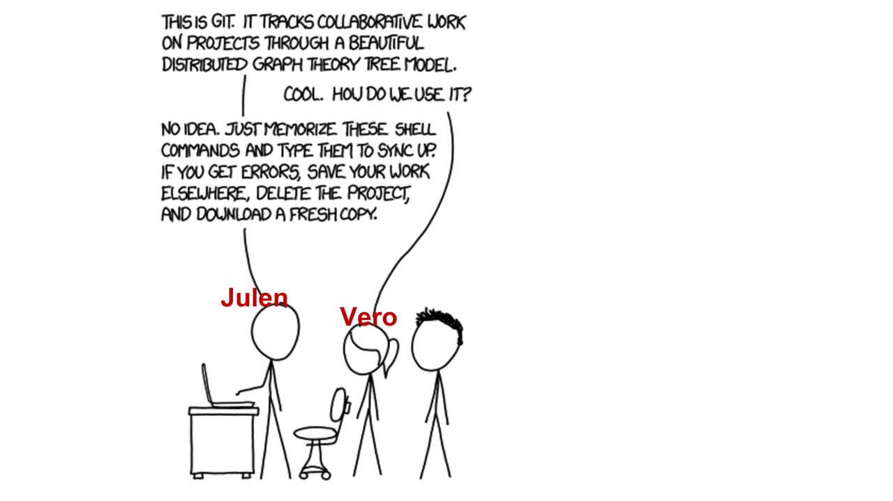
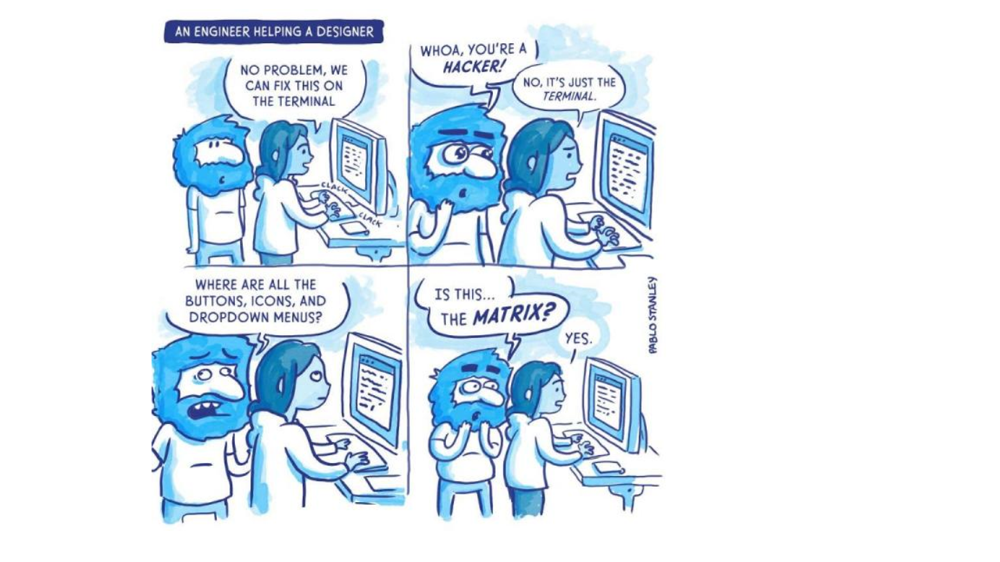
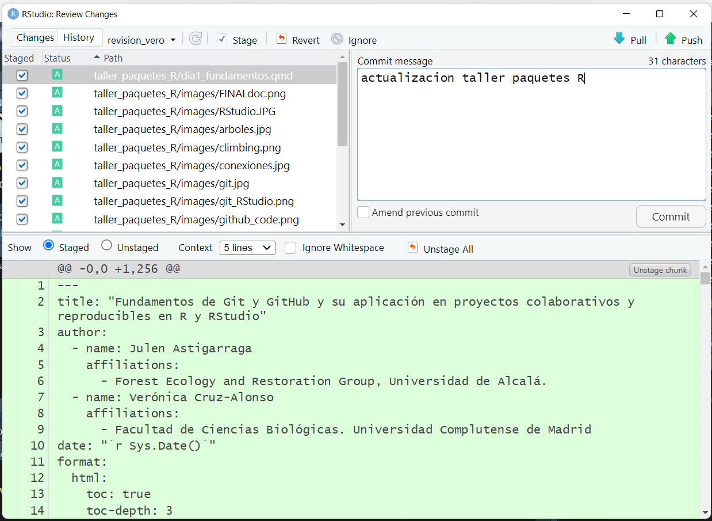
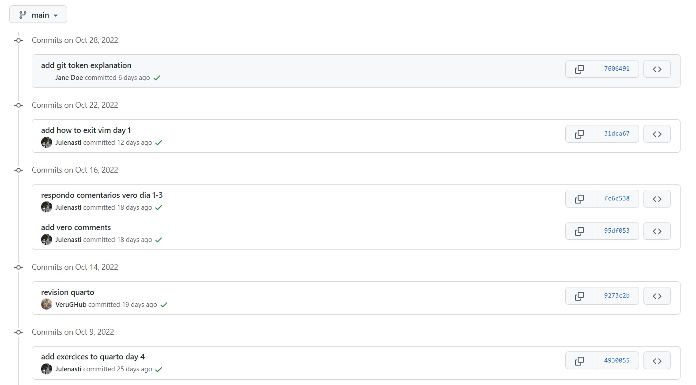
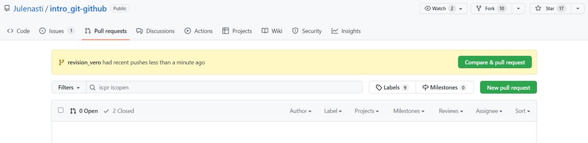
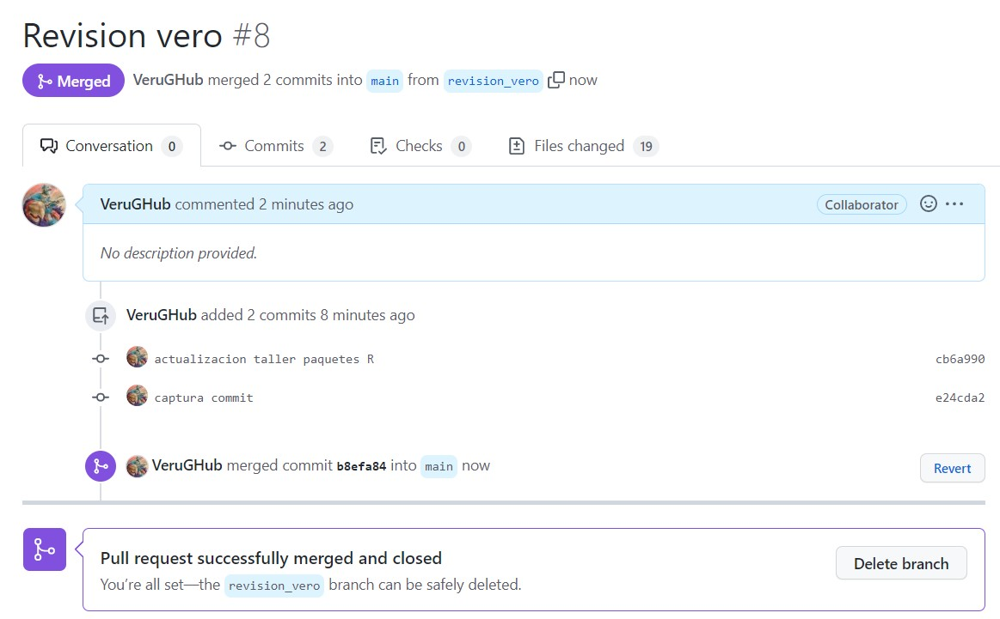
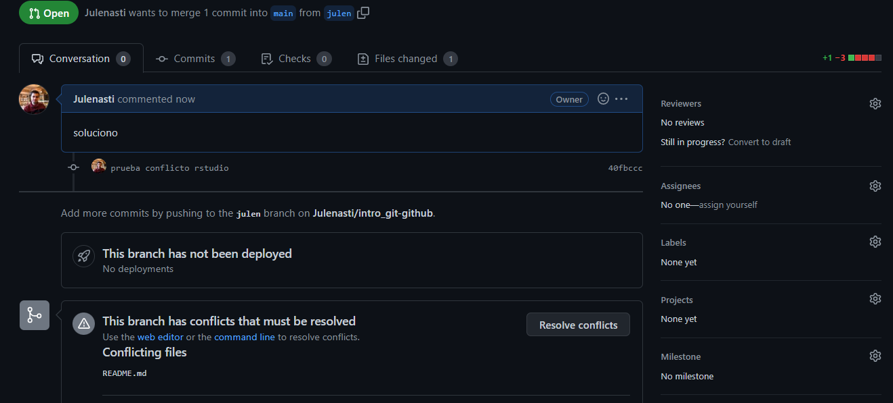
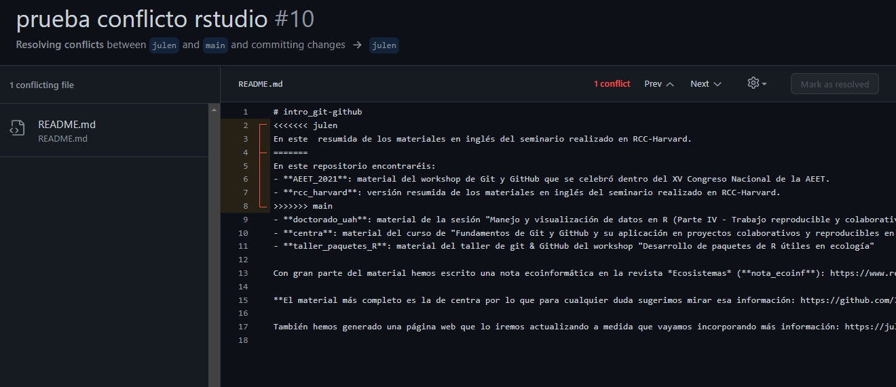

# Introducción a Git y GitHub para el trabajo colaborativo
Julen Astigarraga and Verónica Cruz-Alonso
22/10/2024

- [<span class="toc-section-number">1</span>
  Introducción](#introducción)
  - [<span class="toc-section-number">1.1</span> Qué es
    Git](#qué-es-git)
  - [<span class="toc-section-number">1.2</span> Qué es
    GitHub](#qué-es-github)
- [<span class="toc-section-number">2</span> Instalación](#instalación)
  - [<span class="toc-section-number">2.1</span> Ejercicio](#ejercicio)
- [<span class="toc-section-number">3</span> Repositorios y
  proyectos](#repositorios-y-proyectos)
  - [<span class="toc-section-number">3.1</span> Estructura del
    repositorio de GitHub](#estructura-del-repositorio-de-github)
    - [<span class="toc-section-number">3.1.1</span>
      Ejercicio](#ejercicio-1)
  - [<span class="toc-section-number">3.2</span> Git
    ignore](#git-ignore)
  - [<span class="toc-section-number">3.3</span> GitHub: la red
    social](#github-la-red-social)
- [<span class="toc-section-number">4</span> Flujo de trabajo en Git y
  GitHub](#flujo-de-trabajo-en-git-y-github)
  - [<span class="toc-section-number">4.1</span> ¿Cómo moverse de una
    zona a otra?](#cómo-moverse-de-una-zona-a-otra)
    - [<span class="toc-section-number">4.1.1</span>
      Ejercicio](#ejercicio-2)
  - [<span class="toc-section-number">4.2</span> Navegar por el
    historial](#navegar-por-el-historial)
- [<span class="toc-section-number">5</span> Trabajo
  colaborativo](#trabajo-colaborativo)
  - [<span class="toc-section-number">5.0.1</span>
    Ejercicio](#ejercicio-3)
  - [<span class="toc-section-number">5.1</span>
    Ramificación](#ramificación)
    - [<span class="toc-section-number">5.1.1</span>
      Ejercicio](#ejercicio-4)
  - [<span class="toc-section-number">5.2</span> ¿Cómo se unen distintas
    ramas?](#cómo-se-unen-distintas-ramas)
  - [<span class="toc-section-number">5.3</span> Resolución de
    conflictos](#resolución-de-conflictos)
    - [<span class="toc-section-number">5.3.1</span>
      Ejercicio](#ejercicio-5)
- [<span class="toc-section-number">6</span> Enlaces de
  interés](#enlaces-de-interés)



## Introducción

Git (<https://git-scm.com/>) y GitHub
(<a href="#0" class="uri">https://github.com/</a>) están ganando cada
vez más importancia en diversos campos de estudio a medida que el
volumen de datos aumenta y los análisis se hacen más complejos.
Aprenderemos cómo Git puede usarse para controlar la trazabilidad de los
cambios realizados en proyectos o archivos y veremos cómo este control
de versiones es especialmente útil en proyectos colaborativos mediante
el uso de un servidor de alojamiento en línea como GitHub.

Aunque existen multitud de manuales disponibles gratuitamente sobre cómo
utilizar Git y GitHub, estas herramientas son complejas. El propósito
original de Git era ayudar a grupos de desarrolladores informáticos a
trabajar en colaboración en grandes proyectos de software, por lo que
puede resultar enrevesado, hay múltiples soluciones para el mismo
problema y tiene una curva de aprendizaje pronunciada. Sin embargo, Git
y GitHub nos pueden ayudar a solucionar algunos problemas comunes
derivados de la creación de diferentes versiones que pueden ser un poco
molestos:

\- Sobreescritura de un archivo

\- Versiones finales infinitas


\- Trabajo por error en una versión que no era la final

\- Creación de copias “en conflicto” cuando dos personas trabajan a la
vez

\- Ediciones sin control de cambios


### Qué es Git

Git es un sistema avanzado de control de versiones (como el “control de
cambios” de Microsoft Word) distribuido (Blischak, Davenport, and Wilson
2016; Ram 2013). Git permite “rastrear” el progreso de un proyecto a lo
largo del tiempo ya que hace “capturas” del mismo a medida que
evoluciona y los cambios se van registrando. Este sistema permite ver
qué cambios se hicieron, quién los hizo y por qué, e incluso volver a
versiones anteriores. Además, Git facilita el trabajo en paralelo de
varios participantes. Mientras que en otros sistemas de control de
versiones (p. ej. Subversion (SVN, <https://subversion.apache.org/>) o
Concurrent Versions System (CVS, <http://cvs.nongnu.org/>)) hay un
servidor central y cualquier cambio hecho por un usuario se sincroniza
con este servidor y de ahí con el resto de usuarios, Git es un control
de versiones distribuido que permite a todos los usuarios trabajar en el
proyecto paralelamente e ir haciendo “capturas” del trabajo de cada uno
para luego unirlos. Otras alternativas de control de versiones
distribuido comparables a Git son Mercurial
(<https://www.mercurial-scm.org/>) o Bazaar
(<https://bazaar.canonical.com/>), pero Git es con diferencia el más
utilizado.


### Qué es GitHub

GitHub es un servidor de alojamiento en línea o repositorio remoto para
albergar proyectos basados en Git que permite la colaboración entre
diferentes usuarios o con uno mismo (Galeano 2018; Perez-Riverol et al.
2016). Un repositorio es un directorio donde desarrollar un proyecto que
contiene todos los archivos necesarios para el mismo. Aunque existen
distintos repositorios remotos (p. ej. GitLab, <https://gitlab.com/>, o
Bitbucket, <https://bitbucket.org/>) con funcionalidad similar, GitHub
es hoy en día el más utilizado. GitHub registra el desarrollo de los
proyectos de manera remota, permite compartir proyectos entre distintos
usuarios y proporciona la seguridad de la nube entre otras funciones.
Cuando se trabaja en proyectos colaborativos, la base de la interacción
entre Git y GitHub es que todos los colaboradores de un proyecto están
de acuerdo en que GitHub contiene la copia principal del proyecto, es
decir, GitHub contiene la copia centralizada del control de versiones
distribuido o descentralizado.


## Instalación

En este punto es necesario que tengas instalada la versión más reciente
de R (<https://cloud.r-project.org/>), RStudio
(<https://posit.co/download/rstudio-desktop/>), Git
(<https://happygitwithr.com/install-git.html>) y una cuenta en GitHub
(<https://github.com/>) creada.

### Ejercicio

1.  En el *shell*, preséntate a Git ([Chapter 7:
    Git-Intro](https://happygitwithr.com/hello-git.html))

    *Tools* -\> *Terminal*

    `git config --global user.name 'Nombre Apellido'`

    `git config --global user.email 'nombre@ejemplo.com'`

    💡**Este debe ser el correo electrónico asociado a tu cuenta de
    GitHub**

    ``` r
    #|eval: false

    # También puedes hacerlo utilizando el paquete usethis
    # install.packages("usethis")
    # library(usethis)
    # use_git_config(user.name = "Monchi", user.email = "monchi@example.org")
    ```

  

2.  Compueba que has instalado Git correctamente:

    `git --version`

    Para ver el usuario utilizado para configurar Git:

    `git config user.name`

    Para ver a qué cuenta de correo está asociado Git:

    `git config user.email`

    Para ver tanto el usuario como el correo asociado:

    `git config --global --list`

Para la resolución de problemas durante la instalación recomendamos
mirar aquí: <https://happygitwithr.com/troubleshooting.html>

3.  Genera un PAT (*Personal Access Token*) para HTTPS

    Git puede comunicarse con un servidor remoto utilizando uno de los
    dos protocolos: HTTPS o SSH. Nosotros utilizaremos HTTPS con
    *personal access token* (PAT,
    <https://happygitwithr.com/https-pat.html>).

``` r
#|eval: false

# install.packages("usethis")
# install.packages("gitcreds")
# library(usethis)
# library(gitcreds)
# create_github_token() # generar un token
# gitcreds_set() # acceder al Git credential store
```

💡Conviene describir el propósito del token en el campo *Note*, porque
se pueden tener varios PATs. No podrás volver a ver este token, así que
no cierres ni salgas de la ventana del navegador hasta que almacenes el
PAT localmente. ¡Trata este PAT como una contraseña!

## Repositorios y proyectos

Un repositorio es como un “contenedor” donde desarrollar un proyecto.

Para crear un repositorio en GitHub damos a “*+ New repository*”. Aquí
se indica el nombre, una pequeña descripción, y si quieres que sea
público o privado. Se recomienda iniciar el repositorio con un archivo
“README” (*Initialize this repository with a README*) para recoger
cualquier información esencial para el uso del repositorio (estructura,
descripción más detallada del contenido, etc.).

En RStudio, creamos un nuevo proyecto y lo conectamos al repositorio:
File \> New project \> Version control \> Git \> copiar el URL del
repositorio que hemos creado de GitHub (está en la página principal de
nuestro repositorio, en “*clone or download*”). Seleccionamos el
directorio local donde queremos guardar el proyecto y pulsamos en
“*Create project*”.

Si vamos al directorio local seleccionado, encontraremos la carpeta
conectada a Git y GitHub que hemos creado en nuestro ordenador. Podemos
copiar aquí todos los archivos que nos interesan para el proyecto
(datos, imágenes, etc).

💡Para más información sobre cómo clonar el repositorio en GitHub
(repositorio remoto) en nuestro ordenador (repositorio local) ver
<https://happygitwithr.com/rstudio-git-github.html> para hacerlo desde
RStudio y Galeano (2018) para hacerlo mediante la línea de comandos.

💡En caso de querer conectar un antiguo proyecto de RStudio a Git y
GitHub, puedes seguir los pasos que se describen aquí:
<https://happygitwithr.com/existing-github-first.html>.

### Estructura del repositorio de GitHub

En la página principal del repositorio en GitHub podemos encontrar las
siguientes pestañas:

- **Code**: contenido del proyecto

- **Issues**: foro del proyecto para comentar fallos, tareas pendientes,
  hacer peticiones a los desarrolladores, preguntar dudas, etc. Se
  pueden asignar tareas o preguntas a los miembros del proyecto
  escribiendo “@” antes del nombre del colaborador. Una vez resuelto, el
  issue se cierra (*Close issue*).

- **Pull requests**: veremos más adelante para qué sirve.

- **Actions**: son pequeñas aplicaciones que realizan alguna acción cada
  vez que se sube un commit (p. ej. tests).

- **Projects**: es como una hoja de cálculo con tareas, encargados,
  deadlines, status, etc. que se integra con las incidencias y
  solicitudes de incorporación de cambios para ayudar a planificar las
  tareas y realizar el seguimiento del trabajo.

- **Wiki**: es un espacio para documentar el proyecto (hoja de ruta,
  estado, documentación detallada…).

- **Security**: opciones de seguridad.

- **Insights**: estadísticas del proyecto.

- **Settings**


#### Ejercicio

1.  Crea un repositorio en GitHub y conéctalo a un nuevo proyecto de
    RStudio (esto generará un repositorio (carpeta) en tu ordenador en
    la ubicación que hayas especificado). Incluir un archivo
    “*.gitignore”*

2.  Crea un nuevo script de R en el directorio de trabajo (es decir,
    crea un script de R y guárdalo dentro del repositorio que has
    creado)

3.  En RStudio ve a la pestaña Git para ver todos los documentos que han
    sido identificados por Git

Una vez finalizada la instalación podrás ver la pestaña de Git en
RStudio.


### Git ignore

Al crear un repositorio se recomienda crear un archivo “*.gitignore*”.
Este archivo contendrá los nombres o extensiones de los archivos del
proyecto que por defecto no queremos compartir aunque estén en el
repositorio local (p. ej., el archivo “*.Rhistory*” que RStudio crea por
defecto). Es una buena práctica ignorar archivos que no sean útiles para
el resto de colaboradores así como archivos muy pesados (p. ej., una
base de datos resultado de correr un script) para no subirlos y
descargarlos continuamente de GitHub. Para añadir archivos al
*gitignore* se puede utilizar el botón derecho del ratón sobre el
archivo en la pestaña Git de RStudio pero también se puede añadir el
nombre del archivo que desamos ignorar en el archivo “*.gitignore*”
manualmente.

### GitHub: la red social

GitHub no es sólo un repositorio remoto donde almacenar diferentes
versiones de tu trabajo o desarrollar proyectos colaborativos, si no que
también es una red de encuentro para programadores. Como en otras redes
puedes cotillear perfiles, seguir a ciertas personas, tener seguidores,
guardar proyectos que te gustan…

Con el buscador (🔍) puedes buscar aquellos contenidos que te interesan.
La búsqueda está organizada por categorías (*Repositories, Commits,
Issues, Users*…) lo que facilita encontrar lo que buscas. Para seguir a
un usuario tienes la opción *Follow*. Pulsando *Star*⭐ puedes guardar
un enlace a cualquier repositorio en tu cuenta de GitHub y con *Fork*
estarías guardando una copia con la que puedes interaccionar. Con
*Watch*👁️ puedes hacer un seguimiento de un repositorio. *Download* te
permite guardar una copia de cualquier repositorio público en tu
ordenador.

## Flujo de trabajo en Git y GitHub

Git es capaz de rastrear todos los archivos contenidos en un
repositorio. Para comprender cómo Git registra los cambios y cómo
podemos compartir dichos cambios con nuestros colaboradores es
importante entender cómo se estructura Git y cómo se sincroniza con
GitHub. Hay cuatro “zonas” de trabajo:

1.  **Directorio de trabajo (*working directory*):** es donde se está
    trabajando. Esta zona se sincroniza con los archivos locales del
    ordenador.

2.  **Área de preparación (*staging area* o *Index*):** es la zona
    intermedia entre el directorio de trabajo y el repositorio local de
    Git. Es la zona de borradores. El usuario debe seleccionar los
    archivos que se van a registrar en la siguiente “captura” de Git.

3.  **Repositorio local (*local repository* o *HEAD*):** es donde se
    registran todos los cambios capturados por Git en tu ordenador.

4.  **Repositorio remoto (*remote repository*):** es donde se registran
    todos los cambios capturados por Git en la nube (GitHub).


### ¿Cómo moverse de una zona a otra?

Se puede hacer mediante línea de comandos en la terminal y también
mediante la pestaña integrada en RStudio, pero el proceso es el mismo.

Al principio todos los cambios realizados aparecen en amarillo porque
Git no sabe que hacer con ellos. Estamos en el directorio de trabajo y
puede que no nos interese guardar todos los cambios para el futuro.

Para añadir un cambio del directorio de trabajo al área de preparación
hay que utilizar `git add` (en la pestaña Git de RStudio se hace
seleccionando el archivo). Este comando indica a Git que se quieren
incluir las actualizaciones de algún archivo en la próxima “captura” del
proyecto y que Git las registre. Sin embargo, `git add` no afecta al
repositorio local.

Para registrar los cambios que nos interesen hay que utilizar
`git commit` (en la pestaña Git de RStudio se hace clickando el botón
“*Commit*”). Al ejecutar `git commit` se hace una “captura” del estado
del proyecto. Junto con el *commit* se añade un mensaje con una pequeña
explicación de los cambios realizados y por qué (p. ej. “incluyo las
referencias formateadas”). Cada `git commit` tiene un SHA (*Secure Hash
Algorithm*) que es un código alfanumérico que identifica inequívocamente
ese *commit* (p. ej. 1d21fc3c33cxxc4aeb7823400b9c7c6bc2802be1). Con el
SHA siempre se pueden ver los cambios que se hicieron en ese *commit* y
volver a esa versión fácilmente.

Por último, `git push` permite subir los cambios que hemos hecho a
GitHub y quedarán visibles para nuestros colaboradores (en la pestaña
Git de RStudio se hace clickando el botón “*Push*”). Básicamente,
`git commit` registra los cambios en el repositorio local y `git push`
actualiza el repositorio remoto con los cambios y archivos asociados.

Cuando se retoma un proyecto tras horas, días o incluso meses, con
`git pull` se descargan todas las actualizaciones que haya en GitHub
(nuestras o de nuestros colaboradores), que se fusionarán (*merge*) con
el último *commit* en nuestro repositorio local (en la pestaña Git de
RStudio se hace clickando el botón “*Pull*”).




Además, en la pestaña Git de RStudio podemos observar el botón “*Diff*”
que muestra los cambios que se han hecho a cada archivo desde el último
commit y las ramas (que lo explicaremos más abajo). Clickando con el
botón derecho del ratón podemos abrir los archivos que han sido
modificados mediante “*Open file*” y con el botón “*Revert*” volvemos al
estado del último commit (⚠️cuidado con esto porque te borrará los
cambios realizados en tu directorio de trabajo).

#### Ejercicio

En el proyecto generado en el ejercicio anterior, guardad y subid los
cambios realizados a GitHub (`git add` + `git commit` + `git push`)

💡`git status`: muestra la rama en la que estamos y los cambios hechos y
añadidos desde el último commit.

💡Usar `git commit` es para el proyecto como usar anclajes cuando
estamos escalando una pared de roca. Desarrollar un script sin commits
es como escalar sin asegurarse: puedes avanzar mucho más rápido a corto
plazo, pero a largo plazo las probabilidades de fallo catastrófico son
altas. Por otro lado, hacer muchos commits va a ralentizar tu progreso.
Lo mejor: usar más commits cuando estás en un territorio incierto o
peligroso.


En el repositorio remoto de GitHub, en la pestaña *Code* podemos
observar el contenido de nuestro proyecto, incluyendo cada *commit*
realizado:


### Navegar por el historial

El historial de un repositorio (*🕘XX commits*) contiene una lista de
enlaces a todos los commits que se han realizado en cualquiera de las
ramas. Dentro de cada *commit* se pueden ver los archivos añadidos o
borrados en esa “captura” y las líneas de código añadidas (en verde) o
borradas (en rojo) en cada archivo modificado. Además, en el historial,
se pueden añadir comentarios en líneas concretas de código o comentarios
generales al *commit* entero.

En GitHub también se puede acceder a la historia de commits de cada
archivo en concreto (*History*) y al autor de cada parte del código
(*Blame*).

El historial del proyecto y de los archivos también es accesible a
través de RStudio (🕒).

💡Más información sobre como navegar en el pasado del proyecto aquí:
<https://happygitwithr.com/time-travel-see-past.html>



💡En los *issues* se puede referenciar a una línea concreta de código de
un estado concreto del proyecto entrando en el archivo en la pestaña
*Code* y clickando en el número de línea que se quiere comentar, o a un
*commit* entero copiando el SHA.

💡Si quiero volver atrás en el tiempo o si hago un cambio que no quiero
¿cómo lo puedo resolver? Hay múltiples opciones pero
[aquí](https://github.com/DatSciR/intro_git-github/blob/main/centra/dia3_comandos.md)
(en la sección de “La he liado ¿cómo deshago los cambios?”) detallamos
tres: *restore*, *reset* y *revert*.

## Trabajo colaborativo

Aunque Git y GitHub facilitan el control de versiones de nuestros
proyectos individuales, su máxima potencialidad se despliega al trabajar
en equipo ya que facilitan el seguimiento del trabajo de todos los
colaboradores y la integración ordenada de cada parte en un producto
final.

Para dar acceso de edición a tus colaboradores, en la página principal
de nuestro proyecto en GitHub entramos en “*Settings -\> Access -\>
Collaborators -\> Manage Access -\> Add people*”. Los colaboradores
pueden crear su copia local del proyecto de control de versiones
clonando el repositorio remoto.

#### Ejercicio

En equipos de 2 o 3 personas:

1.  El dueño del repositorio invita al resto de integrantes del equipo a
    su proyecto
2.  Los colaboradores clonan el repositorio al que han sido invitados a
    su directorio de trabajo

### Ramificación

Git permite crear una “rama” (*branch*) paralela al proyecto si se desea
seguir una línea independiente de trabajo, bien por ser diferente de la
principal (p. ej. probar un nuevo análisis) o bien para desarrollar
específicamente una parte del proyecto (p. ej. trabajar sólo en la
escritura de los métodos de un artículo mientras otros colaboradores
trabajan en otras secciones). Las ramas permiten trabajar en el proyecto
sin interferir con lo que están haciendo los compañeros. En Git, una
rama es un *commit* al que le se le da un nombre y que contiene un
“enlace” (puntero o *pointer*) a un SHA específico que es el origen de
la rama. La rama *main* es la rama por defecto cuando se crea un
repositorio y a partir de ella se suelen crear las demás.

Las ramas se pueden generar en la
[terminal](https://github.com/DatSciR/intro_git-github/blob/main/centra/dia2_colaboracion.md)
y en la pestaña Git de RStudio. En la pestaña Git se generan mediante el
botón “*New Branch*”. Al lado de “*New Branch”* podemos observar todas
las ramas que contiene el repositorio y nos permite cambiar de rama
fácilmente clickando en ellas.


#### Ejercicio

1.  Un integrante del equipo crea una rama en el proyecto en el que
    colabora

2.  Modifica la primera frase del archivo README.txt y sube los cambios
    al repositorio remoto

3.  Vuelve a la rama main y comprueba el archivo README.txt


### ¿Cómo se unen distintas ramas?

Cuando el trabajo desarrollado en una rama se da por finalizado hay que
hacer la unión a la rama principal (“*main*”). Esto se puede hacer en la
[terminal](https://github.com/DatSciR/intro_git-github/blob/main/centra/dia2_colaboracion.md)
y con el botón “*pull request*” en la página del proyecto en GitHub
siguiendo los pasos que se explican a continuación.


Una vez que hemos realizado los cambios que queríamos en la rama y están
subidos a GitHub (`git add` + `git commit` + `git push`), en GitHub
aparece la opción de “Compare & pull request”. Aquí se genera el *pull
request* (“*Create pull request*”) añadiendo un mensaje para saber lo
que se está uniendo. GitHub os indicará si existen conflictos o no. Si
no existen conflictos, podréis realizar el *pull request* sin problema
y, si existen conflictos, hay que resolverlos manualmente.






### Resolución de conflictos

Git puede encontrar conflictos al fusionar ramas que hay que arreglar
manualmente (GitHub os indicará “Can’t automatically merge”). Esto
ocurrirá si en las dos ramas se han cambiado las mismas líneas de un
archivo. Hay que generar el pull request y “*Resolve conflicts*”.




Git muestra dónde están los conflictos así:

`<<<<<<código del main=======código de la rama a unir>>>>>>`



Para solucionarlo hay que escoger los cambios de la rama principal o de
la rama a unir según corresponda. Una vez solucionados, Git permite
completar el *merge* (es decir, un nuevo *commit* que contendrá las
ramas fusionadas). La mejor manera de evitar conflictos o por lo menos
reducir su dificultad es realizar cambios pequeños y sincronizar
frecuentemente con GitHub, y tener una comunicación fluida con los
colaboradores.

#### Ejercicio

1.  Un integrante del equipo modifica también la primera frase del
    archivo README.txt en la rama main y sube los cambios al repositorio
    remoto. Esta frase había sido previamente modificada en una rama en
    el ejercicio anterior.
2.  Un integrante del equipo combina la rama del ejercicio anterior con
    la rama principal (*main*) del proyecto.
3.  Resolved el conflicto (es decir, quedaos con los cambios que sirvan
    y subid los cambios al repositorio remoto).

💡[Aquí](https://github.com/DatSciR/intro_git-github/blob/main/centra/dia3_comandos.md)
(en la sección de “Otros comandos útiles”) podéis ver cómo borrar ramas
y otros comandos útiles


## Enlaces de interés

**Ciencia reproducible**

- [Ciencia reproducible: qué, por qué,
  cómo](https://github.com/ecoinfAEET/Reproducibilidad)

**Control de versiones (Git)**

- [Manual de referencia de Git](https://git-scm.com/docs)

- [Software Carpentry](http://swcarpentry.github.io/git-novice/)

- [Atlassian Bitbucket](https://www.atlassian.com/git/tutorials)

- [Oh Shit, Git!?!](https://ohshitgit.com/)

- [git - la guía
  sencilla](https://rogerdudler.github.io/git-guide/index.es.html)

- [Pro Git](https://git-scm.com/book/es/v2)

**Integrar Git, GitHub y RStudio**

- [Happy Git and GitHub for the useR](https://happygitwithr.com/)

- [¡Se puede entender cómo funcionan Git y
  GitHub!](https://www.revistaecosistemas.net/index.php/ecosistemas/article/view/2332)

- [Ciencia reproducible y colaborativa con R, Git y GitHub
  (DatSciR)](https://github.com/DatSciR/intro_git-github)

**Enseñar y aprender con GitHub**

- [GitHub Education para profesores e
  investigadores](https://docs.github.com/en/education/explore-the-benefits-of-teaching-and-learning-with-github-education/use-github-in-your-classroom-and-research/about-github-education-for-educators-and-researchers)

------------------------------------------------------------------------

<div id="refs" class="references csl-bib-body hanging-indent"
entry-spacing="0">

<div id="ref-blischak2016" class="csl-entry">

Blischak, John D., Emily R. Davenport, and Greg Wilson. 2016. “A Quick
Introduction to Version Control with Git and GitHub.” *PLOS
Computational Biology* 12 (1): e1004668.
<https://doi.org/10.1371/journal.pcbi.1004668>.

</div>

<div id="ref-galeano2018" class="csl-entry">

Galeano, Javier. 2018. “¿Por qué usar GitHub? Diez pasos para disfrutar
de GitHub y no morir en el intento.” *Ecosistemas* 27 (2): 140–41.
<https://doi.org/10.7818/ECOS.1604>.

</div>

<div id="ref-perez-riverol2016" class="csl-entry">

Perez-Riverol, Yasset, Laurent Gatto, Rui Wang, Timo Sachsenberg, Julian
Uszkoreit, Felipe da Veiga Leprevost, Christian Fufezan, et al. 2016.
“Ten Simple Rules for Taking Advantage of Git and GitHub.” *PLOS
Computational Biology* 12 (7): e1004947.
<https://doi.org/10.1371/journal.pcbi.1004947>.

</div>

<div id="ref-ram2013" class="csl-entry">

Ram, Karthik. 2013. “Git Can Facilitate Greater Reproducibility and
Increased Transparency in Science.” *Source Code for Biology and
Medicine* 8 (1): 7. <https://doi.org/10.1186/1751-0473-8-7>.

</div>

</div>

------------------------------------------------------------------------


------------------------------------------------------------------------

<details>
<summary>
Session Info
</summary>

``` r
Sys.time()
```

    [1] "2024-10-22 16:11:49 CEST"

``` r
sessionInfo()
```

    R version 4.4.1 (2024-06-14 ucrt)
    Platform: x86_64-w64-mingw32/x64
    Running under: Windows 10 x64 (build 19045)

    Matrix products: default


    locale:
    [1] LC_COLLATE=English_United Kingdom.utf8 
    [2] LC_CTYPE=English_United Kingdom.utf8   
    [3] LC_MONETARY=English_United Kingdom.utf8
    [4] LC_NUMERIC=C                           
    [5] LC_TIME=English_United Kingdom.utf8    

    time zone: Europe/Madrid
    tzcode source: internal

    attached base packages:
    [1] stats     graphics  grDevices utils     datasets  methods   base     

    loaded via a namespace (and not attached):
     [1] compiler_4.4.1    fastmap_1.2.0     cli_3.6.3         tools_4.4.1      
     [5] htmltools_0.5.8.1 rstudioapi_0.16.0 yaml_2.3.9        rmarkdown_2.27   
     [9] knitr_1.48        jsonlite_1.8.8    xfun_0.45         digest_0.6.36    
    [13] rlang_1.1.4       evaluate_0.24.0  

</details>
