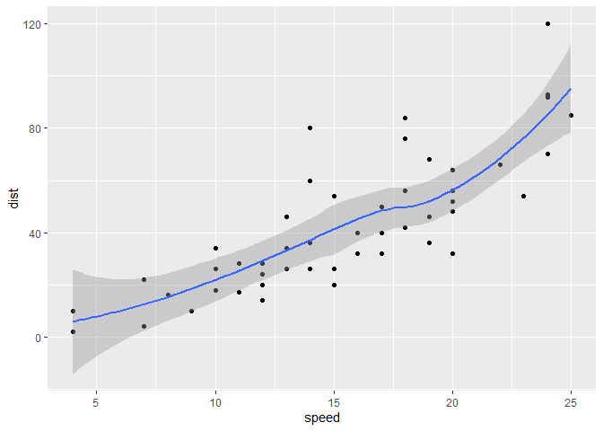
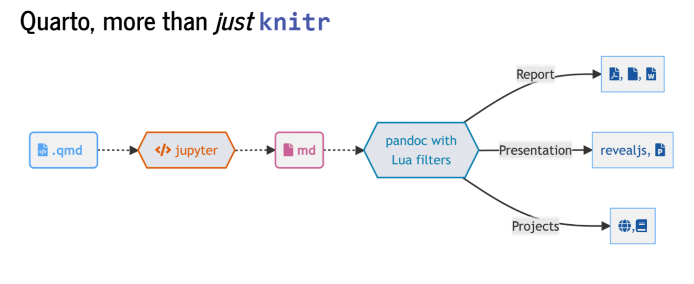

¡Bienvenidos a (R Markdown) Quarto!
================
Julen AstigarragaVerónica Cruz-Alonso
2022-11-25

# [R Markdown](https://rmarkdown.rstudio.com)

`knitr` (paquete para generación de informes dinámicos en R,
<https://yihui.org/knitr/>) empezó en el 2011 y R Markdown
(<https://rmarkdown.rstudio.com/>) en 2014 con el objetivo de facilitar
la reproducibilidad en R. Ha sido desarrollado principalmente por [Yihui
Xie](https://yihui.org/). Utiliza programación literaria que es una
paradigma de programación creado por Donald E. Knuth que consiste en
escribir la lógica del programa en un lenguaje humano (p. ej.
inglés/castellano) con fragmentos de código e instrucciones.

R Markdown es un formato de archivo para crear documentos dinámicos con
R que se apoya en `knitr` (<https://yihui.org/knitr/>) y Pandoc
(conversor de documentos, <https://pandoc.org/>). Está escrito en
markdown y contiene partes de código de R (o algún otro lenguaje de
programación) integrado. Algunas de las razonas por las que es
recomendable utilizar R Markdown son la reproducibilidad, el aumento de
la eficiencia de trabajo (a medio-largo plazo), centrarse en el texto
sin perder tiempo en el diseño y la producción de documentos de alta
calidad.

## Fundamentos básicos de R Markdown

Para crear un archivo R Markdown: File -\> New File -\> R Markdown. Un
archivo `.Rmd` es un archivo de texto plano. Debemos cambiar el modelo
mental. Ahora tendremos un documento fuente de texto plano, y a partir
de dicho documento generamos un documento renderizado. Estos archivos
tienen 3 componentes principales: (i) metadatos, (ii) texto, (iii)
código

- Metadatos: se escriben entre `` `---` `` al comienzo del archivo.
  Utiliza la sintaxis de [YAML](https://en.wikipedia.org/wiki/YAML) (Yet
  Another Markup Language). Se utiliza para evitar teclear manualmente
  todas las opciones que pueden afectar al código, al contenido y al
  proceso de renderizado cada vez que renderizamos el archivo ¡La
  sangría es importante!

- Texto: sintaxis Markdown. Markdown es un formato de texto plano que
  está diseñado para ser fácil de escribir y, aún más importante, fácil
  de leer.

- Código (2 tipos):

  - Code chunk (bloque de código): se escribe entre
    ```` ```{r} codigo aqui``` ````; entre corchetes se indica el
    lenguaje. Se puede escribir manualmente o utilizar el atajo
    `Ctrl + Alt + I` / OS X `Cmd + Option + I` o utilizar el comando
    `Insert Code Chunk` en la barra de herramientas del editor o
    utilizar la paleta de comandos `Ctrl + Shift + P` / OS X
    `Cmd + Shift + P.`

  - Inline (en línea): se escribe entre `` `lenguaje codigo` ``

Ver opciones de chunk
(<https://bookdown.org/yihui/rmarkdown/r-code.html>)

También son compatibles muchos otros lenguajes

     [1] "awk"       "bash"      "coffee"    "gawk"      "groovy"    "haskell"  
     [7] "lein"      "mysql"     "node"      "octave"    "perl"      "php"      
    [13] "psql"      "Rscript"   "ruby"      "sas"       "scala"     "sed"      
    [19] "sh"        "stata"     "zsh"       "asis"      "asy"       "block"    
    [25] "block2"    "bslib"     "c"         "cat"       "cc"        "comment"  
    [31] "css"       "ditaa"     "dot"       "embed"     "eviews"    "exec"     
    [37] "fortran"   "fortran95" "go"        "highlight" "js"        "julia"    
    [43] "python"    "R"         "Rcpp"      "sass"      "scss"      "sql"      
    [49] "stan"      "targets"   "tikz"      "verbatim"  "ojs"       "mermaid"  
    [55] "include"  

``` python

x = "R mola!"

print(x.split(" "))
```

    ['R', 'mola!']

``` r
library(ggplot2)
names(cars)
```

    [1] "speed" "dist" 

``` r
ggplot(cars, aes(speed, dist)) +
  geom_point() +
  geom_smooth()
```

    `geom_smooth()` using method = 'loess' and formula 'y ~ x'



Para buscar ayuda: Help -\> Markdown Quick Reference (italics, bold,
headers, lists, links, images, R codes, tables, page break,
superscripts…)

Formato: **negrita**, *cursiva*, subíndice<sub>1</sub>,
superíndice<sup>2</sup>, codes,
[hypervínculo](https://bookdown.org/yihui/rmarkdown/markdown-syntax.html),
notas al pie[^1]

Títulos: \# primer nivel; \## segundo nivel…

Listas y sublistas: \*, -, +

Citas:

> “R Markdown es maravilloso pero ojo con Quarto”
>
> — Julen Astigarraga

Fórmulas:

$f(os) = {esta \choose gustando} esto^{?} (1-p)^{n-k}$

Comentarios:

<!--# esto es un comentario (atajo: Ctrl + Shift + C / OS X Cmd + Shift + C)-->

Tablas:

| Col1 | Col2 | Col3 |
|------|------|------|
|      |      |      |
|      |      |      |
|      |      |      |

esto es el pie de tabla

Figuras:

<figure>

<figcaption aria-hidden="true">esto es el pie de figura</figcaption>
</figure>

Videos:

<div id="fig-repro">

<iframe width="560" height="315" src="https://www.youtube.com/embed/s3JldKoA0zw">
</iframe>

Figure 1: **?(caption)**

</div>

Para compilar un archivo, se ejecuta el botón de `Render` o `Knit` en
RStudio (atajo: `Ctrl + Shift + K` / OS X `Cmd + Shift + K`), que llama
a Quarto/R Markdown render en un trabajo de fondo. Esto evita que el
renderizado abarrote la consola de R, y así es fácil de detener.

👀 Con el editor visual de RStudio puedes ves en tiempo real cómo es la
conversión a word, HTML…

### 📝**Ejercicio 4.1**

Genera un documento R Markdown que esté compuesto por al menos
metadatos, código y texto, pero también puedes añadir otros elementos,
como tablas.

# Quarto

Quarto (<https://quarto.org/>) es un sistema de publicación científica y
técnica de código abierto construido sobre Pandoc
(<https://pandoc.org/>). Puede entrelazar texto narrativo y código para
producir resultados con un formato elegante en forma de documentos,
páginas web, entradas de blog, libros, etc.

## R Markdown vs. Quarto

La diferencia principal de Quarto respecto a R Markdown es que se ha
generado para la colaboración de más de una comunidad (es decir, no solo
usuarios de R o Phyton). La extensión de Quarto es `.qmd` y utiliza
filtros Lua que es el lenguaje de extensión de Pandoc
(<https://quarto.org/docs/extensions/lua.html>). Utiliza una sintaxis y
formato compartido entre distintos lenguajes.

](images/knitr-diagram-rmd.png)

](images/knitr-diagram-qmd.png)

<figure>

<figcaption>Diagrama de funcionamiento de Quarto. Figura de <a
href="https://jthomasmock.github.io/quarto-2hr-webinar/">jthomasmock.github.io/quarto-2hr-webinar</a></figcaption>
</figure>

Quarto es una interfaz de línea de comandos que convierte los formatos
de texto plano o los formatos mixtos (p. ej. `.qmd`, `.Rmd`, `.md`,
`.ipynb`) en informes estáticos PDF, word, HTML…

Para ello, Quarto utiliza un engine como `knitr` para ejecutar el código
y generar una salida temporal `.md`. El archivo `.md` se procesa
mediante Pandoc y los filtros Lua de Quarto + Bootstrap CSS para HTML o
LaTeX para PDF. Los filtros de Lua están escritos por desarrolladores de
R/Python/Julia y son intercambiables entre formatos.

](images/qmd-universe.png)

Algunas diferencias entre Quarto y R Markdown en cuanto al código:

- Estructura `key: value`

- `#|` syntax (hash pipe). Esta es la sintaxis preferida de Quarto,
  aunque es compatible con la sintaxis anterior de R Markdown. El hash
  pipe le añade más consistencia entre los engine (Jupyter/knitr) y
  entre las distintas opciones de YAML. Además nos da más control sobre
  el orden/espacio de las opciones del chunk (no está limitado a una
  línea de opciones). No hay ningún atajo para un hash pipe pero si
  escribes uno los siguientes se añadirán automáticamente cuando le das
  a enter.

- Tabulación enriquecida: inicias una palabra y tabula para completar o
  ctrl + espacio para ver todas las opciones disponibles

``` r
2 * 2
```

    [1] 4

Baterias incluidas: Quarto viene preinstalado con las últimas versiones
de RStudio. No se tiene que instalar diferentes paquetes para crear
diferentes formatos de salida:
<https://quarto.org/docs/output-formats/all-formats.html>

## Resumen ¿Por qué utilizar Quarto en lugar de R Markdown?

- Baterias incluidas

- Sintaxis compartida (elige tu propio editor y lenguaje preferido)

- Mejores características y más mejoras en el futuro (R Markdown todavía
  se mantiene, pero la mayoría de las nuevas características serán
  incorporadas en Quarto)

### 📝**Ejercicio 4.2**

Genera un documento Quarto que también esté compuesto por al menos
metadatos, código y texto. ¿Qué diferencias observas respecto al de R
Markdown?

## Renderización

1.  Dentro de RStudio puedes seguir usando el botón de Render (ahora
    llamado Render por consistencia)

2.  En el shell mediante quarto render: 🤓

`quarto render archivo.qmd` (por defecto a HTML)

`quarto render archivo.qmd --to pdf`

`quarto render archivo.qmd --to docx`

`quarto --help`

Sobre la importancia del YAML:

`quarto render archivo.qmd --to html`

`quarto render archivo.qmd --to html -M code-fold:true`

3.  Consola de R mediante el paquete `quarto`

`library(quarto)`

`quarto_render("archivo.qmd")`

`quarto_render("archivo.qmd", output_format = "pdf")`

## ¿Qué hago con mi `.Rmd` o `.ipynb` existentes?

¡No pasa nada! Sin embargo, la mayoría de los `.Rmd` o `.ipynb`
existentes se pueden convertir `as-is` a través de Quarto. A través de
la línea de comandos de la terminal:

`quarto render archivo.Rmd --to html`

Además existen distintas opciones para convertir archivos `.Rmd` a
`.qmd`:

1.  Cambiar `.Rmd` a `.qmd` (esto siempre usará Quarto para la
    renderización)

2.  Opción 2: cambiar la salida YAML: `html_document` a `format: html`

3.  Opción 3:
    `knitr::convert_chunk_header("archivo.Rmd", "archivo.qmd")`

No tienes que convertir la sintaxis de todos tus documentos antiguos.
Quarto es compatible con versiones anteriores de R Markdown.

### 📝**Ejercicio 4.3**

Convierte todos los archivos del ejercicio 4.1 a `.qmd` y renderizalo a
HTML y word mediante la opción de renderización que más te guste.

# Generando el documento final

Títulos coloreados en azul, el texto no está doble espacio, no hay
números de línea… (¡manuscrito rechazado!) ¡PERO NO VAMOS A EDITAR NADA
EN WORD! Podemos asegurarnos de que el `.docx` creado tenga siempre el
formato deseado utilizando una plantilla `.docx`. Para utilizarla, la
plantilla debe colocarse en la misma carpeta que el archivo `.qmd`, y
debemos hacer un pequeño ajuste en el YAML.

1.  Primero generamos la plantilla:

    `quarto pandoc -o plantilla.docx \ --print-default-data-file reference.docx`

2.  Modificamos la plantilla generado como la queramos

3.  Lo añadimos al YAML

``` r
format: 
  docx: 
    reference-doc: plantilla.docx
```

## Referencias

- La idea de utilizar BibTeX es evitar tener que formatear manualmente
  las referencias y, en su lugar, escribir una “clave” única (clave de
  citación: @cita) cada vez que se cita una referencia.

- Otra ventaja muy importante es que BibTeX permite a los autores
  cambiar los estilos de las referencias sin tener que reformatear nada
  manualmente (por ejemplo, si hay que enviar un manuscrito a una
  revista diferente).

- Recomendamos utilizar [Zotero](https://www.zotero.org/) como gestor
  bibliográfico porque está incluido en RStudio y facilita bastante la
  vida pero se puede utilizar cualquier gestor.

- Si queremos añadir las referencias en algún lugar concreto del archivo
  (ver código fuente)

<div id="refs">

</div>

### 📝**Ejercicio 4.4**

Genera una plantilla y modifica los colores, tamaño de los títulos, etc.
Después, añadelo al YAML. Añade alguna referencia en el documento y
renderizalo. Por último, sube este documento a nuestro repositorio de
GitHub.

# Información adicional

- [Quarto](https://quarto.org)

- [R Markdown: The Definitive
  Guide](https://bookdown.org/yihui/rmarkdown/)

- [Quarto workshop](https://www.youtube.com/watch?v=yvi5uXQMvu4)

- [What is Quarto? RStudio rolls out next-generation R
  Markdown](https://www.infoworld.com/article/3666743/what-is-quarto-rstudio-quietly-rolls-out-next-generation-r-markdown.html)

- [How to create Word docs from R or Python with
  Quarto](https://www.infoworld.com/article/3671668/how-to-create-word-docs-from-r-or-python-with-quarto.html)

- [Install TinyTeX to create PDF reports](https://yihui.org/tinytex/)

<details>
<summary>
Session Info
</summary>

``` r
Sys.time()
```

    [1] "2022-11-25 13:13:57 CET"

``` r
git2r::repository()
```

    Local:    main C:/Users/julen/OneDrive/Escritorio/GitHub-col/intro_git-github
    Remote:   main @ origin (https://github.com/Julenasti/intro_git-github.git)
    Head:     [5bdd775] 2022-11-25: day 4 quarto ready

``` r
sessionInfo()
```

    R version 4.2.1 (2022-06-23 ucrt)
    Platform: x86_64-w64-mingw32/x64 (64-bit)
    Running under: Windows 10 x64 (build 19044)

    Matrix products: default

    locale:
    [1] LC_COLLATE=English_United Kingdom.utf8 
    [2] LC_CTYPE=English_United Kingdom.utf8   
    [3] LC_MONETARY=English_United Kingdom.utf8
    [4] LC_NUMERIC=C                           
    [5] LC_TIME=English_United Kingdom.utf8    

    attached base packages:
    [1] stats     graphics  grDevices utils     datasets  methods   base     

    other attached packages:
    [1] ggplot2_3.3.6   reticulate_1.25 knitr_1.40.1   

    loaded via a namespace (and not attached):
     [1] Rcpp_1.0.9       git2r_0.30.1     compiler_4.2.1   pillar_1.8.1    
     [5] tools_4.2.1      digest_0.6.29    nlme_3.1-157     jsonlite_1.8.0  
     [9] evaluate_0.16    lifecycle_1.0.3  tibble_3.1.7     gtable_0.3.0    
    [13] lattice_0.20-45  mgcv_1.8-40      pkgconfig_2.0.3  png_0.1-7       
    [17] rlang_1.0.6      Matrix_1.4-1     DBI_1.1.3        cli_3.3.0       
    [21] rstudioapi_0.13  yaml_2.3.5       xfun_0.32        fastmap_1.1.0   
    [25] withr_2.5.0      dplyr_1.0.9      stringr_1.4.1    generics_0.1.3  
    [29] vctrs_0.5.0      rappdirs_0.3.3   tidyselect_1.1.2 rprojroot_2.0.3 
    [33] grid_4.2.1       glue_1.6.2       here_1.0.1       R6_2.5.1        
    [37] fansi_1.0.3      rmarkdown_2.16   farver_2.1.1     purrr_0.3.4     
    [41] magrittr_2.0.3   splines_4.2.1    scales_1.2.1     htmltools_0.5.3 
    [45] ellipsis_0.3.2   assertthat_0.2.1 colorspace_2.0-3 labeling_0.4.2  
    [49] utf8_1.2.2       stringi_1.7.8    munsell_0.5.0   

</details>

[^1]: hello world
