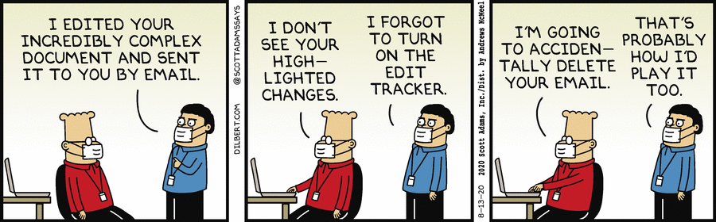
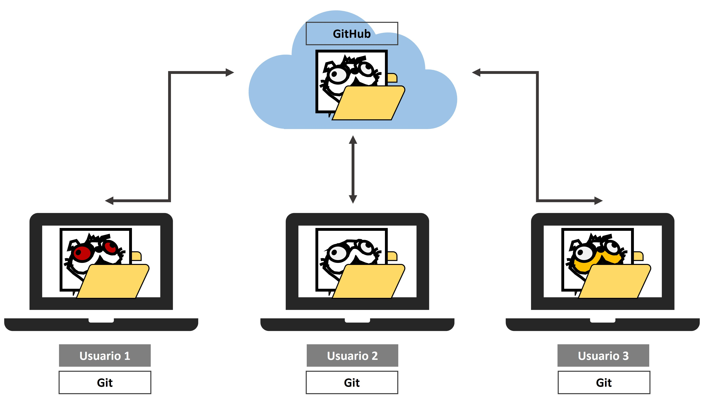
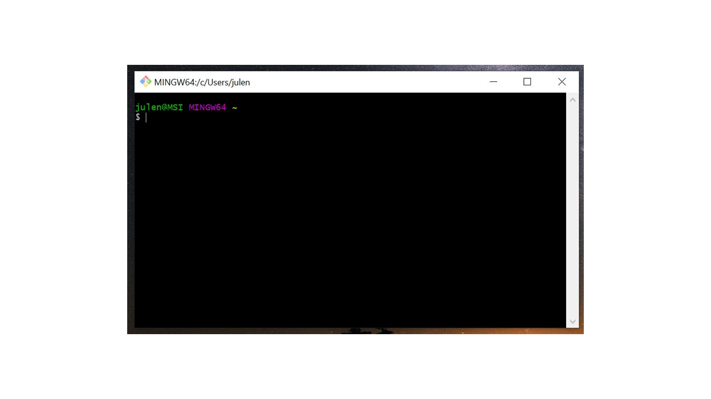
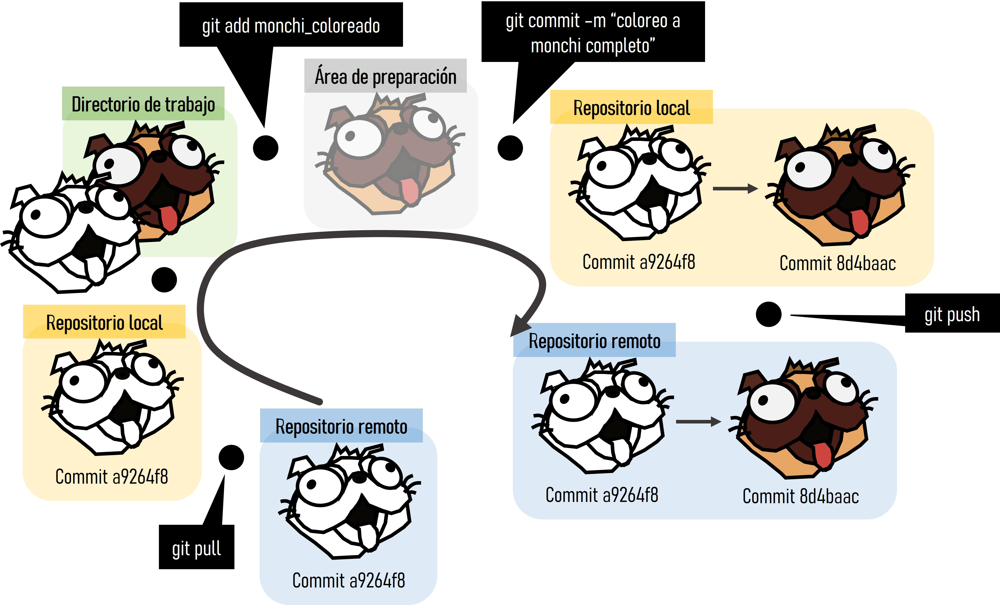

> Gran parte de la información y figuras de esta sesión ha sido obtenida de la nota ecoinformática: Astigarraga, J. & Cruz-Alonso, V. (en prensa). "¡Se puede entender cómo funcionan Git y GitHub!". *Ecosistemas*.

# Introducción

-   Reproducibilidad (<https://the-turing-way.netlify.app/reproducible-research/overview/overview-definitions.html>)

-   Método científico

-   *Big data*

    -   R Markdown (<https://rmarkdown.rstudio.com>)

    -   Git (<https://git-scm.com/>)

    -   GitHub (<https://github.com/>)

Problemas comunes:

\- Sobreescritura de un archivo

\- Versiones finales infinitas

\

\- Trabajo por error en una versión que no era la final

\- Creación de copias "en conflicto" cuando dos personas trabajan a la vez

\- Ediciones sin control de cambios

\

# [Qué es R Markdown](https://rmarkdown.rstudio.com)

-   R Markdown es un formato de archivo para crear documentos dinámicos con R

-   Escrito en markdown y contiene partes de código de R (o algún otro lenguaje de programación) integrado

-   Fue diseñado para facilitar la reproducibilidad

-   Se apoya en knitr (<https://yihui.org/knitr/>) y Pandoc (<https://pandoc.org/>)

-   Otras razones para trabajar en R Markdown: aumento de la eficiencia de trabajo (a medio-largo plazo), producción de documentos de alta calidad, etc.

## Fundamentos básicos de R Markdown

Para crear un archivo R Markdown: File -\> New File -\> R Markdown. Estos archivos tienen 3 componentes principales: (i) metadatos, (ii) texto, (iii) código

-   Metadatos: se escribe entre `` `---` `` (al comienzo del archivo). Utiliza la sintaxis de [YAML](https://en.wikipedia.org/wiki/YAML). La sangría es importante!

-   Texto: sintaxis Markdown

-   2 tipos de código:

    -   Code chunk (trozo de código): se escribe entre ```` ```{r}``` ````; `r` indica el lenguaje (atajo: `Ctrl + Alt + I`)

    -   Inline (en línea): se escribe entre `` `r` ``

Para compilar un archivo R Markdown se utiliza el botón de "*Knit*" de RStudio (atajo: `Ctrl + Shift + K`). También se puede hacer mediante código: rmarkdown::render("intro_repro.Rmd", output_dir = "output")

Para buscar ayuda: Help -\> Markdown Quick Reference (italics, bold, headers, lists, links, images, R codes, tables, page break, superscripts...)

**negrita**, cursiva, subíndice~1~, superíndice^2^, codes, [hypervínculo](https://bookdown.org/yihui/rmarkdown/markdown-syntax.html), notas al pie[^1]

[^1]: hello world

Títulos (\# primer nivel; \#\# segundo nivel...), listas y sublistas (\*, -, +),

> "R Markdown es maravilloso"
>
> --- Julen Astigarraga

$f(how) = {do \choose you} feel^{excellent} (1-p)^{n-k}$

<!--# esto es un comentario -->

`r emo::ji("voltage")` Cambia al **Visual markdown editing mode** mediante el botón del compás

Para analizar las múltiples opciones de chunk (`Ctrl + Alt + I`): <https://bookdown.org/yihui/rmarkdown/r-code.html>

### Ejercicio 1

> Crea un archivo R Markdown, ponle un título, añade un texto, crea un plot (`Ctrl + Alt + I`) y compila al formato HTML ("Knit")

# [Qué es Git](https://git-scm.com/)

-   Git es un sistema avanzado de control de versiones distribuido

-   Permite "rastrear" el progreso de un proyecto a lo largo del tiempo haciendo "capturas" del mismo

-   Permite ver qué cambios se hicieron, quién los hizo y por qué, e incluso volver a versiones anteriores

-   Facilita el trabajo en paralelo de varios participantes

-   Sistemas de control de versiones centralizados: p. ej. Subversion (SVN, <https://subversion.apache.org/>) y Concurrent Versions System (CVS, <http://cvs.nongnu.org/>))

-   Otras alternativas de control de versiones distribuidos: p. ej. Mercurial (<https://www.mercurial-scm.org/>) y Bazaar (<https://bazaar.canonical.com/>)


# [Qué es GitHub](https://github.com/)

-   GitHub es un servidor de alojamiento en línea o repositorio remoto para albergar proyectos basados en Git

-   Un repositorio es un directorio donde desarrollar un proyecto

-   Ventajas de utilizar GitHub: permite compartir proyectos entre distintos usuarios, proporciona la seguridad de la nube, etc.

-   GitHub contiene la copia principal del proyecto

-   Otros repositorios remotos similares a GitHub: p. ej. GitLab (<https://gitlab.com/>) y Bitbucket (<https://bitbucket.org/>)




## Instalación de Git

En este punto es necesario que tengas instalada la versión más reciente de R (<https://cloud.r-project.org/>), RStudio (<https://www.rstudio.com/products/rstudio/download/>), Git (<https://happygitwithr.com/install-git.html>) y una cuenta en GitHub (<https://github.com/>) creada.

### Ejercicio 2

> En el *shell*, preséntate a Git ([Chapter 7: Git-Intro](https://happygitwithr.com/hello-git.html))

`r emo::ji("voltage")` ¿Qué es el *shell*? El *shell* (o terminal) es un programa en tu ordenador cuyo trabajo es ejecutar otros programas (ver <https://happygitwithr.com/shell.html#shell>). También veremos cómo hacerlo a través de un cliente como RStudio (<https://www.rstudio.com/>).

\




*Tools* -\> *Shell*

`git config --global user.name 'Nombre Apellido'`

`git config --global user.email 'nombre@ejemplo.com'`

Compueba que has instalado Git correctamente:

`git --version`

Para ver el usuario utilizado para configurar Git:

`git config user.name`

Para ver a qué cuenta de correo está asociado Git:

`git config user.email`

Para ver tanto el usuario como el correo asociado:

`git config --global --list`

## Repositorios y proyectos

Un repositorio es como un "contenedor" donde desarrollar un proyecto.

Para crear un repositorio en GitHub: "*New*". Aquí se indica el nombre, una pequeña descripción, y si quieres que sea público o privado. Se recomienda iniciar el repositorio con un archivo "README" (*Initialize this repository with a README*) para recoger cualquier información esencial para el uso del repositorio (estructura, descripción más detallada del contenido, etc.).


En R, creamos un nuevo proyecto y lo conectamos al repositorio: File -\> New project -\> Version control -\> Git -\> copiar el URL del repositorio que hemos creado de GitHub (está en la página principal de nuestro repositorio, en "*clone or download*"). Seleccionamos el directorio donde queremos guardar el proyecto y pulsamos en "*Create project*".

Si vamos al directorio seleccionado, encontraremos la carpeta conectada a Git y GitHub que hemos creado en nuestro ordenador. Podemos copiar aquí todos los archivos que nos interesan para el proyecto (datos, imágenes, etc).

### Ejercicio 3

1.  <div>

    > Crea un repositorio en GitHub y conecta a un nuevo proyecto de RStudio (esto generará un repositorio (carpeta) en tu ordenador en la ubicación que le hayas especificado)

    </div>

2.  <div>

    > Copia el archivo de R Markdown que has creado en el Ejercicio 1 en el directorio de trabajo (es decir, copia el archivo R Markdown y guárdalo dentro del repositorio que has creado)

    </div>

3.  <div>

    > En RStudio ve a la pestaña Git (donde está el *environment*) para ver todos los documentos que han sido identificados por Git

    </div>

## Flujo de trabajo en Git y GitHub

Git es capaz de rastrear todos los archivos contenidos en un repositorio. Hay cuatro "zonas" de trabajo:

1.  **Directorio de trabajo (*working directory*):** es donde se está trabajando. Esta zona se sincroniza con los archivos locales del ordenador.

2.  **Área de preparación (*staging area* o *Index*):** es la zona intermedia entre el directorio de trabajo y el repositorio local de Git. Es la zona de borradores. El usuario debe seleccionar los archivos que se van a registrar en la siguiente "captura" de Git.

3.  **Repositorio local (*local repository* o *HEAD*):** es donde se registran todos los cambios capturados por Git en tu ordenador.

4.  **Repositorio remoto (*remote repository*):** es donde se registran todos los cambios capturados por Git en la nube (GitHub).


### ¿Cómo moverse de una zona a otra?

Al principio todos los cambios realizados están en amarillo porque Git no sabe que hacer con ellos. Estamos en el directorio de trabajo y puede que no nos interese guardar todos los cambios para el futuro.

-   `git add <nombre de archivo>`: para añadir una actualización de algún archivo del directorio de trabajo al área de preparación. Indica a Git que se quieren incluir las actualizaciones de algún archivo en la próxima "captura" del proyecto y que Git las registre. Sin embargo, `git add` no afecta al repositorio local.

-   `git status`: para ver el estado del directorio de trabajo y del área de preparación. Este comando permite ver qué archivos están siendo rastreados por Git, qué cambios han sido añadidos al área de preparación (*staged*) y qué archivos están siendo registrados por Git.

-   `git commit -m "mensaje corto y descriptivo"`: para registrar los cambios que nos interesen. Al ejecutar `git commit` se hace una "captura" del estado del proyecto. Junto con el *commit* se añade un mensaje con una pequeña explicación de los cambios realizados y por qué (p. ej. "incluyo las referencias en el formato de Ecosistemas"). Cada `git commit` tiene un SHA (Secure Hash Algorithm) que es un código alfanumérico que identifica inequívocamente ese *commit* (p. ej. 1d21fc3c33cxxc4aeb7823400b9c7c6bc2802be1). Parece difícil de entender, pero no te preocupes, sólo tienes que recordar los siete primeros dígitos 1d21fc3 `r emo::ji("shocked")` (es broma). Con el SHA siempre se pueden ver los cambios que se hicieron en ese *commit* y volver a esa versión fácilmente.

-   `git push`: para subir los cambios que hemos hecho a GitHub y quedarán visibles para nuestros colaboradores.

-   `git pull`: para descargar todas las actualizaciones que haya en GitHub (nuestras o de nuestros colaboradores), que se fusionarán (*merge*) con el último *commit* en nuestro repositorio local.




### Ejercicio 4

> En el proyecto de cada equipo, guardad y subid a GitHub los cambios realizados en el Ejercicio 3 (`git add` + `git commit` + `git push`)

# Algunos enlaces interasantes

**Información más detallada de los temas tratados en esta sesión**

-   [Introducción a Git y GitHub, dos herramientas para una ecología más colaborativa y reproducible](https://github.com/Julenasti/intro_git-github)

**R Markdown**

-   [R Markdown: The Definitive Guide](https://bookdown.org/yihui/rmarkdown/)

-   [RStudio Cheat Sheets](https://rstudio.com/resources/cheatsheets/)

**Ciencia reproducible**

-   [Ciencia reproducible: qué, por qué, cómo](https://github.com/ecoinfAEET/Reproducibilidad)

**Control de versiones (Git)**

-   [Manual de referencia de Git](https://git-scm.com/docs)

-   [Software Carpentry](http://swcarpentry.github.io/git-novice/)

-   [Atlassian Bitbucket](https://www.atlassian.com/git/tutorials)

-   [Oh Shit, Git!?!](https://ohshitgit.com/)

-   [git - la guía sencilla](https://rogerdudler.github.io/git-guide/index.es.html)

**Integrar Git, GitHub y RStudio**

-   [Happy Git and GitHub for the useR](https://happygitwithr.com/){.uri}

**Enseñar y aprender con GitHub**

-   [GitHub Education para profesores e investigadores](https://docs.github.com/en/education/explore-the-benefits-of-teaching-and-learning-with-github-education/use-github-in-your-classroom-and-research/about-github-education-for-educators-and-researchers)

\

------------------------------------------------------------------------

<details>

<summary>

Session Info

</summary>

```{r session-info}
Sys.time()
git2r::repository()
sessionInfo()
```

</details>
