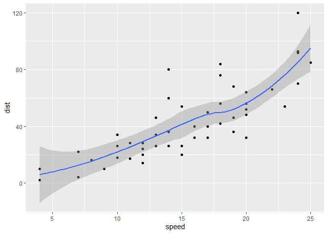

Manejo y visualización de datos en R (Parte IV - Trabajo reproducible y
colaborativo)
================
truetrue
2023-02-06

# Introducción

- Reproducibilidad
  (<https://the-turing-way.netlify.app/reproducible-research/overview/overview-definitions.html>)

- Método científico

- *Big data*

  - Quarto (<https://quarto.org/>)

  - Git (<https://git-scm.com/>)

  - GitHub (<https://github.com/>)

Problemas comunes:

\- Sobreescritura de un archivo

\- Versiones finales infinitas

  

\- Trabajo por error en una versión que no era la final

\- Creación de copias “en conflicto” cuando dos personas trabajan a la
vez

\- Ediciones sin control de cambios

  

# Quarto

Quarto (<https://quarto.org/>) es un sistema de publicación científica y
técnica de código abierto construido sobre Pandoc. Convierte los
formatos de texto plano o los formatos mixtos (p. ej. `.qmd`, `.Rmd`,
`.md`, `.ipynb`) en informes estáticos PDF, word, HTML, etc. Puede
entrelazar texto narrativo y código para producir resultados con un
formato elegante en forma de documentos, páginas web, entradas de blog,
libros, etc.

Utiliza programación literaria, un paradigma de programación creado por
Donald E. Knuth que consiste en escribir la lógica del programa en un
lenguaje humano (p. ej. inglés, castellano) con fragmentos de código e
instrucciones.

<figure>

<figcaption>Figura de <a
href="https://jthomasmock.github.io/quarto-2hr-webinar/">jthomasmock.github.io/quarto-2hr-webinar</a></figcaption>
</figure>

Algunas de las razones por las que es recomendable utilizar Quarto son
la reproducibilidad, el aumento de la eficiencia de trabajo (a
medio-largo plazo), centrarse en el texto sin perder tiempo en el diseño
y la producción de documentos de alta calidad.

La diferencia principal de Quarto respecto a R Markdown es que se ha
generado para la colaboración de más de una comunidad (es decir, no solo
usuarios de R o Python) y utiliza una sintaxis y formato compartido
entre distintos lenguajes. Además, a medida que se añadían más
capacidades a R Markdown a través de paquetes externos de R, la sintaxis
para las tareas básicas se volvía incoherente.

](images/knitr-diagram-qmd.png)

La extensión de Quarto es `.qmd` y utiliza filtros Lua que es el
lenguaje de extensión de Pandoc
(<https://quarto.org/docs/extensions/lua.html>). Para ello, Quarto
utiliza un *engine* como [`knitr`](https://yihui.org/knitr/) (paquete
para generación de informes dinámicos en R) para ejecutar el código y
generar una salida temporal `.md`. El archivo `.md` se procesa mediante
[Pandoc](https://pandoc.org/) (conversor de documentos) y los filtros
Lua de Quarto + Bootstrap CSS para HTML o LaTeX para PDF.

## Fundamentos básicos de Quarto

Para crear un archivo Quarto: *File -\> New File -\> Quarto document*.
Debemos cambiar el modelo mental: ahora tendremos un documento fuente de
texto plano y a partir de dicho documento generamos un documento
renderizado. Estos archivos tienen 3 componentes principales: (i)
metadatos, (ii) texto, (iii) código

- Metadatos: se escriben entre `` `---` `` al comienzo del archivo.
  Utiliza la sintaxis de [YAML](https://en.wikipedia.org/wiki/YAML) (Yet
  Another Markup Language). Se utiliza para evitar teclear manualmente
  todas las opciones que pueden afectar al código, al contenido y al
  proceso de renderizado cada vez que renderizamos el archivo. ¡La
  sangría es importante!

- Texto: sintaxis Markdown. Markdown es un formato de texto plano que
  está diseñado para ser fácil de escribir y, aún más importante, fácil
  de leer.

- Código (2 tipos):

  - Code chunk (bloque de código): se escribe
    ```` ```{r} codigo aqui``` ````; entre corchetes se indica el
    lenguaje. Se puede escribir manualmente, utilizar el atajo
    `Ctrl + Alt + I` (OS X: `Cmd + Option + I`), utilizar el comando
    `Insert Code Chunk` en la barra de herramientas del editor o
    utilizar la paleta de comandos `Ctrl + Shift + P` (OS X
    `Cmd + Shift + P`).

  - Inline (en línea): se escribe `lenguaje codigo aqui`

Para compilar un archivo, se ejecuta el botón de `Render` en RStudio
(atajo: `Ctrl + Shift + K`; OS X `Cmd + Shift + K`), que llama a Quarto
render en un trabajo de fondo. Esto evita que el renderizado abarrote la
consola de R, y así es fácil de detener.

👀 Con el editor visual de RStudio puedes ves en tiempo real cómo es la
conversión a word, HTML…

Opciones de ejecución:
<https://quarto.org/docs/computations/execution-options.html>

- Estructura `key: value`

- `#|` sintaxis *(hash pipe)* (elige tu propio editor y lenguaje
  preferido)

- Tabulación enriquecida

- Baterias incluidas

- Mejores características y más mejoras en el futuro

Son compatibles con muchos lenguajes de programación:

     [1] "awk"       "bash"      "coffee"    "gawk"      "groovy"    "haskell"  
     [7] "lein"      "mysql"     "node"      "octave"    "perl"      "php"      
    [13] "psql"      "Rscript"   "ruby"      "sas"       "scala"     "sed"      
    [19] "sh"        "stata"     "zsh"       "asis"      "asy"       "block"    
    [25] "block2"    "bslib"     "c"         "cat"       "cc"        "comment"  
    [31] "css"       "ditaa"     "dot"       "embed"     "eviews"    "exec"     
    [37] "fortran"   "fortran95" "go"        "highlight" "js"        "julia"    
    [43] "python"    "R"         "Rcpp"      "sass"      "scss"      "sql"      
    [49] "stan"      "targets"   "tikz"      "verbatim"  "ojs"       "mermaid"  
    [55] "include"  

``` python

x = "R mola!"

print(x.split(" "))
```

    ['R', 'mola!']

``` r
library(ggplot2)
names(cars)
```

    [1] "speed" "dist" 

``` r
ggplot(cars, aes(speed, dist)) +
  geom_point() +
  geom_smooth()
```

    `geom_smooth()` using method = 'loess' and formula 'y ~ x'



Para buscar ayuda: *Help -\> Markdown Quick Reference* (italics, bold,
headers, lists, links, images, R codes, tables, page break,
superscripts…)

Formato: **negrita**, *cursiva*, subíndice<sub>1</sub>,
superíndice<sup>2</sup>, codes,
[hypervínculo](https://bookdown.org/yihui/rmarkdown/markdown-syntax.html),
notas al pie[^1]

Títulos: \# primer nivel; \## segundo nivel…

Listas y sublistas: \*, -, +

Citas:

> “Quarto es maravilloso”
>
> — Julen Astigarraga

Fórmulas:

$f(os) = {esta \choose gustando} esto^{?} (1-p)^{n-k}$

Comentarios:

<!--# esto es un comentario (atajo: Ctrl + Shift + C; OS X Cmd + Shift + C)-->

Tablas:

| Col1 | Col2 | Col3 |
|------|------|------|
|      |      |      |
|      |      |      |
|      |      |      |

Esto es el pie de tabla

Figuras:


Videos:

<div id="fig-repro">

<iframe width="560" height="315" src="https://www.youtube.com/embed/s3JldKoA0zw">
</iframe>

Figure 1: **?(caption)**

</div>

## Renderización

Existen tres formas para renderizar un documento en Quarto:

1.  Dentro de RStudio puedes seguir usando el botón de *Render* (antes
    *knit*, pero ahora llamado *Render* por consistencia)

2.  En el shell mediante quarto render: 🤓

`quarto render archivo.qmd` (por defecto a HTML)

`quarto render archivo.qmd --to pdf`

`quarto render archivo.qmd --to docx`

`quarto --help`

Sobre la importancia del YAML:

`quarto render archivo.qmd --to html`

`quarto render archivo.qmd --to html -M code-fold:true`

3.  En la consola de R mediante el paquete `quarto`

`library(quarto)`

`quarto_render("archivo.qmd")`

`quarto_render("archivo.qmd", output_format = "pdf")`

### 📝**Ejercicio 1**

Genera un documento Quarto que esté compuesto por al menos metadatos,
código y texto y renderizalo a HTML

# [Qué es Git](https://git-scm.com/)

Git es un sistema avanzado de control de versiones (como el “control de
cambios” de Microsoft Word) distribuido (Blischak, Davenport, and Wilson
2016; Ram 2013). Git permite “rastrear” el progreso de un proyecto a lo
largo del tiempo ya que hace “capturas” del mismo a medida que
evoluciona y los cambios se van registrando. Esto permite ver qué
cambios se hicieron, quién los hizo y por qué, e incluso volver a
versiones anteriores. Además, Git facilita el trabajo en paralelo de
varios participantes. Mientras que en otros sistemas de control de
versiones (p. ej. Subversion (SVN, <https://subversion.apache.org/>) o
Concurrent Versions System (CVS, <http://cvs.nongnu.org/>)) hay un
servidor central y cualquier cambio hecho por un usuario se sincroniza
con este servidor y de ahí con el resto de usuarios, Git es un control
de versiones distribuido que permite a todos los usuarios trabajar en el
proyecto paralelamente e ir haciendo “capturas” del trabajo de cada uno
para luego unirlos. Otras alternativas de control de versiones
distribuido comparables a Git son Mercurial
(<https://www.mercurial-scm.org/>) o Bazaar
(<https://bazaar.canonical.com/>), pero Git es con diferencia el más
utilizado.

Git surge en 2005, tras la ruptura de la relación entre la comunidad que
estaba desarrollando Linux y la empresa comercial que desarrollaba
BitKeeper (DVCS). En ese momento BitKeeper dejó de ser gratuita y esto
llevó a la comunidad de desarrolladores de Linux (y en particular a
Linus Torvalds, el creador de Linux) a desarrollar su propia herramienta
para el control de versiones basándose en su experiencia al utilizar
BitKeeper. Algunos de los objetivos del nuevo sistema eran velocidad,
diseño sencillo, gran soporte para el desarrollo no lineal (ramas),
sistema distribuido y capacidad para manejar grandes bases de datos. Por
tanto, el propósito original de Git era ayudar a grupos de
desarrolladores informáticos a trabajar en colaboración en grandes
proyectos de software. En este sentido, veremos que hay múltiples
soluciones para un mismo problema y que la curva de aprendizaje para no
desarrolladores puede ser pronunciada.


# [Qué es GitHub](https://github.com/)

GitHub es un servidor de alojamiento en línea o repositorio remoto para
albergar proyectos basados en Git que permite la colaboración entre
diferentes usuarios o con uno mismo (Galeano 2018; Perez-Riverol et al.
2016). Un repositorio es un directorio donde desarrollar un proyecto que
contiene todos los archivos necesarios para el mismo. Aunque existen
distintos repositorios remotos (p. ej. GitLab, <https://gitlab.com/>, o
Bitbucket, <https://bitbucket.org/>) con funcionalidad similar, GitHub
es hoy en día el más utilizado. GitHub registra el desarrollo de los
proyectos de manera remota, permite compartir proyectos entre distintos
usuarios y proporciona la seguridad de la nube entre otras funciones.
Cuando se trabaja en proyectos colaborativos, la base de la interacción
entre Git y GitHub es que todos los colaboradores de un proyecto están
de acuerdo en que GitHub contiene la copia principal del proyecto, es
decir, GitHub contiene la copia centralizada del control de versiones
distribuido o descentralizado.


## Instalación de Git

En este punto es necesario que tengas instalada la versión más reciente
de R (<https://cloud.r-project.org/>), RStudio
(<https://www.rstudio.com/products/rstudio/download/>), Git
(<https://happygitwithr.com/install-git.html>) y una cuenta en GitHub
(<https://github.com/>) creada.

### 📝**Ejercicio 2**

> En el *shell*, preséntate a Git ([Chapter 7:
> Git-Intro](https://happygitwithr.com/hello-git.html))

⚡ ¿Qué es el *shell*? El *shell* (o terminal) es un programa en tu
ordenador cuyo trabajo es ejecutar otros programas (ver
<https://happygitwithr.com/shell.html#shell>). También veremos cómo
hacerlo a través de un cliente como RStudio
(<https://www.rstudio.com/>).

  


*Tools* -\> *Shell*

`git config --global user.name 'Nombre Apellido'`

`git config --global user.email 'nombre@ejemplo.com'`

Compueba que has instalado Git correctamente:

`git --version`

Para ver el usuario utilizado para configurar Git:

`git config user.name`

Para ver a qué cuenta de correo está asociado Git:

`git config user.email`

Para ver tanto el usuario como el correo asociado:

`git config --global --list`

``` r
# install.packages("usethis")
# library(usethis)
# use_git_config(user.name = "Jane Doe", user.email = "jane@example.org")
```

## Repositorios y proyectos

Un repositorio es como un “contenedor” donde desarrollar un proyecto.

Para crear un repositorio en GitHub damos a “*+ New repository*”. Aquí
se indica el nombre, una pequeña descripción, y si quieres que sea
público o privado. Se recomienda iniciar el repositorio con un archivo
“README” (*Initialize this repository with a README*) para recoger
cualquier información esencial para el uso del repositorio (estructura,
descripción más detallada del contenido, etc.).

<figure>

<figcaption>Repositorio en GitHub destacando algunas pestañas
importantes</figcaption>
</figure>

<figure>

<figcaption>Repositorio en GitHub destacando información
importante</figcaption>
</figure>

En RStudio, creamos un nuevo proyecto y lo conectamos al repositorio:
File -\> New project -\> Version control -\> Git -\> copiar el URL del
repositorio que hemos creado de GitHub (está en la página principal de
nuestro repositorio, en “*clone or download*”). Seleccionamos el
directorio donde queremos guardar el proyecto y pulsamos en “*Create
project*”.

Si vamos al directorio seleccionado, encontraremos la carpeta conectada
a Git y GitHub que hemos creado en nuestro ordenador. Podemos copiar
aquí todos los archivos que nos interesan para el proyecto (datos,
imágenes, etc).

### **Ejercicio 3**

1.  Crea un repositorio en GitHub y conéctalo a un nuevo proyecto de
    RStudio (esto generará un repositorio (carpeta) en tu ordenador en
    la ubicación que hayas especificado).

2.  Crea un nuevo script de R en el directorio de trabajo (es decir,
    crea un script de R y guárdalo dentro del repositorio que has
    creado)

3.  En RStudio ve a la pestaña Git para ver todos los documentos que han
    sido identificados por Git

  

## Flujo de trabajo en Git y GitHub

Git es capaz de rastrear todos los archivos contenidos en un
repositorio. Para comprender cómo Git registra los cambios y cómo
podemos compartir dichos cambios con nuestros colaboradores es
importante entender cómo se estructura Git y cómo se sincroniza con
GitHub. Hay cuatro “zonas” de trabajo:

1.  **Directorio de trabajo (*working directory*):** es donde se está
    trabajando. Esta zona se sincroniza con los archivos locales del
    ordenador.

2.  **Área de preparación (*staging area* o *Index*):** es la zona
    intermedia entre el directorio de trabajo y el repositorio local de
    Git. Es la zona de borradores. El usuario debe seleccionar los
    archivos que se van a registrar en la siguiente “captura” de Git.

3.  **Repositorio local (*local repository* o *HEAD*):** es donde se
    registran todos los cambios capturados por Git en tu ordenador.

4.  **Repositorio remoto (*remote repository*):** es donde se registran
    todos los cambios capturados por Git en la nube (GitHub).


### ¿Cómo moverse de una zona a otra?

## ¿Cómo moverse de una zona a otra?

Al principio todos los cambios realizados están en amarillo porque Git
no sabe que hacer con ellos. Estamos en el directorio de trabajo y puede
que no nos interese guardar todos los cambios para el futuro.

Para añadir un cambio del directorio de trabajo al área de preparación
hay que utilizar `git add`. Este comando indica a Git que se quieren
incluir las actualizaciones de algún archivo en la próxima “captura” del
proyecto y que Git las registre. Sin embargo, `git add` no afecta al
repositorio local.

- `git add <nombre de archivo>`: añade una actualización de algún
  archivo del directorio de trabajo al área de preparación.

⚡Usar `git commit` es para el proyecto como usar anclajes cuando
estamos escalando una pared de roca. Desarrollar un script sin commits
es como escalar sin asegurarse: puedes avanzar mucho más rápido a corto
plazo, pero a largo plazo las probabilidades de fallo catastrófico son
altas. Por otro lado, hacer muchos commits va a ralentizar tu progreso.
Lo mejor: usar más commits cuando estás en un territorio incierto o
peligroso.


Para ver el estado del directorio de trabajo y del área de preparación
se utiliza `git status`. Este comando permite ver qué archivos están
siendo rastreados por Git, qué cambios han sido añadidos al área de
preparación (*staged*) y qué archivos están siendo registrados por Git.

Para registrar los cambios que nos interesen hay que utilizar
`git commit`. Al ejecutar `git commit` se hace una “captura” del estado
del proyecto. Junto con el *commit* se añade un mensaje con una pequeña
explicación de los cambios realizados y por qué (p. ej. “incluyo las
referencias formateadas”). Cada `git commit` tiene un SHA (*Secure Hash
Algorithm*) que es un código alfanumérico que identifica inequívocamente
ese *commit* (p. ej. 1d21fc3c33cxxc4aeb7823400b9c7c6bc2802be1). Parece
difícil de entender, pero no te preocupes, sólo tienes que recordar los
siete primeros dígitos 1d21fc3 😮(es broma). Con el SHA siempre se
pueden ver los cambios que se hicieron en ese *commit* y volver a esa
versión fácilmente.

- `git commit -m "mensaje corto y descriptivo"`

Por último, `git push` permite subir los cambios que hemos hecho a
GitHub y quedarán visibles para nuestros colaboradores. Básicamente,
`git commit` registra los cambios en el repositorio local y `git push`
actualiza el repositorio remoto con los cambios y archivos asociados.

Cuando se retoma un proyecto tras horas, días o incluso meses, con
`git pull` se descargan todas las actualizaciones que haya en GitHub
(nuestras o de nuestros colaboradores), que se fusionarán (*merge*) con
el último *commit* en nuestro repositorio local.


### **Ejercicio 4**

En el proyecto generado en el Ejercicio 3, guardad y subid los cambios
realizados a GitHub (`git add` + `git commit` + `git push`)

## ¿Cómo se puede trabajar paralelamente? (más avanzado)

<figure>

<figcaption>Proceso de creación de la rama <em>PPP</em> y la rama
<em>monchi</em></figcaption>
</figure>

<figure>

<figcaption>Proceso de creación y unión de ramas. Ejemplo de unión
(<em>merge</em>) de la rama <em>monchi</em> a la rama
<em>main</em></figcaption>
</figure>

# Algunos enlaces interasantes

**Información más detallada de los temas tratados en esta sesión**

- [Introducción a Git y
  GitHub](https://github.com/Julenasti/intro_git-github)

**Quarto**

- [Quarto](https://quarto.org)

- [Quarto workshop](https://www.youtube.com/watch?v=yvi5uXQMvu4)

- [What is Quarto? RStudio rolls out next-generation R
  Markdown](https://www.infoworld.com/article/3666743/what-is-quarto-rstudio-quietly-rolls-out-next-generation-r-markdown.html)

- [How to create Word docs from R or Python with
  Quarto](https://www.infoworld.com/article/3671668/how-to-create-word-docs-from-r-or-python-with-quarto.html)

- [Install TinyTeX to create PDF reports](https://yihui.org/tinytex/)

- [R Markdown: The Definitive
  Guide](https://bookdown.org/yihui/rmarkdown/)

**Ciencia reproducible**

- [Ciencia reproducible: qué, por qué,
  cómo](https://github.com/ecoinfAEET/Reproducibilidad)

**Control de versiones (Git)**

- [Manual de referencia de Git](https://git-scm.com/docs)

- [Software Carpentry](http://swcarpentry.github.io/git-novice/)

- [Atlassian Bitbucket](https://www.atlassian.com/git/tutorials)

- [Oh Shit, Git!?!](https://ohshitgit.com/)

- [git - la guía
  sencilla](https://rogerdudler.github.io/git-guide/index.es.html)

- [Pro Git](https://git-scm.com/book/es/v2)

**Integrar Git, GitHub y RStudio**

- <a href="https://happygitwithr.com/" class="uri">Happy Git and GitHub
  for the useR</a>

**Enseñar y aprender con GitHub**

- [GitHub Education para profesores e
  investigadores](https://docs.github.com/en/education/explore-the-benefits-of-teaching-and-learning-with-github-education/use-github-in-your-classroom-and-research/about-github-education-for-educators-and-researchers)

  

------------------------------------------------------------------------

<details>
<summary>
Session Info
</summary>

``` r
Sys.time()
```

    [1] "2023-02-06 17:53:44 CET"

``` r
git2r::repository()
```

    Local:    main C:/Users/julen/OneDrive/Escritorio/GitHub-col/intro_git-github
    Remote:   main @ origin (https://github.com/Julenasti/intro_git-github.git)
    Head:     [32191ee] 2022-11-30: incluyo comentarios de vero dia 4

``` r
sessionInfo()
```

    R version 4.2.1 (2022-06-23 ucrt)
    Platform: x86_64-w64-mingw32/x64 (64-bit)
    Running under: Windows 10 x64 (build 19044)

    Matrix products: default

    locale:
    [1] LC_COLLATE=English_United Kingdom.utf8 
    [2] LC_CTYPE=English_United Kingdom.utf8   
    [3] LC_MONETARY=English_United Kingdom.utf8
    [4] LC_NUMERIC=C                           
    [5] LC_TIME=English_United Kingdom.utf8    

    attached base packages:
    [1] stats     graphics  grDevices utils     datasets  methods   base     

    other attached packages:
    [1] ggplot2_3.3.6   reticulate_1.25 knitr_1.40.1   

    loaded via a namespace (and not attached):
     [1] tidyselect_1.1.2 xfun_0.32        purrr_0.3.4      splines_4.2.1   
     [5] lattice_0.20-45  colorspace_2.0-3 vctrs_0.5.0      generics_0.1.3  
     [9] htmltools_0.5.3  emo_0.0.0.9000   yaml_2.3.5       mgcv_1.8-40     
    [13] utf8_1.2.2       rlang_1.0.6      pillar_1.8.1     glue_1.6.2      
    [17] withr_2.5.0      DBI_1.1.3        rappdirs_0.3.3   lifecycle_1.0.3 
    [21] stringr_1.4.1    munsell_0.5.0    gtable_0.3.0     evaluate_0.18   
    [25] labeling_0.4.2   fastmap_1.1.0    fansi_1.0.3      Rcpp_1.0.9      
    [29] scales_1.2.1     jsonlite_1.8.0   farver_2.1.1     png_0.1-7       
    [33] digest_0.6.29    stringi_1.7.8    dplyr_1.0.9      grid_4.2.1      
    [37] rprojroot_2.0.3  here_1.0.1       cli_3.3.0        tools_4.2.1     
    [41] magrittr_2.0.3   tibble_3.1.7     crayon_1.5.2     pkgconfig_2.0.3 
    [45] ellipsis_0.3.2   Matrix_1.4-1     lubridate_1.8.0  assertthat_0.2.1
    [49] rmarkdown_2.16   rstudioapi_0.13  R6_2.5.1         git2r_0.30.1    
    [53] nlme_3.1-157     compiler_4.2.1  

</details>

<div id="refs" class="references csl-bib-body hanging-indent">

<div id="ref-blischak2016" class="csl-entry">

Blischak, John D., Emily R. Davenport, and Greg Wilson. 2016. “A Quick
Introduction to Version Control with Git and GitHub.” *PLOS
Computational Biology* 12 (1): e1004668.
<https://doi.org/10.1371/journal.pcbi.1004668>.

</div>

<div id="ref-galeano2018" class="csl-entry">

Galeano, Javier. 2018. “¿Por qué usar GitHub? Diez pasos para disfrutar
de GitHub y no morir en el intento.” *Ecosistemas* 27 (2): 140–41.
<https://doi.org/10.7818/ECOS.1604>.

</div>

<div id="ref-perez-riverol2016" class="csl-entry">

Perez-Riverol, Yasset, Laurent Gatto, Rui Wang, Timo Sachsenberg, Julian
Uszkoreit, Felipe da Veiga Leprevost, Christian Fufezan, et al. 2016.
“Ten Simple Rules for Taking Advantage of Git and GitHub.” *PLOS
Computational Biology* 12 (7): e1004947.
<https://doi.org/10.1371/journal.pcbi.1004947>.

</div>

<div id="ref-ram2013" class="csl-entry">

Ram, Karthik. 2013. “Git Can Facilitate Greater Reproducibility and
Increased Transparency in Science.” *Source Code for Biology and
Medicine* 8 (1): 7. <https://doi.org/10.1186/1751-0473-8-7>.

</div>

</div>

[^1]: hello world
