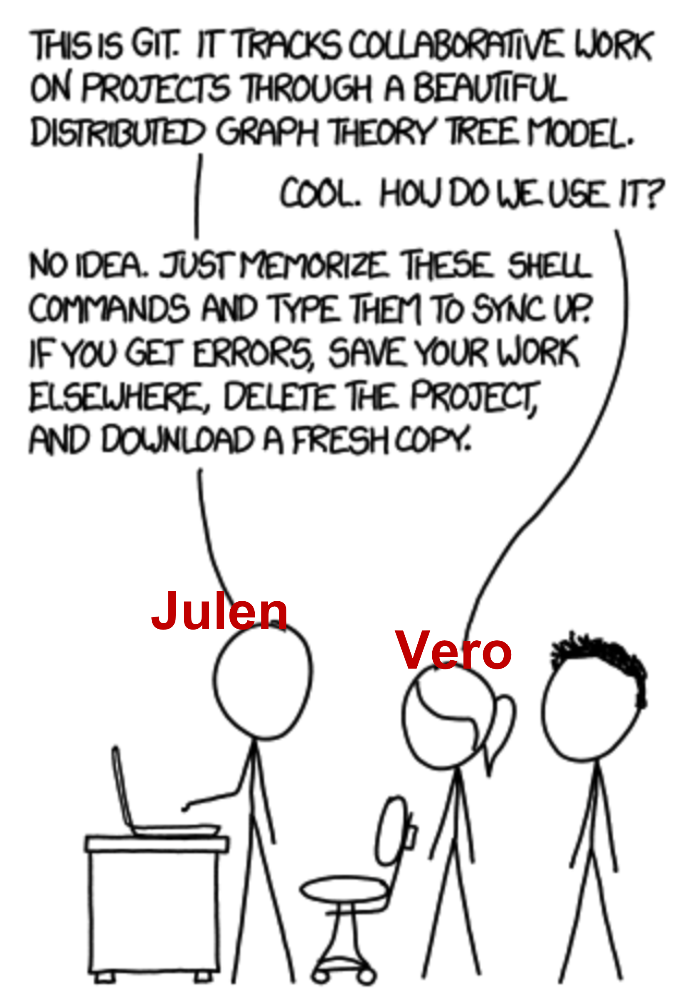
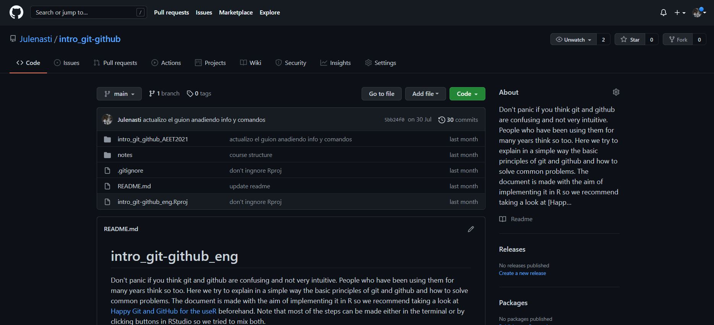
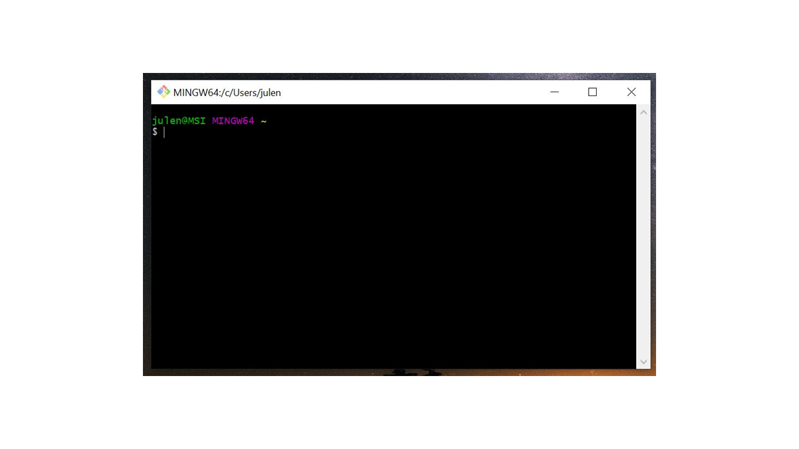
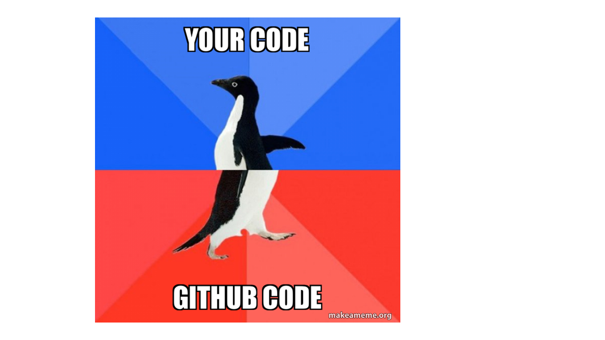
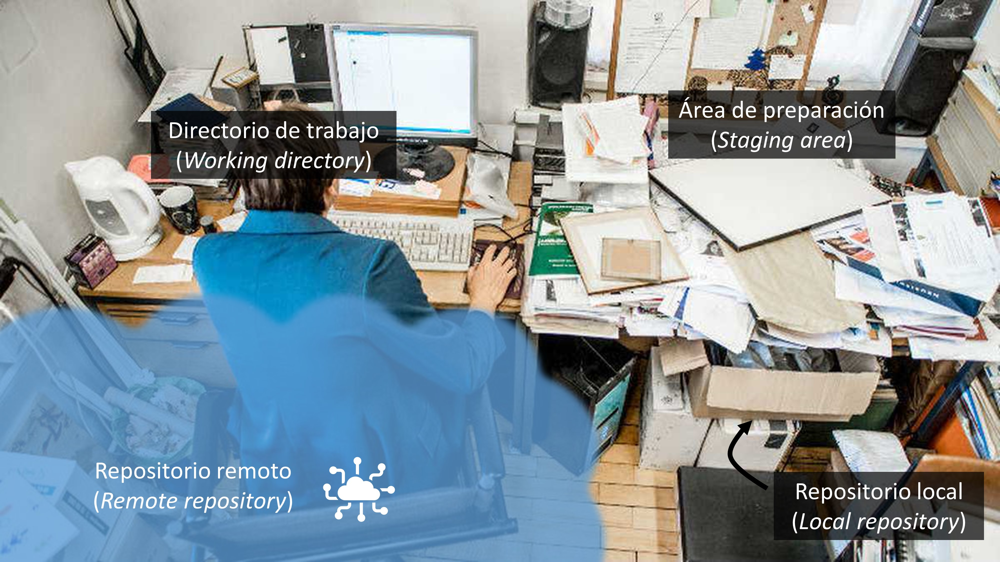
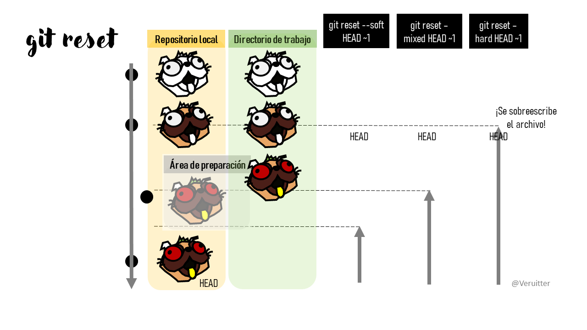
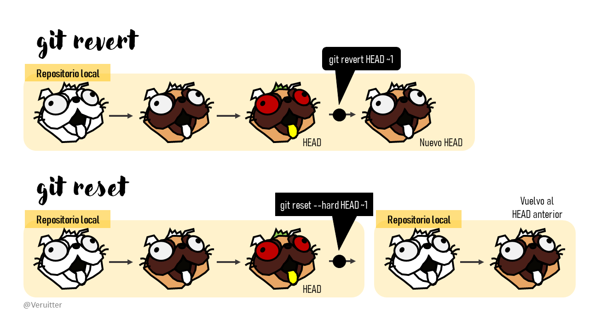
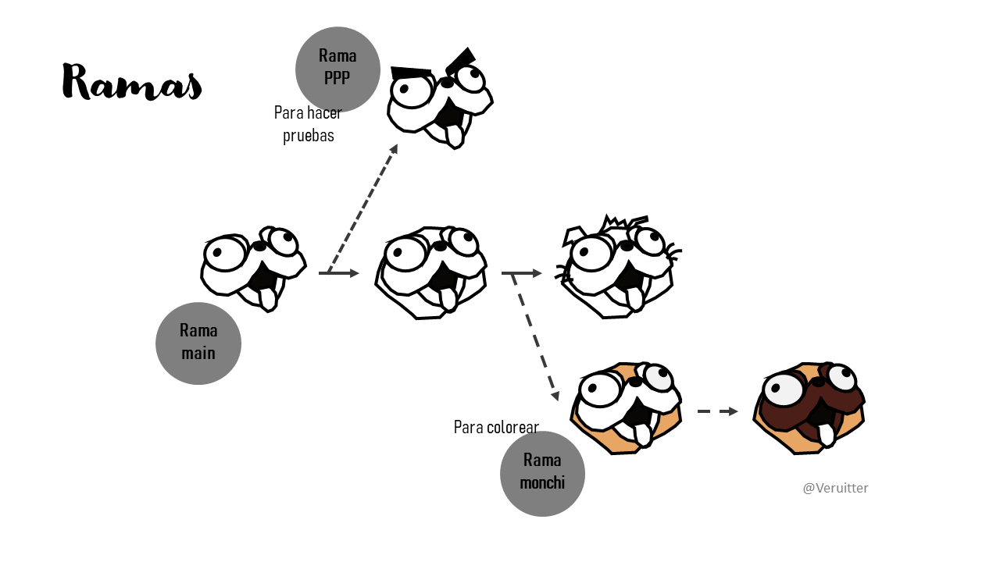
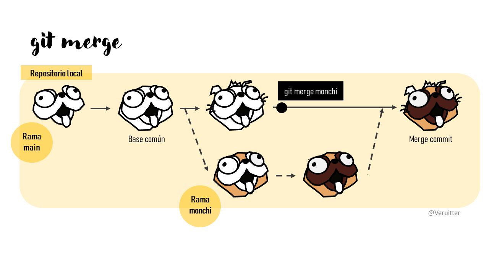

# Introducción

El principal objetivo del taller es familiarizarse con el sistema de control de versiones automatizado Git y el repositorio remoto GitHub. Ambas herramientas están ganando cada vez más importancia en ecología. En el taller aprenderemos cómo Git puede usarse para controlar la trazabilidad de los cambios realizados en proyectos o archivos y veremos como este control de versiones es especialmente útil en proyectos colaborativos mediante el uso de repositorios remotos como GitHub.

Por ejemplo, Git y GitHub nos pueden ayudar a solucionar algunos problemas comunes derivados de la creación de diferentes versiones que pueden ser un poco molestos:

\- Sobreescritura de un archivo

\- Versiones finales infinitas

\- Trabajo por error en una versión que no era la final

\- Creación de copias "en conflicto" cuando dos personas trabajan a la vez

\


## Estructura del curso

+----------------------------------+----------------------------------------------------------+
| Bloques                          | Tiempo estimado                                          |
+==================================+==========================================================+
| Introducción                     | 20 min                                                   |
+----------------------------------+----------------------------------------------------------+
| Instalación                      | 20 min                                                   |
+----------------------------------+----------------------------------------------------------+
| Workflow Git-GitHub              | 50 min (30 min explicación y ejemplo + 20 min ejercicio) |
+----------------------------------+----------------------------------------------------------+
| Descanso                         | 20-30 min                                                |
+----------------------------------+----------------------------------------------------------+
| Deshacer cambios                 | 20 min (10 + 10)                                         |
+----------------------------------+----------------------------------------------------------+
| Ramas                            | 20 min (10 + 10)                                         |
+----------------------------------+----------------------------------------------------------+
| Descanso                         | 10 min                                                   |
+----------------------------------+----------------------------------------------------------+
| Unión de ramas                   | 20 min (10 + 10)                                         |
+----------------------------------+----------------------------------------------------------+
| Otros comandos y elemenos útiles | 20 min (10 + 10)                                         |
+----------------------------------+----------------------------------------------------------+
|                                  | 30 min                                                   |
+----------------------------------+----------------------------------------------------------+

## Quienes somos

\

Y vosotros ¿quienes sois?

 <https://www.menti.com/8fnfxiwrk7>

## [Qué es Git](https://git-scm.com/)

Git es un sistema avanzado de control de versiones, similar al "control de cambios" de Microsoft Word. Git permite "rastrear" el progreso de un proyecto a lo largo del tiempo. Puedes volver atrás y ver los cambios que se hicieron, ya que Git hace "capturas" del proyecto a medida que evoluciona y los cambios se van guardando. Permite al resto de participantes del proyecto mantenerse al día con las actualizaciones y desandar los pasos que se han dado si es necesario. Además, Git facilita el trabajo en paralelo de varios participantes. En otros sistemas de control de versiones hay un servidor central. Cualquier cambio hecho por un usuario se sincroniza con este servidor y de ahí con el resto de usuarios. Si dos personas están trabajando a la vez y guardan, se crean conflictos (p. ej. en Dropbox). En cambio Git es un control de versiones distribuído que permite a todos los usuarios trabajar en el proyecto e ir tomando "capturas" del trabajo de cada uno y facilita la sincronización de los cambios.

## [Qué es GitHub](https://github.com/)

GitHub es una plataforma online para albergar proyectos basados en Git que permite la colaboración de diferentes usuarios (similar a Google Drive o Microsoft Teams). GitHub permite que otros usuarios vean y utilicen tus proyectos e incluso que te propongan cambios. GitHub es útil para trabajar en remoto y poder acceder a tus proyectos desde cualquier ordenador además de proporcionar la seguridad de la nube.




# Instalación

Tener instalado la versión más reciente de RStudio, Git y cuenta en GitHub creada

1.  Presentarte a Git ([Chapter 7: Git-Intro](https://happygitwithr.com/hello-git.html))

2.  Conectar tu ordenador de trabajo a GitHub ([Chapter 9: Connect to GitHub](https://happygitwithr.com/push-pull-github.html))

3.  Conectar RStudio a Git y GitHub ([Chapter 12: Connect RStudio to Git and GitHub](https://happygitwithr.com/rstudio-git-github.html#rstudio-git-github))

**Ejercicio**

En la terminal, compueba que has instalado Git correctamente:

*Tools* -\> *Shell*

`git --version`

Para ver el usuario utilizado para configurar Git:

`git config user.name`

Para ver a qué cuenta de correo está asociado Git:

`git config user.email`

`r emo::ji("voltage")` ¿Qué es el shell? El shell es un programa en tu ordenador cuyo trabajo es ejecutar otros programas. En este workshop aprenderemos a trabajar principalmente con el shell aunque también veremos cómo hacerlo a través de un cliente (RStudio).

\




# Mi primer repositorio en GitHub

En primer lugar creamos un repositorio (es decir, un "contenedor") para nuestro proyecto en GitHub en "+ New repository". Aquí se indica el nombre, una pequeña descripción, y si quieres que sea público o privado. Se recomienda iniciar el repositorio con un archivo "README" (*Initialize this repository with a README*) para recoger cualquier información esencial para el uso del repositorio (estructura, descripción más detallada del contenido, etc.).

En R, creamos un nuevo proyecto y lo conectamos al repositorio: "File -\> New project -\> Version control -\> Git" -\> copiar el URL del repositorio que hemos creado de GitHub (está en la página principal de nuestro repositorio, en "clone or download"). Seleccionamos el directorio donde queremos guardar el proyecto y pulsamos en "Create project".

Si vamos al directorio seleccionado, encontraremos la carpeta conectada a Git y GitHub que hemos creado en nuestro ordenador. Podemos copiar aquí todos los archivos que nos interesan para el proyecto (datos, imágenes, etc).

**Ejercicio**

Copia alguna imagen de internet en el repositorio local

-   En RStudio ir a la pestaña Git (donde está el environment) para ver todos los documentos que hemos añadido en el repositorio local

\

# Flujo de trabajo en Git y GitHub

Cuatro "zonas" de trabajo:

1.  **Directorio de trabajo (working directory):** es donde estás trabajando. Este árbol se sincroniza con los archivos locales de tu PC.

2.  **Área de preparación (staging area):** es la zona intermedia entre el directorio de trabajo y el repositorio local. Registra los cambios que se especifican en el directorio. También se denomina Index.

3.  **Repositorio local (local repository):** es donde se almacenan todos los cambios en tu PC. También se llama HEAD.

4.  **Repositorio remoto (remote repository):** es donde se almacenan todos los cambios en la nube.



Pasos para ir de un árbol a otro:

Al principio todos los cambios realizados están en amarillo porque Git no sabe que hacer con ellos. Estamos en el directorio de trabajo y puede que no nos interese guardar todos los cambios para el futuro.

Para añadir un cambio del directorio de trabajo al área de preparación hay que utilizar `git add`. Indica a Git que quieres incluir las actualizaciones de algún archivo en el próximo commit. Sin embargo, `git add` no afecta realmente al repositorio local de forma significativa. Los cambios no se guardan hasta que se ejecuta el git commit.

-   `git add <file>`: registra todos los cambios en el archivo llamado file para el siguiente commit.
-   `git restore --staged <file>`: eliminará el archivo del área de preparación.

Para ver el estado del directorio de trabajo y del área de preparación se utiliza `git status`. Permite ver qué cambios se han sido añadidos al área de preparación (staged), cuáles no, y qué archivos no están siendo rastreados por Git.

Para registrar los cambios que nos interesen hay que utilizar `git commit`. Al hacer un commit haremos una captura del estado del proyecto (snapshot). Junto con el commit añadiremos un mensaje que es recomendable poner una pequeña explicación de que has cambiado y por qué (p. ej. decimocuarta revisión del capítulo 3 de la tesis con cambios de director1). Cada `git commit` tiene un SHA (Secure Hash Algorithm) que es algo así 1d21fc3c33cddc4aeb7823400b9c7c6bc2802be1. Parece difícil de entender, pero no te preocupes, sólo tienes que recordar los siete primeros dígitos 1d21fc3 `r emo::ji("shocked")` (es broma). Con el SHA puedes ver los cambios que se hicieron en ese commit. Si algo sucede, esa parte se guarda para que puedas volver allí fácilmente.

-   `git commit -m "mensaje corto y descriptivo"`

Por último, con `git push` subiremos los cambios que hemos hecho a GitHub (repositorio remoto) y quedarán visibles para nuestros colaboradores. Basicamente, `git commit` registra los cambios en el repositorio local `git push` actualiza el repositorio remoto con los cambios y archivos asociados.

Cuando retomamos un proyecto (tras horas o días), con `git pull` se descargan todas las actualizaciones que haya en GitHub y fusionará (merge) con el último commit.

Para dar acceso de edición a tus colaboradores, en la página principal de nuestro proyecto en GitHub entramos en "Settings -\> Manage Access -\> Invite a collaborator". Los colaboradores crean un nuevo proyecto de control de versiones, copian el url y luego descargan con `git pull` los archivos de GitHub.


**Ejercicio**

En equipos de 2-3 personas invita a un compañero a tu proyecto.

Descarga los archivos del repositorio al que has sido invitado.

Modifica el archivo README.txt, registra tus cambios y actualiza el repositorio remoto al que has sido invitado.

Vete a tu repositorio de GitHub y comprueba los cambios que se han hecho.

# La he liado ¿cómo deshago los cambios?

Cuando hago un cambio que no quiero ¿cómo lo puedo resolver?

-   `git reset`: deshace un `git commit` o/y un `git add`

    -   `git reset --mixed HEAD~1`: deshace el add y el commit pero no los cambios realizados en el directorio de trabajo. Es equivalente a `git reset`. El HEAD\~1 significa el commit anterior al head. Puedes ir un commit hacia atrás, dos, etc. También se puede utilizar el SHA en lugar del HEAD`~X` para ir a un commit específico.

    -   `git reset --hard HEAD~1`: deshace el add, el commit y todos los cambios realizados en el directorio de trabajo. `r emo::ji("danger")` Esta es la opción más PELIGROSA. Ten en cuenta que borra los cambios no commitidos y apunta tu rama al commit especificado. Recomendamos ejecutar primero `git status` y ver si hay cambios no commitidos. Si los hay, guárdalos con `git stash` (más adelante explicaremos su utilidad).

    -   `git reset --soft HEAD~1`: deshace el último commit pero no los add y los cambios realizados en el directorio de trabajo.



-   `git revert HEAD~1`: es la opción segura de git reset para deshacer un commit ya que no resetea un proyecto a su estado anterior eliminando todos los commits posteriores (i.e., no elimina el historial de commits). Recomendamos usar `git reset` en ramas que no hayan sido compartidas todavía (es decir, que no hayan sido commitidas a un repositorio remoto que otros estén usando). Resetear es cambiar el historial sin dejar rastro. Esto es siempre una mala práctica y puede causar problemas. Si queremos deshacer los cambios en las ramas que se comparten con otros, recomendamos utilizar el comando `git revert`. Con `git revert` quedará constancia de que se ha deshecho un cambio.



**Ejercicio**

Realiza un commit y prueba hacer `git reset --soft HEAD~1`

Realiza otro commit y prueba hacer `git reset --mixed HEAD~1`

Realiza un último commit y prueba hacer `git reset --hard HEAD~1` `r emo::ji("danger")`

¿Qúe comando habéis utilizado para ver las diferencias entre los distintos tipos de git reset?

# ¿Pero cómo se puede trabajar paralelamente?

Podemos crear una "rama" paralela al proyecto si deseamos seguir una línea independiente de trabajo, bien por ser diferente de la principal (p. ej., probar un nuevo análisis que piensas que puede sustituir al que ya se ha hecho) o bien para desarrollar específicamente una parte (p. ej., voy a trabajar sólo en los métodos de un artículo). Básicamente, una rama es un puntero a un commit específico SHA. La rama main es la rama por defecto cuando creamos un repositorio. Las demás ramas se crean con `git checkout`.

-   `git checkout -b <branchname>`: crea una nueva rama y cámbiate a ella.

-   `git checkout main`: vuelve a la rama principal.



# ¿Cómo se unen distintas ramas?

Cuando el trabajo desarrollado en una rama se da por finalizado y se quiere unir a la rama principal ("main") hay que hacer la union utilizando el comando `git merge`. Esto se puede hacer mediante el shell pero creemos que es más fácil hacerlo con el boton "pull request" en la página del proyecto en GitHub.

Sin embargo, a veces git encontrará conflictos al fusionar y tendrás que arreglarlos manualmente. Git te mostrará dónde están los conflictos así (imaginemos que estamos uniendo la rama analisis al main):

\\\<\\\<\\\<\\\<\\\<\\\<código del main=======código de la rama analisis\\\>\\\>\\\>\\\>\\\>\\\>.

Para solucionarlo simplemente escoje los cambios de la rama principal o de la rama analisis. Una vez solucionados te dejará hacer el merge.



**Ejercicio**

Crea una rama en el proyecto en el que colaboras.

Modifica la primera frase del archivo README.txt

Vuelve a la rama principal y modifica también la primera frase del archivo README.txt

Combina la rama que has creado con la rama principal del proyecto.

Resuelve el conflicto.

\

# Otros comandos y elementos útiles

<!-- -   valorar si desahecer push-es! -->

-   ".gitignore": sirve para ignorar archivos que no queremos compartir aunque estén en el repositorio local. P. ej., el archivo ".Rhistory" que RStudio crea por defecto.

-   `git diff`: muestra los cambios no añadidos con `git add`

-   `git add .`: registra todos los cambios a la vez

-   `git log`: muestra el historial de los commit

-   `git rm --cached filename`: elimina un archivo del Index. Muy útil si has commitido un archivo de 10GB `r emo::ji("wink")`

-   `git branch -d <branchname>`: elimina la rama llamada branchname de tu pc

-   `git push origin --delete <branchname>`: elimina la rama remota llamada branchname (por ejemplo, desde GitHub). Ten en cuenta que la rama local y la remota no tienen nada que ver entre sí, por lo que deben eliminarse por separado

-   `git branch -a`: muestra todas las ramas locales y remotas. También te indica en qué rama te encuentras

-   `git stash`: cuando no quieres hacer un commit del trabajo a medio hacer pero quieres volver a este punto más tarde

-   `git stash list`: ver los stash que has guardado

-   `git stash apply`: recupera cualquier stash que has guardado en la stash list

-   `git commit --amend -m "message"`: cambiar el mensaje del último commit.

-   `git checkout HEAD~1`: para inspeccionar una versión antigua del proyecto. Recomendamos crear una rama primero si se quiere añadir commits a partir de este punto temporal.

En la página principal de tu proyecto en GitHub encontrarás herramientas útiles para colaborar.

-   "Issues": permite incluir tareas para acordarte de lo que tienes que hacer o asignar tareas a los miembros del proyecto (escribiendo "\@" antes del nombre del colaborador). Cuando completas una tarea, puedes conectar el issue con el código correspondiente si en el commit message añades `git commit -m "Close #XX"` (p. ej., "Close \#1" para cerrar el "issue" número 1).

-   "Fork": GitHub contiene multitud de proyectos públicos que todos los usuarios pueden clonar y desarrollar independientemente. Al hacer una clonación, se crea una ramificación o copia del proyecto ("fork") que pasa a formar parte de tu cuenta de usuario en GitHub. En caso de que desees unir los cambios realizados al proyecto original, deberás solicitarlo (="pull request"). El dueño del proyecto decide si acepta o no los cambios que propones.

# Algunos enlaces interasantes

-   [Git Reference Manual](https://git-scm.com/docs)

-   [Software Carpentry: An introduction to version control for novices using Git](http://swcarpentry.github.io/git-novice/)

-   [Happy Git and GitHub for the useR](https://happygitwithr.com/)

-   [Atlassian Bitbucket](https://www.atlassian.com/git/tutorials)

-   [Oh Shit, Git!?!](https://dangitgit.com/)

-   [git - la guía sencilla por Roger Dudler](https://rogerdudler.github.io/git-guide/index.es.html)

-   [Apply for an educator or researcher discount](https://docs.github.com/en/education/explore-the-benefits-of-teaching-and-learning-with-github-education/apply-for-an-educator-or-researcher-discount)

------------------------------------------------------------------------

<details>

<summary>

Session Info

</summary>

```{r session-info}
Sys.time()
git2r::repository()
sessionInfo()
```

</details>
