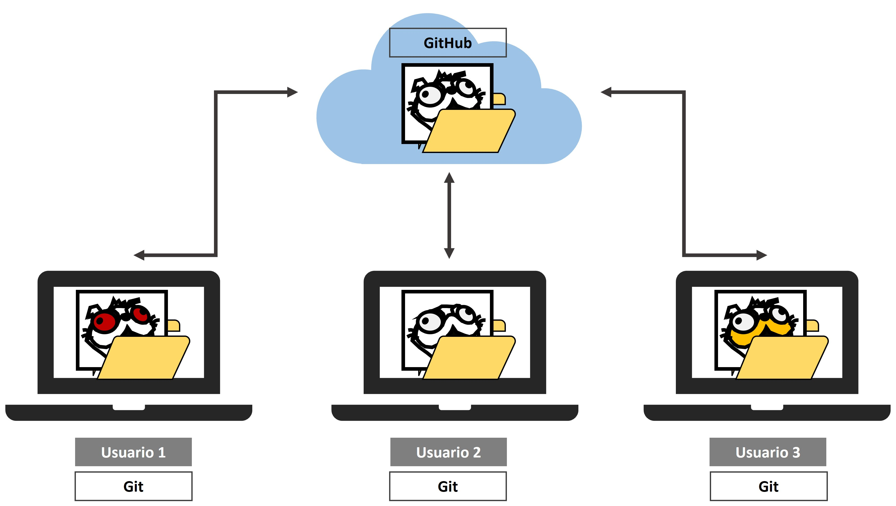

> (1) Universidad de Alcalá, Grupo de Ecología Forestal y Restauración (FORECO), Departamento de Ciencias de la Vida, 28805 Alcalá de Henares (Madrid), España
> (2) Department of Landscape Architecture, Graduate School of Design, Harvard University, 02138 Cambridge MA, Estados Unidos

> Autor para correspondencia: [julenastigarraga\@gmail.com](mailto:author@gmail.com){.email}, [veronica.cral\@gmail.com](mailto:author@gmail.com){.email}

> Contribución de los autores:
>
> Julen Astigarraga: conceptualización y redacción -- borrador original. Verónica Cruz-Alonso: conceptualización, visualización y redacción -- revisión y edición.

# Palabras clave

> ciencia abierta; control de versiones; trazabilidad; reproducibilidad

# Keywords

> open science; reproducibility; traceability; version control

La reproducibilidad, entendida como la capacidad que tienen algunos trabajos o proyectos de ser recreados de forma independiente a partir de los mismos datos y el mismo código que utilizó el equipo original [@theturingwaycommunity2021], es una condición *sine qua non* del método científico [@peng2011]. Algunos autores plantean que gran parte de la ecología es ya una ciencia de *big data* [@hampton2013; @farley2018], lo que hace indispensable utilizar herramientas informáticas que garanticen la trazabilidad de todo el proceso de desarrollo de proyectos (desde su creación hasta su publicación), asegurando de esta manera su reproducibilidad [@rodríguez-sánchez2016]. En este sentido, es recomendable utilizar alguna herramienta de control de versiones como Git (<https://git-scm.com/>) combinada con plataformas en línea para albergar los proyectos (p. ej. GitHub, <https://github.com/>), facilitando así el seguimiento de los proyectos y la coordinación entre colaboradores [@blischak2016; @galeano2018; @rodríguez-sánchez2020]. Aunque existen multitud de manuales disponibles gratuitamente sobre cómo utilizar Git y GitHub (ver Apéndice 1), estas herramientas son complejas y tienen una curva de aprendizaje pronunciada. El objetivo de la presente nota es dar a conocer la estructura, funcionalidad y potencialidad de Git, así como su interacción con GitHub, para el trabajo en proyectos colaborativos en ecología.

# ¿Qué es Git?

Git es un sistema avanzado de control de versiones (como el "control de cambios" de Microsoft Word) distribuido [@blischak2016; @ram2013]. Git permite "rastrear" el progreso de un proyecto a lo largo del tiempo ya que hace "capturas" del mismo a medida que evoluciona y los cambios se van registrando. Esto permite ver qué cambios se hicieron, quién los hizo y por qué, e incluso volver a versiones anteriores (**Fig. 1**). Además, Git facilita el trabajo en paralelo de varios participantes. Mientras que en otros sistemas de control de versiones (p. ej. Subversion (SVN, <https://subversion.apache.org/>) o Concurrent Versions System (CVS, <http://cvs.nongnu.org/>)) hay un servidor central y cualquier cambio hecho por un usuario se sincroniza con este servidor y de ahí con el resto de usuarios, Git es un control de versiones distribuido que permite a todos los usuarios trabajar en el proyecto paralelamente e ir haciendo "capturas" del trabajo de cada uno para luego unirlos. Otras alternativas de control de versiones distribuido comparables a Git son Mercurial (<https://www.mercurial-scm.org/>) o Bazaar (<https://bazaar.canonical.com/>), pero Git es con diferencia el más utilizado.

# ¿Qué es GitHub?

GitHub es un servidor de alojamiento en línea o repositorio remoto para albergar proyectos basados en Git que permite la colaboración entre diferentes usuarios o con uno mismo [@galeano2018; @perez-riverol2016]. Un repositorio es un directorio donde desarrollar un proyecto que contiene todos los archivos necesarios para el mismo. Aunque existen distintos repositorios remotos (p. ej. GitLab, <https://gitlab.com/>, o Bitbucket, <https://bitbucket.org/>) con funcionalidad similar, GitHub es hoy en día el más utilizado. GitHub registra el desarrollo de los proyectos de manera remota, permite compartir proyectos entre distintos usuarios y proporciona la seguridad de la nube entre otras funciones. Cuando se trabaja en proyectos colaborativos, la base de la interacción entre Git y GitHub es que todos los colaboradores de un proyecto están de acuerdo en que GitHub contiene la copia principal del proyecto, es decir, GitHub contiene la copia centralizada del control de versiones distribuido o descentralizado (**Fig. 2**).

# Flujo de trabajo en Git y GitHub

Git es capaz de rastrear todos los archivos contenidos en un repositorio. Para comprender cómo Git registra los cambios y cómo podemos compartir dichos cambios con nuestros colaboradores es importante entender cómo se estructura Git y cómo se sincroniza con GitHub. Hay cuatro "zonas" de trabajo (**Fig. 3**):

1.  **Directorio de trabajo (*working directory*):** es donde se está trabajando. Esta zona se sincroniza con los archivos locales del ordenador.

2.  **Área de preparación (*staging area* o *Index*):** es la zona intermedia entre el directorio de trabajo y el repositorio local de Git. Es la zona de borradores. El usuario debe seleccionar los archivos que se van a registrar en la siguiente "captura" de Git.

3.  **Repositorio local (*local repository* o *HEAD*):** es donde se registran todos los cambios capturados por Git en tu ordenador.

4.  **Repositorio remoto (*remote repository*):** es donde se registran todos los cambios capturados por Git en la nube (GitHub).

Si se ejecuta Git desde la línea de comandos de *Unix shell* (para más información sobre el *shell* o terminal ver <https://happygitwithr.com/shell.html#shell>), la transición entre zonas de trabajo se realiza mediante comandos (**Fig. 4**). Adicionalmente, también se puede trabajar en Git a través de un cliente, como RStudio (<https://www.rstudio.com/>), que incorpora una pestaña llamada "Git" que facilita la transición entre zonas de trabajo ya que contiene funcionalidades básicas de Git. Usar un cliente como RStudio es recomendable para usuarios noveles de Git (ver <https://happygitwithr.com/rstudio-git-github.html>).

El primer paso para trabajar con Git es crear un repositorio en GitHub (repositorio remoto) y clonarlo en nuestro ordenador (repositorio local; para hacerlo desde RStudio ver <https://happygitwithr.com/rstudio-git-github.html>, y para hacerlo mediante la línea de comandos ver @galeano2018). Para añadir una actualización de algún archivo del directorio de trabajo al área de preparación se utiliza el comando `git add <nombre de archivo>`. Este comando indica a Git que se quieren incluir las actualizaciones de algún archivo en la próxima "captura" del proyecto y que Git las registre. Sin embargo, `git add` no afecta al repositorio local. Para ver el estado del directorio de trabajo y del área de preparación se utiliza `git status`. Este comando permite ver qué archivos están siendo rastreados por Git, qué cambios han sido añadidos al área de preparación (*staged*) y qué archivos están siendo registrados por Git.

Para registrar los cambios que nos interesan se utiliza `git commit`. Al ejecutar `git commit` se hace una "captura" del estado del proyecto. Junto con el *commit* se añade un mensaje con una pequeña explicación de los cambios realizados y por qué (p. ej. "incluyo las referencias en el formato de Ecosistemas"). Cada `git commit` tiene un SHA (Secure Hash Algorithm) que es un código alfanumérico que identifica inequívocamente ese *commit* (p. ej. 1d21fc3c33cxxc4aeb7823400b9c7c6bc2802be1). Con el SHA siempre se pueden ver los cambios que se hicieron en ese *commit* y volver a esa versión fácilmente.

Por último, `git push` permite subir los cambios que hemos hecho a GitHub y quedarán visibles para nuestros colaboradores. Básicamente, `git commit` registra los cambios en el repositorio local y `git push` actualiza el repositorio remoto con los cambios y archivos asociados. Cuando se retoma un proyecto tras horas, días o incluso meses, con `git pull` se descargan todas las actualizaciones que haya en GitHub (nuestras o de nuestros colaboradores), que se fusionarán (*merge*) con el último *commit* en nuestro repositorio local.

# ¿Cómo se puede trabajar paralelamente?

Git permite crear una "rama" (*branch*) paralela al proyecto si se desea seguir una línea independiente de trabajo, bien por ser diferente de la principal (p. ej. probar un nuevo análisis) o bien para desarrollar específicamente una parte del proyecto (p. ej. trabajar sólo en la escritura de los métodos de un artículo mientras otros colaboradores trabajan en otras secciones). Las ramas permiten trabajar en el proyecto sin interferir con lo que están haciendo los compañeros (**Fig. 5**). En Git, una rama es un *commit* al que le se le da un nombre y que contiene un "enlace" (puntero o *pointer*) a un SHA específico que es el origen de la rama. La rama *main* es la rama por defecto cuando se crea un repositorio. Las demás ramas se crean con `git checkout -b <nombre de rama>`. Para moverse de una rama a otra se utiliza `git checkout <nombre de rama>` (p. ej. `git checkout main` para volver a la rama principal).

Cuando el trabajo desarrollado en una rama se da por finalizado y se quiere unir a la rama principal *main* hay que hacer la unión utilizando el comando `git merge` (**Fig. 5**). Con `git checkout main` se posiciona el puntero de Git en el último *commit* de la rama principal a la que quiero unir la otra rama y con `git merge <rama a unir>` se fusionan los cambios hechos en las dos ramas. Esto se puede hacer en el *shell* como acabamos de ver pero también se puede hacer con el botón "*pull request*" en la página del proyecto en GitHub (ver @galeano2018).

Git puede encontrar conflictos al fusionar ramas que hay que arreglar manualmente. Esto ocurrirá si en las dos ramas se han cambiado las mismas líneas de un archivo. Git muestra dónde están los conflictos así:

`<<<<<<código del main=======código de la rama a unir>>>>>>`

Para solucionarlo hay que escoger los cambios de la rama principal o de la rama a unir según corresponda. Esto también se puede hacer a través de un cliente de Git, como GitKraken (<https://www.gitkraken.com/>) o SourceTree (<https://www.sourcetreeapp.com/>). Una vez solucionados, Git permite completar el *merge* (es decir, un nuevo *commit* que contendrá las ramas fusionadas). La mejor manera de evitar conflictos o por lo menos reducir su dificultad es realizar cambios pequeños y sincronizar frecuentemente con GitHub.

# Agradecimientos

JA está financiado por el Programa Predoctoral de Formación de Personal Investigador No Doctor del Departamento de Educación del Gobierno Vasco y VCA por el Real Colegio Complutense (Becas Postdoctorales 2020). Agradecemos al grupo de Ecoinformática de la AEET, especialmente a F. Rodríguez-Sánchez e I. Bartomeus por adentrarnos en el mundo de Git y Github, a P. Ruiz-Benito por su paciencia y colaboración en todo nuestro proceso de aprendizaje, y a C. Lara-Romero, J. Galeano, H. Saiz, A. Garmendia, J. Salgado-Rojas y F. Rodríguez-Sánchez por sus sugerencias para mejorar esta nota.

###### REFERENCIAS

::: {#refs}
:::

###### PIES DE FIGURA

**Figura 1**. Ejemplo de un proyecto rastreado por Git con indicaciones de cómo se registran los cambios y la evolución del proyecto, el autor o autora de los cambios (¿quién?), el momento en que se han registrado (¿cuándo?), en qué documentos o líneas se han producido cambios (¿dónde?) y qué ha cambiado (¿qué?).

**Figure 1**. Example of a project tracked by Git, showing how changes are recorded, the project timeline, the author of the changes (who? - *¿quién?*), the moment when changes were recorded (when? - *¿cuándo?*), the documents or lines changed (where? - *¿dónde?*), and what have been changed (what? - *¿qué?*).

**Figura 2**. Interacción entre Git y GitHub. Git, al ser un control de versiones distribuido, permite que todos los usuarios trabajen paralelamente sin interferir en el trabajo de los demás. Luego cada usuario sincroniza su trabajo con la copia principal del proyecto ubicado en GitHub.

**Figure 2**. Interaction between Git and GitHub. Git allows the users to work in parallel without interfering other user's work as it is a distributed version control system. Each user synchronizes the work with the main copy of the project that is hosted in GitHub.

**Figura 3**. Representación gráfica de las diferentes zonas de trabajo en Git y GitHub: Directorio de trabajo (*working directory*), área de preparación (*staging area* o *Index*), repositorio local (*local repository* o *HEAD*) y repositorio remoto (*remote repository*). Imagen de fondo de Philip Brookes (<https://creativecommons.org/licenses/by-nc-nd/2.0/legalcode>).

**Figure 3**. Graphical representation of the different working areas in Git and GitHub: working directory, staging area or Index, local repository or HEAD, and remote repository. Background image from Philip Brookes (<https://creativecommons.org/licenses/by-nc-nd/2.0/legalcode>).

**Figura 4**. Flujo de trabajo en Git y GitHub mostrando las diferentes zonas de trabajo y los comandos utilizados para la transición de una zona de trabajo a otra.

**Figure 4**. Workflow in Git and GitHub showing the different working areas and the commands used for transitioning from one area to another one.

**Figura 5**. Proceso de creación y unión de ramas. Ejemplo de unión (*merge*) de la rama *monchi* a la rama *main*.

**Figure 5**. Process of creation and merging of branches. The example shows how *monchi* branch is merged into *main* branch.

###### FIGURA 1

###### FIGURA 2

###### FIGURA 3

###### FIGURA 4

###### FIGURA 5

###### Apéndice 1: recursos para entender Git y Github

**Información más detallada de los temas tratados en esta nota y ejercicios**

-   [Introducción a Git y GitHub, dos herramientas para una ecología más colaborativa y reproducible](https://github.com/Julenasti/intro_git-github)

**Ciencia reproducible**

-   [Ciencia reproducible: qué, por qué, cómo](https://github.com/ecoinfAEET/Reproducibilidad)

**Control de versiones (Git)**

-   [Manual de referencia de Git](https://git-scm.com/docs)

-   [Software Carpentry](http://swcarpentry.github.io/git-novice/)

-   [Atlassian Bitbucket](https://www.atlassian.com/git/tutorials)

-   [Oh Shit, Git!?!](https://ohshitgit.com/)

-   [git - la guía sencilla](https://rogerdudler.github.io/git-guide/index.es.html)

**Integrar Git, GitHub y RStudio**

-   [Happy Git and GitHub for the useR](https://happygitwithr.com/){.uri}

**Enseñar y aprender con GitHub**

-   [GitHub Education para profesores e investigadores](https://docs.github.com/en/education/explore-the-benefits-of-teaching-and-learning-with-github-education/use-github-in-your-classroom-and-research/about-github-education-for-educators-and-researchers)
