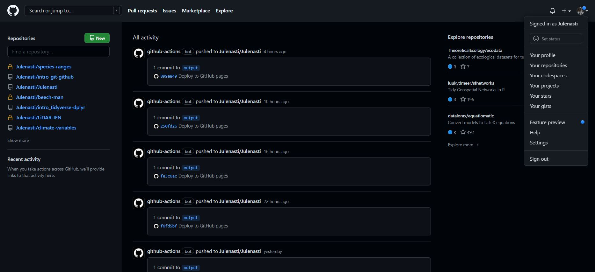
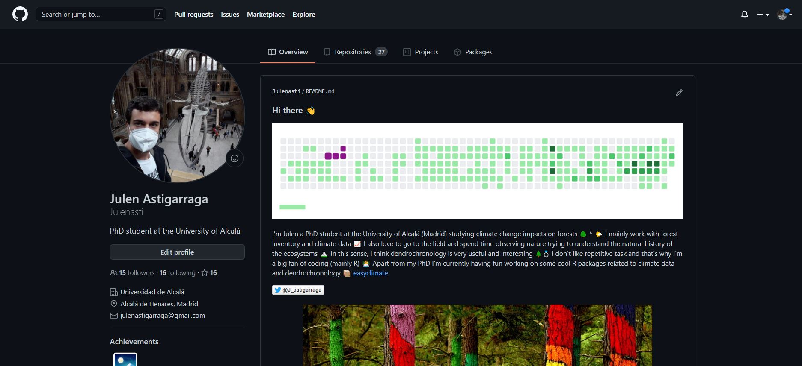
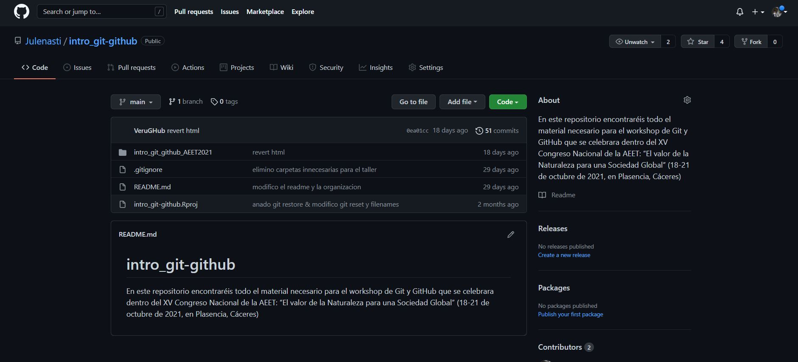
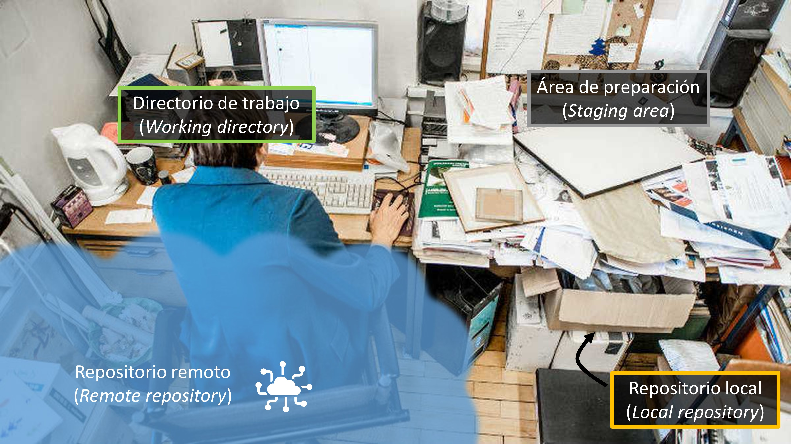
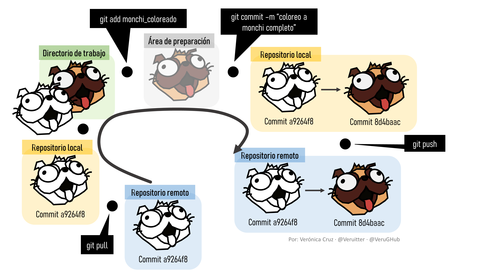
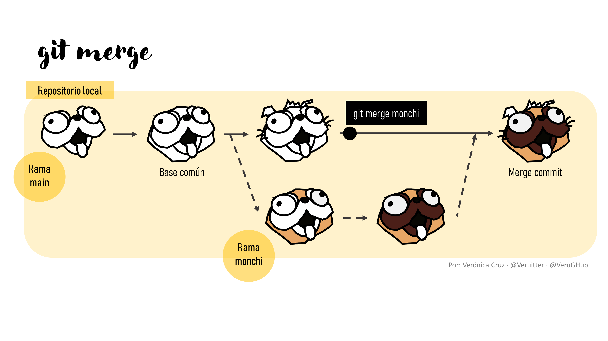

# Introduction

**The main objective** **of the seminar** is to become familiar with the automated version control system Git and the remote repository GitHub.

Both tools are **gaining more importance in the daily workflows** of many researchers and university courses (e.g., STAT 545 course at the University of British Columbia, <https://stat545.stat.ubc.ca/>)

In **this seminar we will learn** how Git can be used to track changes to projects or files and how this version control is especially useful in collaborative projects through the use of hosting services such as GitHub. **Understand their logic, functionality and power** so that anyone can then explore them further.

Specifically we will learn:

1.  The benefits of using an automated version control system

2.  The advantages of integrating version control and hosting services

3.  The basic workflow for using Git and GitHub from RStudio

For example, Git and GitHub can help us solve some everyday versioning problems that can be a bit of a nuisance:

\- Overwriting a file

\- Infinite final versions

\

\- Mistakenly worked on a non-final version

\- Creating "conflicting" copies when two people work at the same time

\- Editions without tracking changes

\

## Seminar structure

+---------------------------------+
| Introduction                    |
+---------------------------------+
| What is Git                     |
+---------------------------------+
| What is Github                  |
+---------------------------------+
| Repositories & projects         |
+---------------------------------+
| Workflow in Git & GitHub        |
+---------------------------------+
| Branches                        |
+---------------------------------+
| Some interesting links          |
+---------------------------------+

# [What is Git](https://git-scm.com/)

-   Git is an advanced version control system, similar to Microsoft Word's "track changes"

-   Git takes "snapshots" of the project as it evolves and changes are saved

-   Git facilitates parallel work by several participants (central server vs. distributed server)

-   The original purpose of Git (software development) vs. the re-purposed


\


# [What is GitHub](https://github.com/)

-   GitHub is an online hosting server for hosting Git-based projects that allows collaboration between different users (similar to Google Drive or Microsoft Teams but much more powerful)

-   GitHub advantages: working remotely, user-friendly interface, access your projects from any computer and the security of the cloud

-   All contributors agree that GitHub contains the main copy of the project





# Repositories & projects

A repository is like a "container" in which to develop a project



# Workflow in Git & GitHub

There are four working areas (trees):

1.  **Working directory:** where you are working. This tree is synchronised with the local files on your PC

2.  **Staging area:** the intermediate zone between the working directory and the local repository. It is the draft zone. It records changes that are specified in the directory. It is also called Index

3.  **Local repository:** where all changes of your PC are stored. It is also called HEAD

4.  **Remote repository:** where all changes are stored in the cloud





# Branches

-   A branch is basically a pointer to a specific commit

-   We can create a parallel "branch" to the project if we want to follow an independent line of work, either because it is different from the main one or to specifically develop a part

-   Branches allow you to work on the project without interfering with what your colleagues may be doing and then we can merge different branches



# Some interesting links

-   [Git Reference Manual](https://git-scm.com/docs)

-   [Software Carpentry: An introduction to version control for novices using Git](http://swcarpentry.github.io/git-novice/)

-   [Happy Git and GitHub for the useR](https://happygitwithr.com/)

-   [Atlassian Bitbucket](https://www.atlassian.com/git/tutorials)

-   [Oh Shit, Git!?!](https://ohshitgit.com/)

-   [git - la guía sencilla por Roger Dudler](https://rogerdudler.github.io/git-guide/index.es.html)

-   [Apply for an educator or researcher discount](https://docs.github.com/en/education/explore-the-benefits-of-teaching-and-learning-with-github-education/apply-for-an-educator-or-researcher-discount)

\

------------------------------------------------------------------------

<details>

<summary>

Session Info

</summary>

```{r session-info}
Sys.time()
git2r::repository()
sessionInfo()
```

</details>
